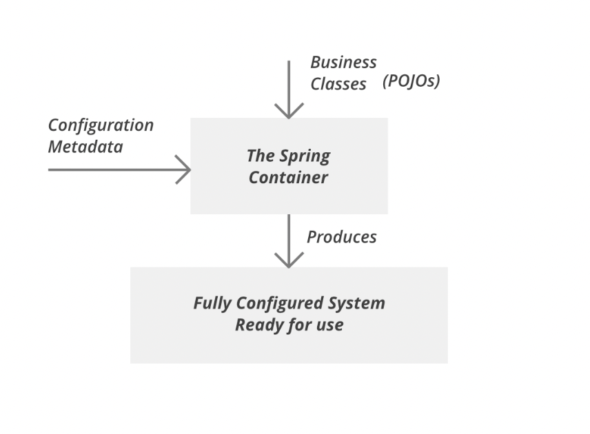

# IoC와 Spring IoC

## IoC

### IoC (Inversion of Control)란 무엇인가?

**IoC (Inversion Of Control)** 란 **제어의 역전**을 의미한다. **제어의 역전**이란, 객체 생성과 관리의 제어 권한을 **개발자(또는 객체 자신)가 아니라 외부 시스템(프레임워크)** 에 위임하는 설계 원칙이다.

### 예시 비교 (직접 생성 vs IoC)

```java
// 전통적인 방식(제어의 직접 소유)
MemberDao dao = new MemberDao();
MemberService service = new MemberService(dao);
service.insertMember(member);

// IoC 방식
// 객체 생성과 주입을 외부(Spring Container)가 담당
ApplicationContext ctx = new AnnotationConfigApplicationContext(AppConfig.class);
MemberService service = ctx.getBean(MemberService);
service.insertMember(member);
```
- 개발자가 직접 의존하는 객체를 생성하는 것이 아니라, **IoC 컨테이너가 객체를 생성하고, 의존 객체를 주입**해준다.

### IoC의 동작 방식
1. **개발자는 객체를 생성하지 않고, 단순한 POJO 클래스를 정의한다.**
2. 객체 간의 의존관계를 **설정파일(XML, Java Config, Annotation 등)** 에 정의한다.
3. **Spring IoC Container**는 애플리케이션 실행 시 설정에 따라 객체를 생성하고, 필요한 의존성을 주입하여 실행 가능한 객체 그래프를 구성한다.

### IoC의 역할
- **객체의 생성과 생명주기 관리**
- **의존성 관리 (DI 구현)**
- **객체 간 결합도 감소 (Low Coupling)**
- **애플리케이션 설정을 메타정보(XML, 어노테이션 등)로 외부화**

### IoC의 활용

| 활용 영역 | 설명 |
|---|---|
| **서비스 계층 구성** | Controller -> Service -> Repository 구조에서 DI를 통해 객체를 주입 |
| **테스트 환경 구성** | Mock 객체를 쉽게 주입할 수 있어 유닛 테스트가 쉽다. |
| **설정 외부화** | Bean 설정을 JavaConfig 또는 XML로 정의해 유연한 구성 가능 |
| **대규모 구조 설계** | Layered Architecture, Hexagonal Architecture에서 필수 요소다. |

## Spring IoC

스프링 프레임워크에서의 IoC는 **Spring IoC Container**를 통해 구현된다.

### Spring IoC Container

**Spring IoC 컨테이너**는 Bean을 생성하고, 의존 객체를 주입하며, 생명주기를 관리하는 역할을 한다. 
- **Spring IoC 컨테이너**는 Spring Framework의 핵심 요소로, **객체를 생성**하고, **의존성을 구성하고 결합**하며 **생명 주기를 관리**한다.
- **Spring IoC 컨테이너**는 **DI (Dependency Injection)를 사용**해 애플리케이션을 구성하는 컴포넌트들을 관리한다.
- **Spring IoC 컨테이너**를 사용하면 **객체들의 생명주가가 개발자가 아닌 프레임워크의 제어를 통해 관리**된다.

### Spring IoC Container의 동작 방식



####  구성요소
1. Configuration Metadata(구성 메타데이터)
   - 스프링에게 어떤 빈(Bean)을 생성하고, 이들 간에 어떤 의존관계가 있는지를 알려주는 설정정보다.
   - XML파일, Java Configuration 클래스, Annotation으로 구성 메타데이터를 설정한다.
   - 이 메타데이터는 스프링 컨테이너가 내부적으로 객체를 생성하고 관리하는 **지침서 역할**을 한다.
2. Business Classes (POJOs)
   - 스프링이 관리하게 될 순수 자바 객체다.
   - 스프링은 프레임워크에 종속적인 클래스를 요구하지 않으며, 일반 자바 클래스를 사용한다.
   - 예: BookDao, OrderDao, BookService, OrderService 등 비즈니스 로직을 수행할 때 필요한 클래스들 
   - 이 클래스들은 **개발자가 작성**하는 애플리케이션의 핵심 로직이며, **의존성 주입 (DI)** 을 통해 서로 연결된다.
3. The Spring Container
   - Spring IoC 컨테이너로서, 애플리케이션에서 사용되는 객체를 생성하고 조립하여 관리하는 핵심 컴포넌트다.
   - **객체의 생성, 의존성 주입, 객체의 라이프사이클 관리, 스코프 관리를 담당**한다.
   - 대표적인 구현체
     - `BeanFactory` : 가장 단순한 형태의 IoC 컨테이너다.
     - `ApplicationContext` : BeanFactory를 확장하여 국제화, 이벤트, 메세지처리 기능을 지원하는 IoC 컨테이너다.
     - **Spring이 객체의 제어권을 소유**하고, 필요한 객체를 만들어서 적절히 연결한다.
4. Fully Configured System Ready for use
   - 컨테이너가 모든 객체를 생성하고 의존성을 주입한 후, 애플리케이션은 **완전히 구성된 상태**가 되어 서비스 요청에 대응할 수 있게 된다.
   - 스프링이 모든 구성을 마친 다음, **비즈니스 로직 수행 준비가 완료된 애플리케이션 컨텍스트**를 개발자에게 제공한다.

#### 전체 흐름

```scss
[1] 개발자가 Configuration Metadata를 작성한다
       ↓
[2] Spring Container가 POJO 객체들을 생성하고, 설정에 따라 의존성을 주입한다
       ↓
[3] 이 과정을 통해 하나의 완전한 시스템(Fully Configured System)이 준비된다
```

위의 그림은 **Spring IoC 컨테이너의 핵심 역할**을 보여주는 그림이다.
- 스프링은 객체의 생성과 조립을 담당함으로써 **개발자의 직접적인 제어권을 프레임워크가 대신함** (IoC, 제어의 역전)
- 개발자는 단순히 **구성 정보와 비즈니스 로직 클래스만 정의**하면 되고, 나머지 객체 생성, 주입, 조립은 스프링이 알아서 처리합니다.

### Spring IoC의 장점

| 장점 | 설명 |
|---|---|
| **결합도 낮춤** | 객체 간 의존성이 명시적이지 않아 구조 변경이 쉬움 |
| **테스트 용이성** | 의존 객체를 쉽게 주입/교체 가능 |
| **설정 외부화** | 구성 정보(XML, Java Config)로 구조를 분리 |
| **유지보수성 향상** | 구조가 명확하고 느슨하게 결합되어 변경에 강함 |
| **코드 재사용성 증가** | 재사용 가능한 컴포넌트로 구성 가능 |

Spring IoC는 **객체의 생성과 연결 제어를 개발자가 아닌 프레임워크가 담당함**으로써, 개발자는 **비즈니스 로직에 집중**하고, 전체 시스템의 구조는 **더 유연하고 테스트 가능한 구조로 변모**하게 됩니다.
스프링의 의존성 주입 기능은 단순히 객체 관리 수준을 넘어서서, **유지보수, 확장성, 생산성** 전반에 걸쳐 막대한 영향을 끼치는 **핵심 설계 철학**입니다.