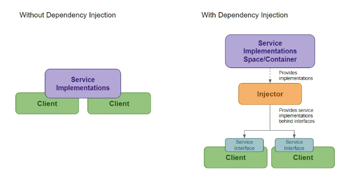

# DI와 Spring DI

## DI(Dependency Injection)이란 무엇인가?

**DI (Dependency Injection)** 이란, 객체가 의존하는 다른 객체를 **직접 생성하지 않고, 외부에서 주입받는 설계 패턴**이다.
DI는 **IoC (Inversion of Control)** 의 한 구현 방식으로, 객체 간의 **결합도를 낮추고 유연한 설계**를 가능하게 한다.


### 자바의 의존성 주입



#### Without Dependency Injection

```java
interface Service {
    void biz1();
}

class ServiceImpl implements Service {
    public void biz1() {
        ...
    }
}

class Client1 {
    Service service = new ServiceImpl();

    public void execute() {
        service.biz1();
    }
}
```
- `Client`는 `ServiceImpl` 구현 클래스스에 직접 의존하고 있다.
- `Client`는 `ServiceImpl`객체를 직접 생성하고 사용한다.
- `Client`와 `ServiceImpl`가 강하게 결합되어 있다.]
- 문제점

    | 문제 | 설명 |
    |---|---|
    | 높은 결합도 | `Client`와 `ServiceImpl` 구현 클래스에 직접 의존한다. |
    | 유연성 부족 | `Client`가 사용하는 `Service`인터페이스으 구현체를 변경하려면 `Client`의 소스코드를 변경해야 한다. |

#### With Dependency Injection

```java
interface Service {
    void biz1();
}

class ServiceImpl implements Service {
    public void biz1() {
        ...
    }
}

class Client {
    Service service;

    public Client(Service service) {
        this.service = service;
    }

    public void execute() {
        service.biz1();
    }
}
```
- `Client`는 `Service` 인터페이스에 의존하고 있다.
- `Client`객체와 `ServiceImpl`객체는 Container 공간에 존재한다.
- Container가 애플리케이션 실행에 필요한 객체를 생성한다.
- `Injector`가 의존성을 분석해서 실제 구현객체를 인터페이스 기반으로 주입한다. 즉, `Client`객체는 `Service` 인터페이스에 의존하기 때문에 `Injector`가 Container에서 `Service`인터페이스의 구현 객체인 `ServiceImpl`객체를 찾아서 `Client`객체에 주입한다.
- `Client`는 직접 구현객체를 생성할 필요도 없고, 실제로 사용하는 구현객체가 무엇인지 알 필요가 없다.
- 장점

    | 장점 | 설명 |
    |---|---|
    | 낮은 결합도 | `Client`는 `Service` 인터페이스에만 의존하고 실제 구현 클래스를 몰라도 된다. |
    | 유연성 향상 | `Client`가 사용하는 `Service` 인터페이스의 구현객체를 변경해도 `Client`의 소스코드를 변경할 필요가 없다. |
    | 테스트 용이 | `Client`에 Mock 또는 Stub 객체를 주입해서 테스트 할 수 있다. |
    | 객체지향 개발 원칙 준수 | 제어 역전 원칙과 단일 책임 원칙을 실현하였다. |

#### 핵심 개념 비교

| 항목 | Without Dependency Injection | With Dependency Injection |
|---|---|---|
| **의존 방향** | Client -> 구현클래스 | Client -> 인터페이스 |
| **구성 책임** | Client 자신 | 외부 Injector |
| **우연성** | 낮음 | 높음 |
| **테스트 용이성** | 어려움 | 매우 용이함 |
| **변경에 대한 영향** | Client 소스코드 수정 필요 | Client 소스코드 수정 없음 |

위의 그림은 의존성 주입의 핵심 철학을 직관적으로 표현하는 그림이다.
> **사용하는 객체는 의존하는 객체를 직접 생성하지 않고, 외부에서 제공받는다.**

Spring Framework에서는 이 Injector 역할을 **IoC 컨테이너(ApplicationContext)** 가 수행하며,
이를 통해 유지보수성, 확장성, 테스트 가능성이 뛰어난 시스템을 만들 수 있게 된다.

## Spring DI

Spring에서 의존성 주입은 **객체 간의 의존성을 프레임워크(Spring Container)가 외부에서 주입해 주는 설계 패턴**이다. 

### Spring의 의존성 주입 방식

#### 1. 생성자 주입(Constructor Injection)
- 생성자를 통해 의존 객체를 주입받는 방식이다.
- 불변성을 유지하고, 필수 의존성 주입에 적합하다.
- Spring 4.3 이상부터는 생성자가 하나일 경우 @Autowired 생략 가능하다.
    ```java
    @Service
    public UserService {
        private final UserRepository userRepository;

        @Autowired
        public UserService(UserRepository userRepository) {
            this.userRepository = userRepository;
        }
    }
    ```
#### 2. 세터 주입(Constructor Injection)
- setter 메소드를 통해 의존성 객체를 주입받는 방식이다.
- 선택적 의존성이나 빈 생성 후 변경 가능성이 있을 때 사용한다.
    ```java
    @Service
    public UserService {
        private UserRepository userRepository;

        @Autowired
        public void setUserRepository(UserRepository userRepository) {
            this.userRepository = userRepository;
        }
    }
    ```
#### 3. 필드 주입(Constructor Injection)
- 필드에 직접 `@Autowired`를 붙여서 의존성 주입을 받는 방식이다.
- 테스트와 유지보수가 어렵기 때문에 실무에서는 권장하지 않는다.
    ```java
    @Service
    public UserService {
        @Autowired
        private UserRepository userRepository;
    }
    ```

Spring에서 의존성 주입은 객체 간 의존관계를 효율적으로 관리할 수 있게 해주는 핵심 기능이다.
**객체는 자신이 필요로 하는 객체를 직접 생성하지 않는다**는 원칙을 통해 유연하고 테스트 가능한 코드를 구현할 수 있다.
