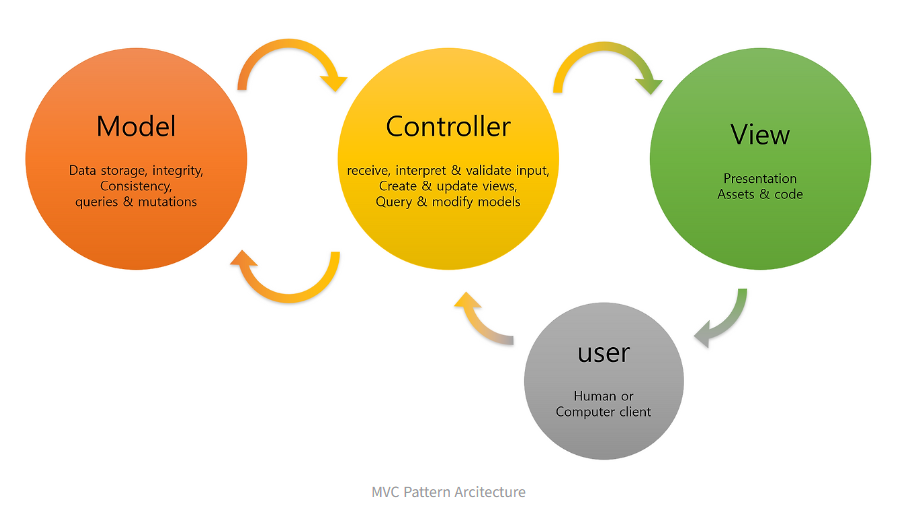
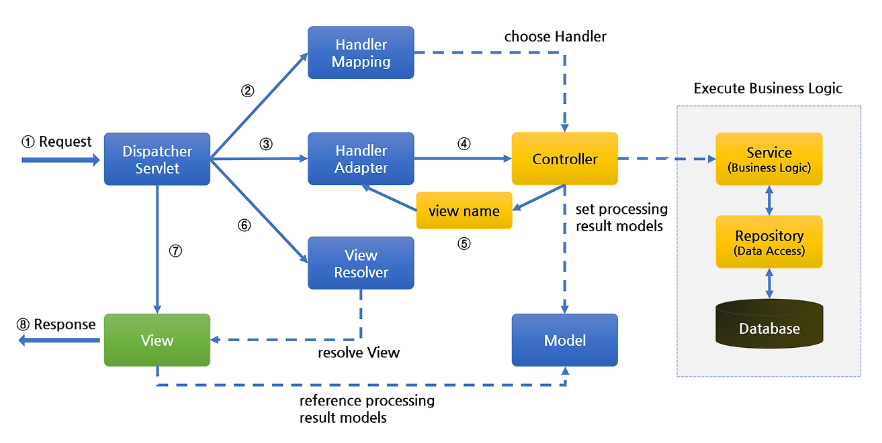

# Spring MVC
**Spring MVC**는 **Model-View-Controller 아키텍처 기반의 웹 애플리케이션 프레임워크**다. Spring Framework의 핵심 모듈 중 하나로, 웹 요청을 처리하고 데이터를 가공하여 사용자에게 뷰를 통해 응답하는 구조를 제공한다.

## Spring MVC의 아키텍처
### 주요 구성 요소

- Model
  - 정의: 애플리케이션의 데이터를 책임지며, 비즈니스 로직을 처리한다.
  - 역할: 사용자에게 표시되는 데이터를 가공하고 저장하며, 데이터의 변경이 일어날 경우 적절한 처리 방법을 구현한다.
  - 구현: Java 객체로 표현되며, 특정 도메인의 데이터를 담는 역할을 한다.
- View
  - 정의: 시각적인 UI를 담당하며, 사용자에게 정보를 표현한다.
  - 역할: Model에서 받은 데이터를 화면에 표시하고, 사용자의 입력을 Controller에 전달한다.
  - 구현: 주로 HTML, JSP, Thymeleaf 등의 템플릿 엔진을 사용하여 구현한다.
- Controller
  - 정의: Model과 View를 연결하는 역할을 한다.
  - 역할: 사용자의 요청을 받아 해당 요청에 대한 비즈니스 로직을 실행하고, 그 결과를 Model에 저장한 후, 적절한 View로 전달한다.
  - 구현: 주로 Java 클래스로 구현되며, @Controller 어노테이션을 통해 Spring에 등록한다. 

## Spring MVC 아키텍처 구성도

### 구성요소
- DispatcherServlet
  - DispatcherServlet은 Spring MVC에서 사용자의 모든 요청을 받아 처리하는 프론트 컨트롤러로, 웹 애플리케이션의 진입점 역할을 수행한다.
  - 이 서블릿의 설정은 주로 web.xml 파일이나 WebApplicationInitializer를 통해 이루어진다. DispatcherServlet은 클라이언트로부터 받은 요청을 적절한 컨트롤러에게 전달하여 처리한다.
- HandlerMapping
  - HandlerMapping은 DispatcherServlet이 요청을 처리할 컨트롤러를 찾는 역할을 한다. 이것은 사용자의 요청 URL을 분석하여 어떤 컨트롤러가 이를 처리할지를 결정한다.
  - XML 파일이나 Java config 어노테이션을 사용하여 설정할 수 있다.
- HandlerAdapter
  - HandlerAdapter는 매핑된 컨트롤러의 실행을 요청하고, 그 결과를 ModelAndView 객체로 변환한다. 이는 다양한 종류의 컨트롤러를 유연하게 지원하기 위한 역할을 수행한다. 즉, 각각의 컨트롤러가 어떻게 실행되고 그 결과를 어떻게 처리해야 하는지를 다양한 방식으로 다룰 수 있게 해준다.
- Controller
  - Controller는 사용자의 요청을 받아 해당 요청에 대한 비즈니스 로직을 실행하고, 그 결과를 Model에 저장한 후, 적절한 View로 전달하는 역할을 한다.
  - 주로 Java 클래스로 구현되며, @Controller 어노테이션을 통해 Spring에 등록한다.
- ViewResolver
  - ViewResolver는 Controller에서 리턴된 뷰 이름을 기반으로 실제 View 객체를 찾는 역할을 한다. 이를 통해 View 객체는 실제 화면을 생성하고 클라이언트에게 응답한다.
  - Spring은 다양한 View 템플릿을 지원하며, ViewResolver는 해당 템플릿을 찾아준다.
- View
  - View는 화면을 생성하고 클라이언트에게 응답하는 역할을 한다. Controller에서 전달받은 데이터를 이용하여 사용자에게 시각적으로 표현되는 부분을 담당한다.
  - 주로 HTML, JSP, Thymeleaf 등의 템플릿 엔진을 사용하여 구현한다.

### 동작 순서
1. Client 요청을 `DispatcherServlet`이 받는다.
2. `DispatcherServlet`은 `HandlerMapping`를 호출하여 요청 정보를 전달한다. 요청 정보(URL)를 분석하여 적합한 `Controller`를 선택한다.
3. `DispatcherServlet`이 다음으로 `HandlerAdapter`를 호출한다. `HandlerAdapter`는 요청한 URL에 적합한 Method를 찾는다.
4. `HandlerAdapter`가 `Controller`로 요청을 위임한다. `Controller`는 Business Logic을 처리하고, `View`에 전달할 결과를 `Model` 객체에 저장한다.
5. `Controller`는 **view name**을 `DispatcherServlet`에 리턴한다.
6. `DispatcherServlet`이 `ViewResolver`를 호출하여 `Controller`가 리턴한 **view name**을 기반으로 적합한 `View`를 찾는다.
7. `DispatcherServlet`이 `View` 객체에 처리 결과를 전달하여 보여준다.
8. `View` 객체는 해당하는 `View`를 호출한다. `View`는 `Model` 객체에 화면을 표시하는 데 필요한 객체를 가져와 화면에 처리하고, Client에 넘겨준다.

## Spring MVC의 주요 API

### 컨트롤러 관련 주요 어노테이션
| 애너테이션 | 설명 |
|---|---|
| `@Controller` | 해당 클래스가 컨트롤러임을 선언. 주로 JSP 뷰 리턴 시 사용 |
| `@RestController` | REST API 응답을 위한 컨트롤러 (JSON/XML 직접 반환) |
| `@RequestMapping` | 클래스 또는 메서드에 URL 경로 매핑 (GET/POST 등 지정 가능) |
| `@GetMapping`, `@PostMapping`, `@PutMapping`,` @DeleteMapping` | HTTP 메서드별 요청을 처리할 메서드 지정 |
|` @PathVariable` | URL 경로 변수 값을 파라미터로 전달 |
| `@RequestParam` | 쿼리 파라미터 (URL?name=value) 를 메서드 파라미터로 바인딩 |
| `@ModelAttribute` | 폼 데이터를 객체로 바인딩하여 모델로 전달 |
| `@RequestBody` | JSON 데이터를 Java 객체로 변환 (주로 REST API에서 사용) |
| `@ResponseBody` | 객체를 JSON 혹은 XML로 직접 응답 (주로 REST API에서 사용) |
| `@SessionAttributes` | Model 데이터를 세션에 유지하고 싶을 때  |

### 컨트롤러의 요청 핸들러 메소드의 매개변수 인자의 타입
| 타입 | 설명 |
|---|---|
| Servlet API (`HttpServletRequest`, `HttpServletResponse`, `HttpSession` ) | 서블릿 API 직접 사용 |
| `@RequestParam`, `@PathVariable`, `@ModelAttribute` | 요청 파라미터 추출 |
| `BindingResult`, `Errors` | 유형 검증 결과 처리 |
| `Model`, `ModelMap` | View로 전달할 데이터 저장 |
| `@RequestBody` | JSON 형식의 요청 데이터를 역직렬화 |
| `Principal`, `Authentication` | 인증된 사용자 정보 획득 |
