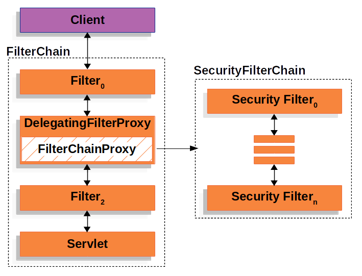

# Spring Security
Spring Security는 Spring Framework 기반 애플리케이션에서 **인증(Authentication)** 과 **인가(Authorization)** 를 포함한 전반적인 보안 요구사항을 처리하기 위해 설계된 가장 강력하고 유연한 보안 프레임워크이다. 엔터프라이즈 수준의 웹 애플리케이션과 마이크로서비스 환경에서 표준으로 자리 잡고 있으며, 다양한 보안 위협(CSRF, 세션 고정, 세션 탈취, XSS 등)으로부터 애플리케이션을 보호한다.

## 1. 정의
`Spring Security`는 다음을 포함한 종합적인 보안 프레임워크입니다:
- 인증(사용자 로그인 처리)
- 인가(URL, 메서드 접근 제어)
- 보안 정책 적용(세션 관리, CSRF 방지, CORS, HTTPS 강제 등)
- 보안 이벤트 처리 (로그인 실패, 로그아웃 등)
- 확장 가능한 구조 (OAuth2, JWT, LDAP, SAML, API Key 등과 통합 가능)

## 2. 역할
| 구분 | 역할 |
|---|---|
| 인증 (Authentication) | 사용자의 신원을 확인하고, 사용자 정보 및 권한을 인증 토큰(Authentication)에 저장 |
| 인가 (Authorization) | 인증된 사용자의 권한에 따라 요청한 자원 접근 허용 여부 판단 |
| 보안 정책 적용 | 세션 고정 공격 방지, CSRF 보호, HTTPS 강제, CORS 설정 등 |
| 보안 예외 처리 | 접근 거부, 인증 실패 등의 상황을 사용자 친화적으로 처리 |
| 감사 및 로깅 | 보안 관련 이벤트(로그인 시도, 실패, 성공 등)에 대한 로그 처리 | 

## 3. 아키텍처
Spring Security는 **Servlet Filter 기반의 아키텍처**로 구성되어 있으며, 요청에 대해 보안 처리를 하는 수많은 필터가 **체인 형태로 실행**된다.

### 스프리 시큐리티 아키텍처의 구성 요소들

#### 1. Client
  - 브라우저 또는 REST 클라이언트가 HTTP 요청을 전송한다.

#### 2. FilterChain (Servlet Filter Chain)
  - Java EE(또는 Spring Boot) 웹 어플리케이션의 전체 Filter 체인이다.
  - `Filter_0`, `DelegatingFilterProxy`, `Filter_2` 등은 웹.xml 또는 Spring Boot가 자동 등록한 Servlet Filter입니다.

#### 3. DelegatingFilterProxy
  - **Spring Security의 진입점 역할을 하는 필터**다.
  - Spring Security의 필터들은 스프링 애플리케이션의 일부가 아닌 독립적인 객체로 정의된다. 이를 스프링 컨테이너와 통합하기 위새 `DelegatingFilterProxy`가 사용된다.
  - `DelegatingFilterProxy`는 인증, 인가 등 보안관련 작업을 수행하는 필터 체인을 관리하고, **각 필터가 스프링 컨테이너에서 정의된 빈으로 위임할 수 있도록 한다.**
  - `DelegatingFilterProxy`는 Spring Application과 Spring Security 사이의 다리 역할을 수행한다.
  - 실질적인 보안 처리는 하지 않고, 내부의 `FilterChainProxy`로 **위임(delegate)** 한다.
  - Spring ApplicationContext 내의 `springSecurityFilterChain`이라는 이름의 Bean을 찾는다.

#### 4. FilterChainProxy
  - Spring Security의 **보안 필터 체인을 실행하는 핵심 컴포넌트**다.
  - 등록된 여러 개의 SecurityFilterChain 중, 현재 요청 URL에 해당하는 체인을 선택한다.
  - 선택된 체인에 따라 `Security Filter_0`부터 `Security Filter_n`까지 실행된다.

#### 5. SecurityFilterChain
  - 실제 보안 필터들의 묶음이다.
  - 요청에 맞는 보안 정책을 적용하며, 아래와 같은 필터들이 포함된다.
    | 순서 | 필터 클래스 |주요 역할 |
    |---|---|---|
    | 1| `WebAsyncManagerIntegrationFilter` | Spring MVC의 @Async 처리 시 SecurityContext 연동 |
    | 2 | `SecurityContextPersistenceFilter` |요청 시작 시 SecurityContext 로드, 종료 시 저장 |
    | 3 | `HeaderWriterFilter` | 응답 헤더 추가 (X-Content-Type-Options, X-Frame-Options 등) |
    | 4 | `CorsFilter` | CORS (Cross-Origin Resource Sharing) 처리 |
    | 5 | `CsrfFilter` | CSRF 토큰 검증 |
    | 6 | `LogoutFilter` | 로그아웃 요청 처리 (/logout) |
    | 7 | `OAuth2AuthorizationRequestRedirectFilter` | OAuth2 로그인 요청 리다이렉트 처리 |
    | 8 | `OAuth2LoginAuthenticationFilter` | OAuth2 로그인 응답 처리 (code → token) |
    | 9 | `UsernamePasswordAuthenticationFilter` | 폼 로그인 처리 (POST /login) |
    | 10 | `ConcurrentSessionFilter` | 세션 동시 접속 제어 |
    | 11 | `DigestAuthenticationFilter` | HTTP Digest 인증 처리 (거의 사용되지 않음) |
    | 12 | `BearerTokenAuthenticationFilter` | JWT 등의 Bearer 토큰 인증 처리 |
    | 13 | `BasicAuthenticationFilter` | HTTP Basic 인증 처리 |
    | 14 | `RequestCacheAwareFilter` | 인증 후 이전 요청 정보 기억/복원 |
    | 15 | `SecurityContextHolderFilter` | 새로운 인증 객체를 SecurityContextHolder에 설정 |
    | 16 | `AnonymousAuthenticationFilter` | 인증되지 않은 사용자를 "anonymousUser"로 설정 |
    | 17 | `SessionManagementFilter` | 세션 생성, 고정 공격 방지, 세션 만료 처리 |
    | 18 | `ExceptionTranslationFilter` | 인증/인가 실패 예외를 처리하고 적절한 응답 반환 |
    | 19 | `FilterSecurityInterceptor` | 최종 인가 판단 (접근 권한 여부 확인) |

#### 6. Filter_2 → Servlet
  - 보안 필터 체인을 모두 통과한 요청은 다음 필터(`Filter_2`)로 이동하고,
  - 마지막으로 `DispatcherServlet`이 실행되어 Controller에서 비즈니스 로직을 처리한다.

### 전체 요청 흐름
1. 클라이언트가 HTTP 요청을 보냄
2. FilterChain의 첫 번째 필터(`Filter_0`) 실행
3. `DelegatingFilterProxy`가 요청을 가로채어 `FilterChainProxy`에게 위임
4. `FilterChainProxy`는 요청 URL에 맞는 `SecurityFilterChain`을 선택
5. 선택된 보안 필터들이 순서대로 실행됨 (`Security Filter_0` ~ `Security Filter_n`)
6. 모든 보안 필터 처리가 끝나면 다음 필터(`Filter_2`)로 이동
7. 최종적으로 `DispatcherServlet` → `Controller` → `View`로 처리됨
