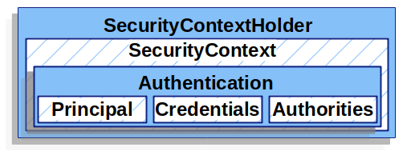
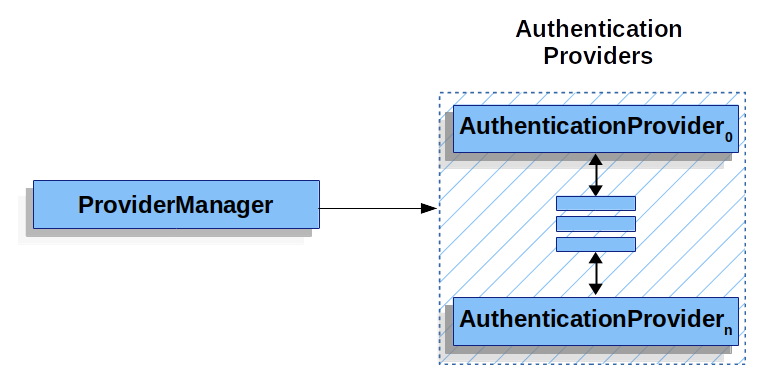
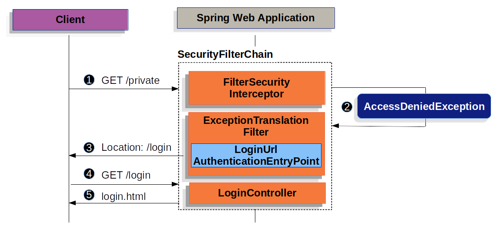
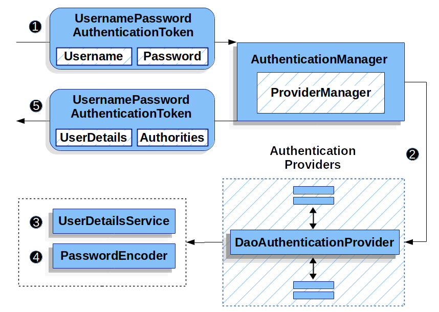

# Spring Security의 인증 아키텍처

## Spring Security가 Servlet 환경에서 인증을 수행할 때 사용하는 핵심 컴포넌트
### 1. `SecurityContextHolder`

- Spring Security는 인증된 사용자에 대한 세부 정보를 `SecurityContextHolder`에 저장한다.
- `SecurityContextHolder`는 인증 정보를 보관하는 **스레드 로컬(ThreadLocal)** 저장소다.
- 현재 요청 처리 중인 스레드에 대해 고유한 `SecurityContext`를 제공하며, 언제든지 다음과 같이 접근할 수 있다.

### 2. `SecurityContext`
- `SecurityContext`는 `SecurityContextHolder`에서 얻으며, 현재 인증된 사용자의 `Authentication` 정보를 포함한다.
- `SecurityContext`는 **사용자 인증 정보를 담고 있는 객체**다.
- 인증 성공 시 Spring Security가 이 객체를 생성하여 `SecurityContextHolder`에 저장한다.
- 로그아웃하거나 세션이 종료되면 이 정보는 제거된다.

### 3. `Authentication`
- `Authentication`은 인증을 위해 사용자가 제공한 자격 증명(input)일 수도 있고, 인증이 완료된 사용자의 정보일 수도 있다.
- `Authentication` 인터페이스는 Spring Security에서 두 가지 주요 목적으로 사용된다.
    - 사용자가 인증을 위해 제공한 자격 증명을 AuthenticationManager에 전달하기 위한 입력값
      - 로그인 시 사용자가 입력한 ID/PW
    - 현재 인증된 사용자를 나타내기 위한 객체
      - 현재 인증이 완료된 사용자 정보
- Authentication 객체의 구성 요소
  | 구성 요소 | 설명 |
  |---|---|
  | `principal` | 사용자를 식별하는 값이다. 아이디/비밀번호 인증 방식에서는 보통 UserDetails 객체가 사용된다. |
  | `credentials` | 보통 비밀번호를 의미한다. 인증이 완료된 이후에는 보안을 위해 이 값이 지워지는 경우가 많다. |
  | `authorities` | 사용자가 부여받은 **권한(roles, scopes 등)** 을 나타내는 GrantedAuthority 객체들의 집합이다. |

- 일반적으로 `UsernamePasswordAuthenticationToken`이 구현체로 사용

### 4. `GrantedAuthority`
- 인증 객체에 포함된 Principal에게 부여된 권한(역할, 범위 등)을 나타낸다.
- 예 : `ROLE_USER`, `ROLE_ADMIN`
- `Authentication.getAuthorities()` 메서드를 통해 조회할 수 있다.
- 실제 구현체는 `SimpleGrantedAuthority`가 일반적으로 사용된다.

### 5. `AuthenticationManager`
- Spring Security의 필터가 인증을 수행할 때 사용하는 핵심 API다.
- 인터페이스이며, `Authentication authenticate(Authentication auth)` 메서드를 정의한다.
- 필터(예: `UsernamePasswordAuthenticationFilter`)가 사용자의 입력을 받아 `Authentication` 객체로 만든 후, 이 메서드를 호출하여 인증을 시도한다.
- 인증 성공 시 인증된 `Authentication` 객체를 반환하며, 실패하면 예외(`AuthenticationException`)를 던진다.

### 5. `ProviderManager`

- `AuthenticationManager`의 가장 일반적인 구현체다
- 내부에 다수의 `AuthenticationProvider`를 가지고 있으며, 순차적으로 인증 시도를 위임한다.
- 인증 성공하면 즉시 인증 객체를 반환, 실패하면 다음 `AuthenticationProvider`로 넘김
- 모든 provider가 실패하면 `BadCredentialsException` 또는 관련 예외 발생

### 6. `AuthenticationProvider`
- `ProviderManager`가 특정 유형의 인증을 처리하기 위해 사용하는 인터페이스다.
- 아이디/비밀번호 인증, JWT 인증, LDAP 인증, 소셜 로그인 등 각각의 방식별로 다양한 구현체가 있다.
- 구현 클래스
  - `DaoAuthenticationProvider`
  - `JwtAuthenticationProvider`
  - `LdapAuthenticationProvider`
  - `OAuth2LoginAuthenticationProvider`

### 7. `AuthenticationEntryPoint`
- `AuthenticationEntryPoint`는 Spring Security에서 인증되지 않은 사용자가 보호된 리소스에 접근하려고 할 때 호출되는 컴포넌트다.
- **인증이 필요한데 인증이 안 되어 있는 상태**에서 어떻게 대응할지 결정하는 역할을 한다.
- 주요 클래스
  - `LoginUrlAuthenticationEntryPoint`: 로그인 페이지로 리다이렉트
  - `Http403ForbiddenEntryPoint`: 403 반환
  - `Http401AuthenticationEntryPoint`: 401 반환
  - `BearerTokenAuthenticationEntryPoint`: REST API에서 Bearer 토큰이 없을 경우 401과 WWW-Authenticate 헤더 반환
  
### 8. `AbstractAuthenticationProcessingFilter`
- AbstractAuthenticationProcessingFilter는 Spring Security에서 인증(authentication) 처리를 담당하는 필터들을 만들기 위한 추상 클래스다.
- 로그인 요청을 감지하고, 인증 로직을 수행한 뒤, 성공/실패에 따라 적절한 후속 처리를 자동으로 수행한다.
- 구현 클래스
  - `UsernamePasswordAuthenticationFilter`
  - `OAuth2LoginAuthenticationFilter` 

## 인증 처리 흐름
### 1. 로그인 화면

1. 사용자가 인증되지 않은 상태로 `/private` 리소스에 접근하려고 요청한다. 이 리소스는 인가되지 않은 사용자게게 허용되지 않는다.
2. Spring Security의 `AuthorizationFilter`는 해당 **요청이 인증되지 않았음을 감지**하고, 접근을 **거부(deny)** 하며 `AccessDeniedException`을 발생시킨다.
3. 사용자가 아직 인증되지 않았기 때문에, `ExceptionTranslationFilter`는 **인증 시작(Start Authentication)** 을 트리거하고, **AuthenticationEntryPoint(`LoginUrlAuthenticationEntryPoint`)** 를 통해 로그인 페이지로 리다이렉트한다.
4. 브라우저는 리다이렉트된 경로에 따라 **로그인 페이지**를 요청한다.
5. 애플리케이션에서 **로그인 페이지를 렌더링(render)** 해서 응답으로 제공한다.

### 2. `UsernamePasswordAuthenticationFilter`

1. **사용자 자격 증명 제출**
   - 사용자가 **아이디(username)와 비밀번호(password)** 를 제출하면, `UsernamePasswordAuthenticationFilter`는 `HttpServletRequest` 객체로부터 이 값을 추출하고, UsernamePasswordAuthenticationToken 객체를 생성한다. 이 객체는 `Authentication`의 구현체 중 하나다.
2. **AuthenticationManager를 통한 인증 시도**
   - 생성된 `UsernamePasswordAuthenticationToken`은 `AuthenticationManager` **인스턴스에 전달되어 인증이 수행**된다.
   - `AuthenticationManager`의 구체적인 동작 방식은 **사용자 정보가 어떻게 저장되어 있는지에 따라 달라**진다.
3. 인증 실패 시 처리
   - 인증이 실패한 경우, 실패 처리 단계로 이동한다.
     - `SecurityContextHolder`가 **초기화**된다.
     - `RememberMeServices.loginFail()`가 호출된다. remember-me 설정이 없는 경우, 이 메서드는 아무 작업도 수행하지 않는다.
     - `AuthenticationFailureHandler`가 호출된다. 로그인 실패 시 리다이렉트 또는 에러 메시지를 반환한다.
4. 인증 성공 시 처리
   - 인증이 성공한 경우, 성공 처리 단계로 이동한다.
     - `SessionAuthenticationStrategy`가 새로운 로그인 발생을 감지하고 처리한다.
        - 예: 동시 로그인 제한, 세션 고정 공격 방지 등
   - 인증된 `Authentication` 객체가 `SecurityContextHolder`에 설정된다.
        - 이는 이후 요청에서 인증된 사용자 정보를 참조할 수 있게 한다.
   - `RememberMeServices.loginSuccess()`가 호출된다.
        - remember-me 설정이 없는 경우, 아무 작업도 수행하지 않는다.
   - `ApplicationEventPublisher`가 `InteractiveAuthenticationSuccessEvent` 이벤트를 발행한다.
        - 이는 로그인 성공 이벤트를 기반으로 다른 처리를 트리거할 수 있게 한ㄷ.
   - A`uthenticationSuccessHandler`가 호출됩니다.
        - 일반적으로 `SimpleUrlAuthenticationSuccessHandler`가 사용되며, 이는 사용자가 로그인 전 접근하려 했던 URL로 리다이렉트시켜준다. 이 정보는 ExceptionTranslationFilter가 저장해둔 요청이다.

### 3. `DaoAuthenticationProvider`
`DaoAuthenticationProvider`는 `UserDetailsService`와 `PasswordEncoder`를 사용하여 **사용자 이름(username)과 비밀번호(password)** 를 인증하는 `AuthenticationProvider`의 구현체다.

1. 사용자 이름과 비밀번호를 읽는 인증 필터(예: `UsernamePasswordAuthenticationFilter`)는 `UsernamePasswordAuthenticationToken`을 생성하여 `AuthenticationManager`에 전달한다. 이 `AuthenticationManager`는 일반적으로 `ProviderManager`로 구현되어 있다.

2. `ProviderManager`는 내부적으로 `DaoAuthenticationProvider` 타입의 `AuthenticationProvider`를 사용하도록 설정되어 있다.

3. `DaoAuthenticationProvider`는 `UserDetailsService`를 이용하여 사용자 정보를 조회한다.

4. 그 후 `DaoAuthenticationProvider`는 `PasswordEncoder`를 사용하여, 이전에 조회된 `UserDetails` 객체의 비밀번호가 사용자가 입력한 비밀번호와 일치하는지 검증한다.
인증에 성공하면, 반환되는 `Authentication` 객체는 `UsernamePasswordAuthenticationToken` 타입이며, `principal` 필드에는 **UserDetailsService에서 반환된 사용자 정보(UserDetails)** 가 포함된다.. 이 `UsernamePasswordAuthenticationToken`은 인증 필터(예: `UsernamePasswordAuthenticationFilter`)에 의해 `SecurityContextHolder`에 설정되어, 인증 상태가 유지된다.
