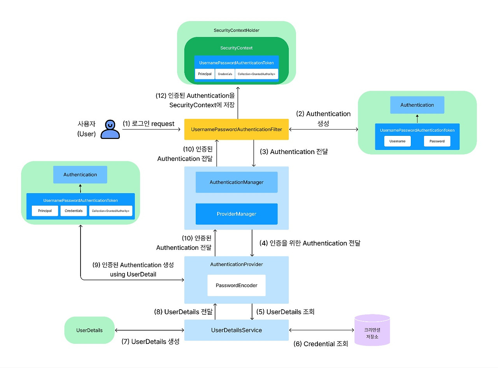

#  스프링 시큐리티 Username/Password 인증
가장 일반적인 사용자 인증 방법 중 하나는 **사용자 이름(username)** 과 **비밀번호(password)** 를 검증하는 것이다.
Spring Security는 **사용자 이름과 비밀번호를 이용한 인증을 포괄적으로 지원**한다.


## 1. 주요 API
| API / 클래스명 | 설명 |
|---|---|
| **`UsernamePasswordAuthenticationFilter`** | 사용자가 로그인 폼을 통해 제출한 `username`과 `password`를 처리하는 필터. `/login` 요청을 가로채어 인증 처리 흐름을 시작함.|
| **`UsernamePasswordAuthenticationToken`** | 인증 요청 시 사용되는 `Authentication` 구현체. 인증 전/후 상태를 담으며, 인증 전에는 비밀번호만 있고, 인증 후에는 `UserDetails` 포함됨.|
| **`AuthenticationManager`** | 인증을 수행하는 핵심 인터페이스. 내부적으로 하나 이상의 `AuthenticationProvider`에 인증 요청을 위임.|
| **`DaoAuthenticationProvider`** | `AuthenticationProvider`의 기본 구현체. `UserDetailsService`를 통해 사용자 정보를 조회하고, `PasswordEncoder`를 이용하여 비밀번호를 검증. |
| **`UserDetailsService`** | 사용자 정보를 로드하는 인터페이스. `loadUserByUsername(String username)` 메서드를 구현해야 하며, `UserDetails` 객체를 반환.|
| **`UserDetails`** | 인증된 사용자 정보를 담는 인터페이스. 권한, 계정 상태, 비밀번호, 사용자명 등을 포함.|
| **`SecurityContextHolder`**| 인증된 사용자의 `Authentication` 객체를 저장하고, 애플리케이션 전반에서 접근할 수 있도록 해주는 저장소 역할.|
| **`PasswordEncoder`** | 비밀번호 암호화 및 비교를 위한 인터페이스. 대표 구현체는 `BCryptPasswordEncoder`. |
| **`SecurityFilterChain`** | Spring Security 필터 체인을 구성하는 설정 클래스. 인증/인가 규칙, 필터 추가, 로그인/로그아웃 정책을 정의.|

- 인증처리 구현을 위해서 **`UserDetailsService`** 와 **`UserDetails`** 를 구현한다.

## 2. 인증 흐름 


  1. 사용자가 로그인을 하기 위해 아이디와 패스워드를 포함한 요청(request)을 보낸다. 사용자 로그인 요청이 들어오면 `UsernamePasswordAuthenticationFilter`가 해당 요청을 전달받는다.
  2. `UsernamePasswordAuthenticationFilter`는 전달받은 Username과 Password를 이용하여 `UsernamePasswordAuthenticationToken`을 생성한다. `UsernamePasswordAuthenticationToken`은 `Authentication` 인터페이스의 구현체이다. 이때 `Authentication`은 아직 인증이 되지 않은 `Authentication`이다.
  3. `UsernamePasswordAuthenticationFilter`는 `Authentication`을 `AuthenticationManager`에 전달한다. `AuthenticationManager`는 인증 처리를 총괄하는 역할을 하는 인터페이스이다. `AuthenticationManager`의 구현체는 `ProviderManager` 클래스이다.
  4. `ProviderManager`는 `AuthenticationProvider`에게 `Authentication`을 전달한다. `UserDetails`는 데이터베이스 등의 저장소에 저장된 Username과 사용자의 크리덴셜(Credential)인 Password, 사용자의 권한 정보를 포함하고 있는 컴포넌트이다.
  5. `AuthenticationProvider`는 `UserDetailsService`를 이용하여 UserDetails를 조회한다.
  6. `UserDetailsService`는 데이터베이스 등의 저장소에서 사용자의 크리덴셜을 포함한 사용자의 정보를 조회한다.
  7. 데이터베이스 등의 저장소에서 조회한 사용자의 크리덴셜을 포함한 사용자의 정보를 기반으로 `UserDetails`를 생성한다.
  8. 생성된 `UserDetails`를 `AuthenticationProvider`에게 전달한다.
  9. `UserDetails`를 전달받은 `AuthenticationProvider`는 `PasswordEncoder`를 이용해 `UserDetails`에 포함된 암호화된 Password와 인증을 위한 `Authentication` 안에 포함된 Password가 일치하는지 검증한다. 검증에 성공하면 `UserDetails`를 이용해 인증된 `Authentication`을 생성한다. 검증에 성공하지 못하면 Exception을 발생시키고 인증 처리를 중단한다.
  10. `AuthenticationProvider`는 인증된 `Authentication`을 P`roviderManager`에게 전달한다. 이때 `Authentication`은 인증에 성공한 사용자 정보(`Principal`, `Credential`, `GrantedAuthorities`)를 가지고 있다.
  11. `ProviderManager`는 인증된 `Authentication`을 `UsernamePasswordAuthenticationFilter`에게 전달한다.
  12. 마지막으로 `UsernamePasswordAuthenticationFilter`는 `SecurityContextHolder`를 이용하여 `SecurityContext`에 인증된 `Authentication`을 저장한다.

## 3. 주요 구현 클래스 

### `SecurityUser` <- `UserDetails` 인터페이스 구현
```java
@Getter
public class SecurityUser implements UserDetails {
    private final User user;

    public SecurityUser(User user) {
        this.user = user;
    }

    @Override
    public Collection<? extends GrantedAuthority> getAuthorities() {
        return Collections.singletonList(new SimpleGrantedAuthority("ROLE_USER"));
    }

    @Override
    public String getPassword() {
        return user.getPassword();
    }

    @Override
    public String getUsername() {
        return user.getUsername();
    }

    @Override
    public boolean isAccountNonExpired() {
        return true;
    }

    @Override
    public boolean isAccountNonLocked() {
        return true;
    }

    @Override
    public boolean isCredentialsNonExpired() {
        return true;
    }

    @Override
    public boolean isEnabled() {
        return "N".equals(user.getIsDeleted());
    }
} 
```

### `CustomUserDetailsService` <- `UserDetailsService` 인터페이스 구현
```java
@Service
@RequiredArgsConstructor
public class CustomUserDetailsService implements UserDetailsService {
    
    private final UserService userService;
    
    @Override
    public UserDetails loadUserByUsername(String username) throws UsernameNotFoundException {
        User user = userService.findByUsername(username);
        if (user == null) {
            throw new UsernameNotFoundException("사용자를 찾을 수 없습니다: " + username);
        }
        return new SecurityUser(user);
    }
} 
```

### `SecurityConfig`
```java
@Configuration
@EnableWebSecurity
public class SecurityConfig {

    @Bean
    public SecurityFilterChain securityFilterChain(HttpSecurity http) throws Exception {
        http
        	.csrf(AbstractHttpConfigurer::disable)
            .authorizeHttpRequests(auth -> auth
            	.dispatcherTypeMatchers(DispatcherType.FORWARD).permitAll()
                .requestMatchers("/", "/register", "/login").permitAll()
                .requestMatchers("/resources/**").permitAll()
                .anyRequest().authenticated()
            )
            .formLogin(form -> form
                .loginPage("/login")
                .defaultSuccessUrl("/")
                .permitAll()
            )
            .logout(logout -> logout
                .logoutSuccessUrl("/")
                .permitAll()
            );
        
        return http.build();
    }

    @Bean
    public PasswordEncoder passwordEncoder() {
        return new BCryptPasswordEncoder();
    }
} 
```

### `AuthController`
```java
@Controller
@RequiredArgsConstructor
public class AuthController {
    
    private final UserService userService;
    
    @GetMapping("/register")
    public String registerForm(Model model) {
        model.addAttribute("user", new User());
        return "user/register";
    }
    
    @PostMapping("/register")
    public String register(@Valid @ModelAttribute User user) {
        userService.register(user);
        return "redirect:/login";
    }
    
    @GetMapping("/login")
    public String loginForm() {
        return "user/login";
    }
} 
```

### `header.jsp`
```html
<%@ page language="java" contentType="text/html; charset=UTF-8" pageEncoding="UTF-8"%>
<%@ taglib prefix="c" uri="http://java.sun.com/jsp/jstl/core" %>
<%@ taglib prefix="fmt" uri="http://java.sun.com/jsp/jstl/fmt" %>
<%@ taglib prefix="sec" uri="http://www.springframework.org/security/tags" %>
<!DOCTYPE html>
<html>
<head>
    <meta charset="UTF-8">
    <meta name="viewport" content="width=device-width, initial-scale=1">
    <title>게시판</title>
    <link href="https://cdn.jsdelivr.net/npm/bootstrap@5.3.0/dist/css/bootstrap.min.css" rel="stylesheet">
</head>
<body>
    <nav class="navbar navbar-expand-lg navbar-dark bg-dark">
        <div class="container">
            <a class="navbar-brand" href="/">홈</a>
            <button class="navbar-toggler" type="button" data-bs-toggle="collapse" data-bs-target="#navbarNav">
                <span class="navbar-toggler-icon"></span>
            </button>
            <div class="collapse navbar-collapse" id="navbarNav">
                <ul class="navbar-nav me-auto">
                    <li class="nav-item">
                        <a class="nav-link" href="/posts">게시판</a>
                    </li>
                </ul>
                <ul class="navbar-nav">
                    <sec:authorize access="isAnonymous()">
                        <li class="nav-item">
                            <a class="nav-link" href="/login">로그인</a>
                        </li>
                        <li class="nav-item">
                            <a class="nav-link" href="/register">회원가입</a>
                        </li>
                    </sec:authorize>
                    <sec:authorize access="isAuthenticated()">
                        <li class="nav-item">
                            <form action="/logout" method="post" class="d-inline">
                                <button type="submit" class="btn btn-link nav-link">로그아웃</button>
                            </form>
                        </li>
                    </sec:authorize>
                </ul>
            </div>
        </div>
    </nav>
    <div class="container mt-4"> 
```

### `register.jsp`
```html
<%@ page language="java" contentType="text/html; charset=UTF-8" pageEncoding="UTF-8"%>
<%@ include file="../common/header.jsp" %>

<div class="row justify-content-center">
    <div class="col-md-6">
        <div class="card">
            <div class="card-header">
                <h3 class="text-center">회원가입</h3>
            </div>
            <div class="card-body">
                <form action="/register" method="post">
                    <div class="mb-3">
                        <label for="username" class="form-label">아이디</label>
                        <input type="text" class="form-control" id="username" name="username" required>
                    </div>
                    <div class="mb-3">
                        <label for="password" class="form-label">비밀번호</label>
                        <input type="password" class="form-control" id="password" name="password" required>
                    </div>
                    <div class="mb-3">
                        <label for="name" class="form-label">이름</label>
                        <input type="text" class="form-control" id="name" name="name" required>
                    </div>
                    <div class="mb-3">
                        <label for="email" class="form-label">이메일</label>
                        <input type="email" class="form-control" id="email" name="email" required>
                    </div>
                    <div class="d-grid">
                        <button type="submit" class="btn btn-primary">가입하기</button>
                    </div>
                </form>
            </div>
        </div>
    </div>
</div>

<%@ include file="../common/footer.jsp" %> 
```

### `login.jsp`
```html
<%@ page language="java" contentType="text/html; charset=UTF-8" pageEncoding="UTF-8"%>
<%@ include file="../common/header.jsp" %>

<div class="row justify-content-center">
    <div class="col-md-6">
        <div class="card">
            <div class="card-header">
                <h3 class="text-center">로그인</h3>
            </div>
            <div class="card-body">
                <form action="/login" method="post">
                    <div class="mb-3">
                        <label for="username" class="form-label">아이디</label>
                        <input type="text" class="form-control" id="username" name="username" required>
                    </div>
                    <div class="mb-3">
                        <label for="password" class="form-label">비밀번호</label>
                        <input type="password" class="form-control" id="password" name="password" required>
                    </div>
                    <div class="d-grid">
                        <button type="submit" class="btn btn-primary">로그인</button>
                    </div>
                </form>
            </div>
        </div>
    </div>
</div>

<%@ include file="../common/footer.jsp" %> 
```

### `PostController`
```java
@Controller
@RequestMapping("/posts")
@RequiredArgsConstructor
public class PostController {
    
    private final PostService postService;
    private final UserService userService;
    
    @GetMapping
    public String list(@RequestParam(required = false) String search,
                      @RequestParam(defaultValue = "1") int page,
                      @RequestParam(defaultValue = "10") int size,
                      Model model) {
        model.addAttribute("posts", postService.findAll(search, page, size));
        model.addAttribute("totalCount", postService.getTotalCount(search));
        model.addAttribute("search", search);
        model.addAttribute("currentPage", page);
        return "post/list";
    }
    
    @GetMapping("/{postNo}")
    public String view(@PathVariable Integer postNo, Model model) {
        model.addAttribute("post", postService.findByPostNo(postNo));
        return "post/view";
    }
    
    @GetMapping("/new")
    public String createForm(Model model) {
        model.addAttribute("post", new Post());
        return "post/form";
    }
    
    @PostMapping
    public String create(@Valid @ModelAttribute Post post,
                        @AuthenticationPrincipal UserDetails userDetails) {
        User user = userService.findByUsername(userDetails.getUsername());
        post.setUserNo(user.getUserNo());
        postService.create(post);
        return "redirect:/posts";
    }
    
    @GetMapping("/{postNo}/edit")
    public String editForm(@PathVariable Integer postNo, Model model) {
        model.addAttribute("post", postService.findByPostNo(postNo));
        return "post/form";
    }
    
    @PostMapping("/{postNo}")
    public String update(@PathVariable Integer postNo,
                        @Valid @ModelAttribute Post post) {
        post.setPostNo(postNo);
        postService.update(post);
        return "redirect:/posts/" + postNo;
    }
    
    @PostMapping("/{postNo}/delete")
    public String delete(@PathVariable Integer postNo) {
        postService.delete(postNo);
        return "redirect:/posts";
    }
} 
```