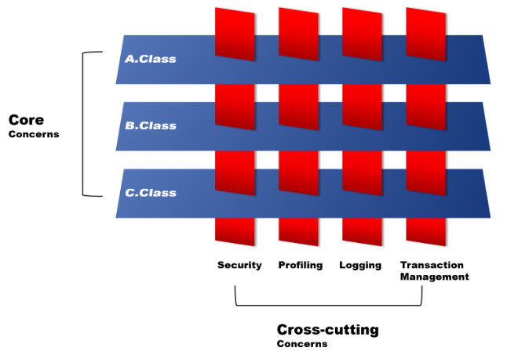

# AOP

Spring AOP(Aspect-Oriented Programming, 관점 지향 프로그래밍)는 **애플리케이션에서 핵심 기능과 공통 기능을 분리하여 모듈화하는 프로그래밍 기법**이다. 로깅, 보안, 트랜잭션 처리, 예외 처리처럼 여러 객체에서 공통적으로 필요한 기능을 **핵심 비즈니스 로직과 분리하여 재사용 가능하도록 만든 것**이 AOP다.

## AOP란 무엇인가?

**관점 (Aspect)** 은 객체 지향 프로그래밍에서 분리하기 어려운 **횡단 관심사**를 **독립적인 단위로 분리하여 모듈화**한 것이다.

### 관심의 분리(Separation of Concerns)

AOP에서는 프로그램을 관심사(Concerns)를 기준으로 **핵심 관심사와 횡단 관심사**로 구분한다.

- 핵심 관심사 (Core Concerns) : 프로그램의 핵심 가치와 목적이 그대로 드러난 관심 영역을 뜻한다.
- 횡단 관심사 (Cross-cutting Concerns) : 비즈니스 기능과 다른 관심 영역을 뜻한다. 

#### 대표적인 횡단 관심사
- 횡단 관심사는 보안, 로깅, 트랜잭션 처리 기능이다. 
- 보안, 로깅, 트랜잭션은 비즈니스 기능을 아니지만만, 요구 사항에 따라서 다수의 비즈니스 기능에 포함되는 부가 기능들이다.
  

- 횡단 관심사는 비즈니스 기능과는 별개의 영역이지만 필연적으로 대다수의 비즈니스 기능에 분포되어 있다.
- 이러한 관계는 비즈니스 기능 상에서 많은 부분에 서로 엉켜져 있어 가독성을 떨어트리고 자칫 중복된 코드가 생겨날 가능성이 크다. 이는 비즈니스 기능의 모듈성을 감소시키는 가장 큰 요인이다.

### AOP의 필요성
- AOP는 분리된 횡단 관심사를 `Aspect`라는 모듈 형태로 만들어서 설계하고 개발을 한다.
- Aspect 모듈에는 부가 기능(횡단 관심사)을 내포하고 있으며 자체적으로 부가 기능을 여러 객체의 핵심기능에 교차로 적용을 시켜주기 때문에  횡단 관심사 모듈을 효율적으로 관리할 수 있다.

- OOP는 핵심 관심사의 모듈화에 사용되고, AOP는 횡단 관심사의 모듈화에 사용된다.
- 절대 OOP보다 AOP가 좋은 프로그래밍이 아니라 서로 다른 프로그래밍이다.

## AOP 용어와 동작

### AOP 핵심 용어

#### Aspect(공통 관심사)
- **여러 클래스에 걸쳐 있는 공통 관심사(Cross-Cutting Concern)를 모듈화한 것**이다.
- 핵심 비즈니스 로직과는 별도로 적용되어야 하는 공통 기능(ex. 로깅, 트랜잭션, 보안 등)을 모듈로 정의한 것이다.
- 하나의 클래스에 여러 Advice를 포함할 수 있으며, @Aspect 어노테이션을 통해 지정한다.

#### Advice (실행할 코드)
- **공통 기능을 정의하는 코드 블록**이다.
- 언제, 무엇을 실행할지 정의한다.
- 종류

    | 종류 | 설명 |
    |---|---|
    | `@Before` | 대상 메소드 실행 전에 실행된다. |
    | `@After` | 대상 메소드 실행 후 항상 실행된다. (성공, 예외 상관없이 실행됨) |
    | `@AfterReturning` | 대상 메소드가 정상적으로 실행된 후 실행된다. |
    | `@AfterThrowing` | 대상 메소드에서 예외 발생시 실행된다. |
    | `@Around` | 대상 메소드 실행 전/후에 사용자 지정 동작을 수행할 수 있다. |

#### Join Point (적용 지점)
- **Advice가 적용될 수 있는 실행 지점**이다.
- Spring AOP에서는 **메소드 실행 시점**이 Join Point다.

#### Pointcut (Advice 적용 조건)
- **어떤 Join Point에 Advice를 적용할지를 지정하는 표현식**이다.
- Advice는 Pointcut 표현식과 연결되며, Pointcut과 매칭되는 모든 Join Point에서 실행된다.

#### Target Object (대상 객체)
- **Advice가 적용될 실제 비즈니스 로직 구현 객체**다.
- Spring AOP는 런타임 프록시를 사용함으로 이 객체는 AOP 프록시에 의해 감싸져 실행된다.

#### Weaving (위빙)
- **Advice와 핵심 비즈니스 로직(Target Object)을 연결하는 과정**이다.
- Aspect(공통 관심사, Advice)를 핵심 코드에 적용하는 과정이다.
- Spring AOP는 **런타임 프록시 객체**를 통해 위빙을 수행한다.

#### AOP Proxy (대리 객체)
- **Spring AOP가 Advice를 적용하기 위해 생성한 객체**다.
- Target 객체를 감싸고 있는 객체다.
- Advice를 실행한 후, 실제 대상 객체의 메소드를 호출한다.

### AOP 용어와 동작

#### 핵심 관심사 영역

- **Target Object**
  - `Target Object`는 횡단 기능(`Advice`)이 적용될 객체를 말한다.
  - `Target Object`는 핵심 모듈(비즈니스 클래스)이라 할 수 있다.
  - Spring AOP에서는 실제 적용할 객체 대산 `Runtime Proxy`를 사용하여 구현하기 때문에, `Target Object`는 항상 `Proxy Object`다.
- **Join Point**
  
    

  - `Join Point`는 `Target Object`안에서 횡단 기능(`Advice`)가 적용될 수 있는 여러 위치를 뜻한다.
  - `Join Point`는 아래와 같은 여러 시점이 횡단 기능이 적용될 수 있는 위치다.
    - 프로그램 실행
    - 예외발생
    - 필드(Attribute) 수정
    - 객체 생성
    - 메소드 호출 
  - Spring AOP는 **메소드 호출** 시점 Join Point만 지원한다.

#### 횡단 관심사 영역
- **Aspect**
  - AOP는 횡단 관심사를 Aspect라는 모듈을 기반으로 모듈화한다.
  - Spring AOP에서 제공하는 `@Aspect` 어노테이션을 통한 구현 방식은 AspectJ보다 쉬운 설정과 클래스로 구현할 수 있다.
  - Spring AOP에서는 **XML (스키마 기반)** 과 **@AspectJ (어노테이션 기반)** 2가지 방식으로 Aspect를 구현한다.

- **Advice**
  - `Advice`는 Join Point에 적용할 공통 기능(횡단 기능)이다.

    

  - Spring AOP의 Join Point와 횡단 코드의 각기 다른 결합점을 제어할 수 있도록 다양한 Advice를 제공한다.
  
    

- **Pointcut**
  - Pointcut은 여러 Join Point 중에서 Advice를 적용할 Joint Point를 지정하는 표현식이다.
  
    

  - Advice는 여러 JoinPoint중에서 Pointcut의 표현식에 명시된 JoinPoint에서 실행된다.
  - Pointcut 표현식과 일치하는 JoinPoint를 실행한다는 개념은 AOP의 핵심이다.
  - Spring AOP에선 Pointcut과 Advice를 합쳐 `Advisor`라 불린다. Spring AOP은 기본적으로 AspectJ Pointcut 언어를 사용한다.

#### AOP Proxy

- Proxy는 “대신 일을 하는 사람”이라는 사전적 의미를 가지고 있다. `AOP Proxy`는 Aspect를 대신 수행하기 위해 AOP 프레임워크에 의해 생성된 객체(Object)이다.
- Spring을 포함한 많은 AOP 프레임워크에선 핵심 관심 코드에 직접적인 Aspect를 하지 않고 Proxy Object를 활용하여 Aspect를 한다.
- 횡단 관심 객체와 핵심 관심 객체의 느슨한 결합 구조를 만들고, 필요 여부에 따라 부가 기능을 탈 부착하기 용이하게 해준다.
- Spring을 포함하여 대부분 AOP 프레임워크에서 Proxy를 사용하여 동적으로 Advice하기 위해 Java에서 제공해주는 `java.lang.reflect.Proxy`을 사용하여 Proxy 객체를 동적으로 생성해준다.

#### 관심사의 교차

AOP는 특정 JoinPoint에 Advice하여 핵심기능과 횡단기능이 교차하여 새롭게 생성된 객체를 프로세스에 적용하는 일련의 모든 과정을 `Weaving`라 한다.

- **Weaving**

  - Spring AOP는 Dynamic Proxy 기반으로 기본적으로 RTW(Run-Time Weaving)를 사용한다. Spring AOP의 Weaving의 방식은 AspectJ에 비해 가볍지만, 대부분 기능을 구현할 수 있다.
  