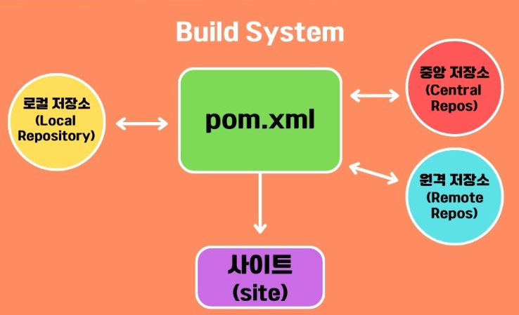

# Maven

**Maven**은 **Java 기반 프로젝트의 빌드(build), 관리(manage), 배포(deploy)를 자동화**하는 강력할 **프로젝트 관리 도구 (Project Management Tool)** 다.

- Maven은 
  - 소스 코드를 컴파일하고 패키징하는 빌드 도구다.
  - **프로젝트 생명주기 (lifecycle)** 관리
  - **의존성 (dependency)** 관리
  - **플러그인 (plugin)** 기반 확장
  - **배포(Deploy) 관리**
  - **소프트웨어 개발의 전 과정을 체계화하고 자동화**한다.

## 특징

### 1. POM(Project Object Model) 기반 구성



```xml
<project>
    <modelVersion>4.0.0</modelVersion> <!-- POM 버전 -->
    <groupId>com.example</groupId>     <!-- 조직(회사, 도메인) -->
    <artifactId>myapp</artifactId>     <!-- 프로젝트명 -->
    <version>1.0.0</version>            <!-- 버전 -->
    <packaging>jar</packaging>          <!-- 패키징 타입 (jar, war 등) -->

    <dependencies>                     <!-- 의존성 목록 -->
        <dependency>
            <groupId>org.springframework</groupId>
            <artifactId>spring-context</artifactId>
            <version>5.3.27</version>
        </dependency>
    </dependencies>

    <build>                             <!-- 빌드 관련 설정 -->
        <plugins>
            <plugin>
                <groupId>org.apache.maven.plugins</groupId>
                <artifactId>maven-compiler-plugin</artifactId>
                <version>3.10.1</version>
                <configuration>
                    <source>17</source>
                    <target>17</target>
                </configuration>
            </plugin>
        </plugins>
    </build>
</project>

```

- Maven은 프로젝트에 필요한 설정 정보를 **프로젝트 객체 (Project Object)라는 개념으로 모델링하여 관리**한다.
- 프로젝트 객체 정보는 **Project Object Model (POM) 파일인 pom.xml에 작성**된다.
- 버전, 빌드 환경, 라이브러리 저장소, 사용할 라이브러리 의존성 등과 같은 모든 설정 정보를 포함한다.
- Maven은 빌드와 관련된 설정을 모두 pom.xml 파일에 정의하면 필요한 작업을 자동으로 처리한다.

### 2. 표준화된 프로젝트 구조

```css
myapp/
 ├── src/
 │    ├── main/
 │    │    ├── java/           (애플리케이션 Java 소스 코드)
 │    │    └── resources/      (프로퍼티 파일, 설정 파일 등)
 │    └── test/
 │         ├── java/           (JUnit 테스트 코드)
 │         └── resources/      (테스트용 리소스 파일)
 ├── target/                   (빌드 결과물 생성 디렉터리)
 └── pom.xml                   (프로젝트 설정 파일)

```

- Maven은 디렉토리 구조를 표준화하여, 모든 Maven 프로젝트가 비슷한 형태를 갖게 합니다.
- **Maven은 빌드도구이지만 설정파일에 소스 파일의 위치나 컴파일한 결과를 저장할 Target 폴더의 위치를 지정하지 않는다.**
- 미리 정해둔 **관습** 의거해서 **어디에 소스 파일이 위치할 것인지 어디에 컴파일한 파일을 만들것인지를 미리 정해두고** 그 위치에 소스파일이 있으면 **그것을 근거로 빌드(컴파일) 작업을 진행**한다.
- Maven의 이런 특징 즉, 설정보다는 관습을 기반으로 동작하는 특징을 가리켜서 **CoC(Convention over Configuration)** 이라고 한다.

#### archetype

- **Maven Archetype**은 **새로운 Maven 프로젝트를 빠르고 표준화된 형태로 생성하기 위한 템플릿 시스템**이다.
- Maven Archetype는
  - 프로젝트 뼈대(skeleton) 를 자동으로 만들어주는 템플릿이다.
  - 코드, 디렉토리 구조, 기본 pom.xml, 설정파일 등을 초기 생성해준다.
  - 일관된 프로젝트 구조를 유지하게 하고, 개발 생산성과 품질을 높이는 데 필수적입니다.
- 사용이유
  - 표준화된 프로젝트 구조를 강제할 수 있다.
  - 복잡한 설정 없이 프로젝트의 기본 뼈대를 빠르게 생성할 수 있다.
  - 디렉토리/파일 누락 같은 실수를 방지할 수 있다.
  - 기업 내부 표준에 맞는 고유 템플릿 제작이 가능하다.
- 대표적인 Archetype 종류
  
  | 이름 | 설명 |
  |---|---|
  | `maven-archetype-quickstart` | 가장 기본적인 Java 애플리케이션 템플릿 |
  | `maven-archetype-webapp` | 웹 애플리케이션 템플릿 |
- `maven-archetype-quickstart`로 프로젝트 만들기
  ```bash
  mvn archetype:generate 
    -DgroupId=com.example 
    -DartifactId=demo 
    -DarchetypeArtifactId=maven-archetype-quickstart 
    -DinteractiveMode=false
  ```

### 3. 의존성(Dependency) 관리
- 필요한 라이브러리를 수동으로 다운로할 필요없이, POM에 정의만 화면 Maven이 자동을 내려받아 프로젝트에 추가한다.
- Maven은 전이적 의존성 관리까지 지원한다.
- 예시
    ```xml
    <dependencies>
        <dependency>
            <groupId>org.springframework</groupId>
            <artifactId>spring-context</artifactId>
            <version>5.3.27</version>
        </dependency>
    </dependencies>
    ```
    - Maven은 `spring-context`가 필요로 하는 다른 라이브러리(전이적 의존성, transitive dependencies)도 자동으로 설치한다.
    - `spring-context`는 단독으로 설치되지 않고, **spring-core, spring-beans, spring-aop, spring-expression, spring-jcl** 등의 라이브러리가 **자동으로 함께 설치**된다.
    - maven dependency tree
        ```csharp
        [INFO] +- org.springframework:spring-context:jar:5.3.27:compile
        [INFO] |  +- org.springframework:spring-aop:jar:5.3.27:compile
        [INFO] |  |  +- org.springframework:spring-beans:jar:5.3.27:compile
        [INFO] |  |  |  \- org.springframework:spring-core:jar:5.3.27:compile
        [INFO] |  |  |     \- org.springframework:spring-jcl:jar:5.3.27:compile
        [INFO] |  +- org.springframework:spring-beans:jar:5.3.27:compile
        [INFO] |  +- org.springframework:spring-core:jar:5.3.27:compile
        [INFO] |  +- org.springframework:spring-expression:jar:5.3.27:compile
        [INFO] |  |  \- org.springframework:spring-core:jar:5.3.27:compile
        ```

### 4. 빌드 라이프사이클(Build Lifecycle) 관리
- Maven 라이프사이클이란, **프로젝트를 빌드(Build)하고, 테스트(Test)하고, 배포(Deploy)하는 과정을 일련의 규칙과 단계로 정의한 것** 이다.
- Maven은 프로젝트 빌드 과정을 **라이프사이클(Lifecycle) -> 페이즈(Phase) -> 골(Goal)** 구조로 체계화하여 자동화한다.

    | 구분 | 개념 | 관계 |
    |---|---|---|
    | **Lifecycle** | 프로젝트 전체 빌드 흐름을 정해놓은 것 | 여러 Phase를 포함 |
    | **Phase** | 빌드 작업의 논리적 단계 (예: complie, package) | 여러 Goal를 실행 |
    | **Goal** | Maven 플러그인에 의해 실제로 특정 작업을 수행하는 하나의 작업 단위 | 플러그인의 기능 |
  - Lifecycle은 여러 Phase의 모임이다.
  - 각 Phase는 실제로 하나 이상의 Goal을 실행하여 작업을 수행한다.

#### 라이프사이클(Lifecycle)
- **Lifecycle**는 **프로젝트를 빌드하고 배포하기 위한 전체 흐름(프로세스 집합)** 이다.
- Maven은 **3가지 표준 라이프사이클을 제공**이다.

| 라이프사이클 | 설명 |
|---|---|
| **clean** | 이전 빌드 결과물을 삭제한다. |
| **default (build)** | 소스코드 컴파일, 테스트, 패키징, 배포 등을 수행한다. |
| **site** | 프로젝트 문서 사이트를 생성하고 배포한다. |

#### 단계 (Phase)
- **Phase**는 **Lifecycle 안에 존재하는 빌드 작업의 논리적 단계**입니다.
- 각 라이프사이클은 여러 단계(Phase) 로 세분화되어 있습니다. Maven은 지정한 Phase까지 자동으로 이전 단계를 모두 실행합니다.

1. clean 라이프사이클 단계
    
    | 단계(Phase) | 설명 
    |---|---|
    | pre-clean | Clean 전 작업 (필요 시) |
    | **clean** | 기존 빌드 산출물 제거 |
    | post-clean | Clean 후 작업 (필요 시) |

2. default (build) 라이프사이클 단계
    
    | 단계(Phase) | 설명 |
    |---|---|
    | validate | 프로젝트의 유효성 검사 (POM 검사 등) |
    | initialize |빌드 상태 초기화 (프로파일 설정 등) |
    | generate-sources | 소스 생성 (예: 코드 생성기) |
    | process-sources | 소스 가공 (필요 시) |
    | generate-resources | 리소스 생성 (예: 프로퍼티 파일) |
    | process-resources | 리소스 복사 및 필터링 (src/main/resources → target/classes) |
    | **compile** | Java 소스 컴파일 |
    | process-classes | 컴파일된 클래스 가공 |
    | generate-test-sources | 테스트 소스 생성 |
    | process-test-sources | 테스트 소스 가공 |
    | compile-test | 테스트 소스 컴파일 |
    | process-test-classes | 테스트 클래스 가공 |
    | **test** | JUnit 등의 단위 테스트 수행 |
    | prepare-package | 패키징 준비 (예: WAR 디렉터리 생성) |
    | **package** | 산출물 패키징 (JAR, WAR 생성) |
    | pre-integration-test | 통합 테스트 전 설정 |
    | integration-test | 통합 테스트 수행 (외부 시스템 연동 테스트) |
    | post-integration-test | 통합 테스트 후 정리 |
    | verify | 모든 테스트 결과 검증 |
    | **install** | 로컬 저장소(~/.m2/repository)에 설치 |
    | **deploy** | 원격 저장소(리포지토리 서버)에 배포 |

    - `mvn complie`을 입력하면 `validate` -> `initialize` -> `generate-source` -> ... -> `compile` 까지 순차적으로 실행된다.

3. site 라이프사이클 단계
   
    | 단계(Phase) | 설명 |
    |---|---|
    | pre-site | 사이트 생성 준비 |
    | site | 사이트 생성 |
    | post-site | 사이트 후처리 |
    | site-deploy | 사이트를 서버에 배포 |

#### 골(Goal)
- **Goal**은 **Maven 플러그인에 의해 실행되는 실제 작업 단위**이다.
- 예시
  - `maven-compiler-plugin:compile` → Java 소스 파일을 컴파일
  - `maven-surefire-plugin:test` → 단위 테스트 실행
  - `maven-install-plugin:install` → 산출물을 로컬 저장소에 복사

#### 실행 예시

```bash
# 기본 빌드 실행 (instal Phase를 실행함)
mvn install

# Goal 직접 실행 (플러그인:골)
mvn compiler:compile
# maven-compiler-plugin의 compile Goal만 실행함함 
```

### 5. 플러그인 기반 아키텍처

- Maven은 **플러그인 (Plugin)** 을 통해 빌드, 테스트, 배포, 문서화 등 **모든 작업을 수행**한다.
- 대표적인 플러그인
  
    | 플러그인 | 기능 |
    |---|---|
    | maven-compiler-plugin | Java 소스 컴파일 |
    | maven-surefire-plugin | 테스트 실행 |
    | maven-jar-plugin | JAR  파일 생성 |
    | maven-install-plugin | 로컬 저장소에 설치 |
    | maven-deploy-plugin | 원격 저장소에 배포 |

## pom.xml 파일

- `pom.xml` 파일은 **Maven 프로젝트의 핵심 파일**이다. 
- 프로젝트의 모든 것을 기술하는 **설계도이자 실행지침서**가 `pom.xml`이다.
- pom.xml 파일의 주요 정보
  - 프로젝트 **정보** (이름, 버전, 라이선스 등)
  - **빌드 설정** (컴파일러 버전, 빌드 프로필 등)
  - **외부 라이브러리** (dependency) 관리
  - **플러그인** 설정 (테스트, 패키징, 배포 등)
  - **모듈 구성** (다중 프로젝트 관리리)

### `pom.xml` 파일 기본 구조
```xml
<project xmlns="http://maven.apache.org/POM/4.0.0"
         xmlns:xsi="http://www.w3.org/2001/XMLSchema-instance"
         xsi:schemaLocation="http://maven.apache.org/POM/4.0.0 
                             http://maven.apache.org/xsd/maven-4.0.0.xsd">
                             
    <modelVersion>4.0.0</modelVersion>

    <groupId>com.example</groupId>
    <artifactId>demo-project</artifactId>
    <version>1.0.0</version>
    <packaging>jar</packaging>

    <name>Demo Project</name>
    <description>A simple Maven project example.</description>

    <properties>
        <java.version>17</java.version>
    </properties>

    <dependencies>
        <!-- 의존성 목록 -->
    </dependencies>

    <build>
        <plugins>
            <!-- 플러그인 목록 -->
        </plugins>
    </build>

</project>
```
주요 태그 설명

| 태그 | 설명 |
|---|---|
| `<project>` | 모든 `pom.xml`파일은 이 루트 태그로 시작한다. |
| `<modelVersion>` | 현재 사용중인 POM 모델의 버전이다. |
| `<groupId>` | 프로젝트 그룹 이름 (회사나 팀의 도메인) |
| `<artifactId>` | 실제 프로젝트 이름 |
| `<version>` | 프로젝트 버전 |
| `<packaging>` | 빌드 결과물 현태, 기본은 `jar`, 다른 옵션은 `war`, `pom`이 있다. |
| `<name>` | 프로젝트 이름 |
| `<description>` |  프로젝트 설명|
| `<properties>` | 전역 변수 설정, 여러 번 사용되는 값들을 변수처럼 선언한다. |
| `<dependencies>` | 프로젝트가 필요로 하는 라이브러리를 지정한다. |
| `<build>` | 빌드 시 필요한 설정 및 플러그인을 설정한다. |
| `<repositories>` | 외부 라이브러리 저장소를 명시 (필요한 경우) |
| `<pluginRepositories>` | 플러그인 저장소를 명시 (필요한 경우)|
| `<profiles>` | 빌드 시 서로 다른 환경을 적용할 수 있도록 설정한다. |

### Spring Boot 프로젝트의 `pom.xml` 예시

```xml
<project xmlns="http://maven.apache.org/POM/4.0.0"
         xmlns:xsi="http://www.w3.org/2001/XMLSchema-instance"
         xsi:schemaLocation="http://maven.apache.org/POM/4.0.0 
                             http://maven.apache.org/xsd/maven-4.0.0.xsd">
    
    <modelVersion>4.0.0</modelVersion>

    <groupId>com.example</groupId>
    <artifactId>springboot-todo</artifactId>
    <version>1.0.0</version>
    <packaging>jar</packaging>

    <name>Spring Boot Todo Application</name>
    <description>Todo List Application using Spring Boot</description>

    <parent>
        <groupId>org.springframework.boot</groupId>
        <artifactId>spring-boot-starter-parent</artifactId>
        <version>3.1.2</version>
    </parent>

    <properties>
        <java.version>17</java.version>
    </properties>

    <dependencies>
        <!-- Spring Web -->
        <dependency>
            <groupId>org.springframework.boot</groupId>
            <artifactId>spring-boot-starter-web</artifactId>
        </dependency>

        <!-- Lombok -->
        <dependency>
            <groupId>org.projectlombok</groupId>
            <artifactId>lombok</artifactId>
            <scope>provided</scope>
        </dependency>

        <!-- MySQL Connector -->
        <dependency>
            <groupId>com.mysql</groupId>
            <artifactId>mysql-connector-j</artifactId>
            <scope>runtime</scope>
        </dependency>

        <!-- MyBatis -->
        <dependency>
            <groupId>org.mybatis.spring.boot</groupId>
            <artifactId>mybatis-spring-boot-starter</artifactId>
            <version>3.0.3</version>
        </dependency>
    </dependencies>

    <build>
        <plugins>
            <!-- Spring Boot Plugin -->
            <plugin>
                <groupId>org.springframework.boot</groupId>
                <artifactId>spring-boot-maven-plugin</artifactId>
            </plugin>
        </plugins>
    </build>

</project>
```
- `<parent>` 태그를 통햇 **spring-boot-starter-parent**를 상속한다.
- `<dependencies>`에 피룡할 라이브러리를 추가한다.
- `<build>`에 `spring-boot-maven-plugin`을 등록해야 `.jar` 실행 파일 생성이 가능하다.
- **scope**의 종류

    | scope | 설명 | 예시 |
    |---|---|---|
    | compile (기본값) | 컴파일, 실행, 테스트 모두 필용 | Spring core |
    | provided | 컴파일 시 필요하지만 런타임에는 제공됨 | Servlet API |
    | runtime | 컴파일 시 필요없고 런타임에만 필요 | JDBC 드라이버 |
    | test | 테스트 코드 작성 시만 필요 | JUnit, Mockito |

## 결론
Maven은 단순한 빌드 도구를 넘어, **소프트웨어 개발 전체를 체계적으로 관리하는 강력한 플랫폼**이다.
- **POM 파일** 하나로 빌드, 의존성, 배포를 관리
- **표준 구조**로 협업과 유지보수 용이
- **의존성 자동 관리**로 개발 속도 향상
- **라이프사이클 체계**로 복잡한 빌드도 단순화
- **플러그인 아키텍처**로 무한한 확장성 보장