# EC2 인스턴스에 도메인 연결하기 (가비아 기준)

1. [가비아](https://www.gabia.com/)에서 도메인을 등록한다.

2. AWS의 "Route 53" 서비스에 접속한다.

3. "Route 53"의 메뉴에서 "호스팅 영역"을 선택한다.
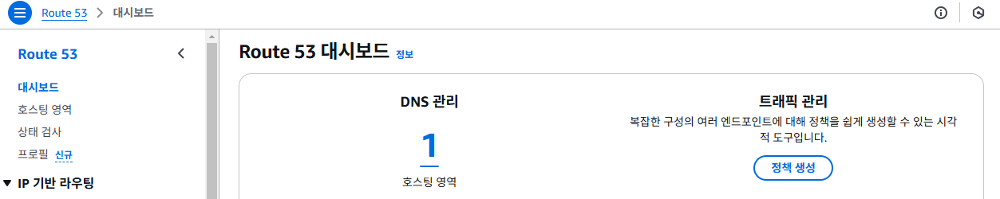

4. "호스팅 영역" 화면에서 "호스팅 영역 생성"버튼을 클릭한다.
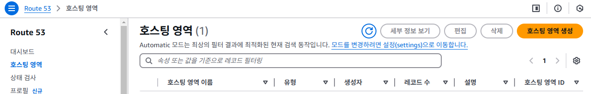

5. "호스팅 영역 생성" 화면에서 도메인 이름을 입력하고, "호스팅 영역 생성" 버튼을 클릭한다. 도메인 이름은 가비아에서 등록한 도메인 이름을 입력한다.
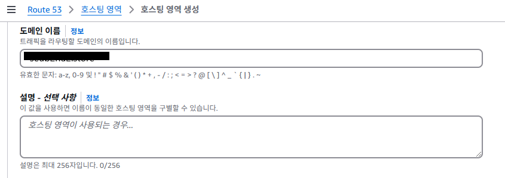

6. "호스팅 목록"에서 생성된 호스팅 영역을 확인한다.
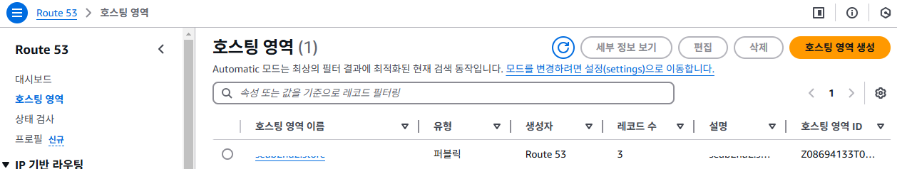

7. "호스팅 목록"에서 생성된 호스팅을 클릭해서 "호스팅 영역 세부 정보" 화면으로 이동한다.
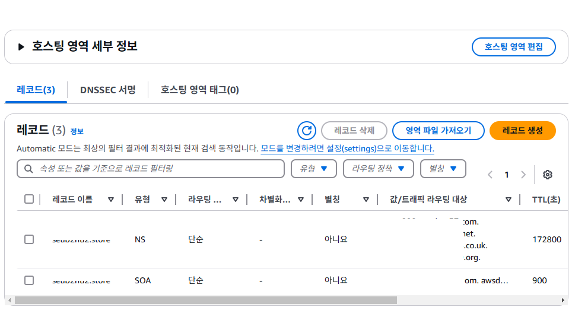

8. "호스팅 영역 세부 정보"의 레코드 중에서 아래의 정보를 복사한다.
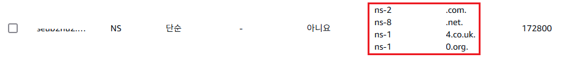

9. 가비아에 접속 -> My가비아 -> 서비스 관리를 클릭한다.

10. 서비스 관리에서 등록된 도메인을 확인하고 "관리" 버튼을 클릭한다.
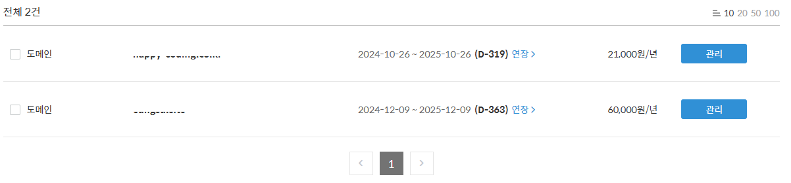

11. "도메인 정보" 조회 화면에서 네임서버 "설정"버튼을 클릭한다.
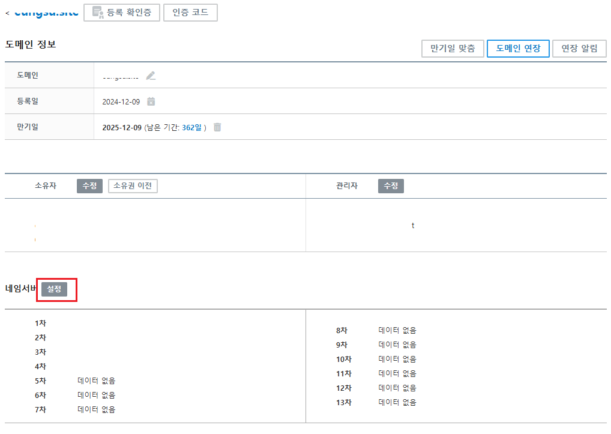

12. "네임서버"설정 화면의 각 입력필드에 8번 항목에서 복사한 값을 하나씩 입력한다. 입력할 때 주소 끝의 "."은 입력하지 않는다.
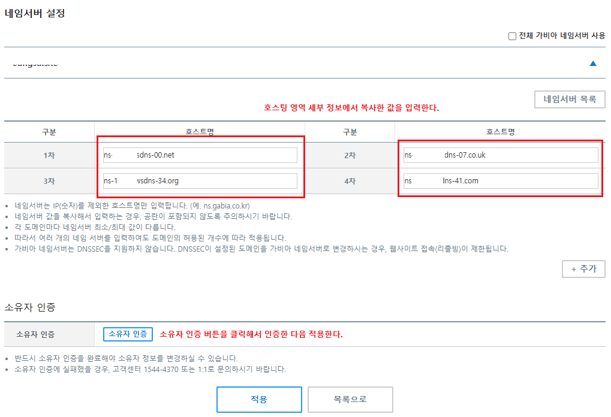

13. "호스팅 영역 세부 정보"에서 "레코드 생성"버튼을 레코드 생성 화면을 열고, 아래와 같이 정보를 입력하고, "레코드 생성"버튼을 클릭한다.
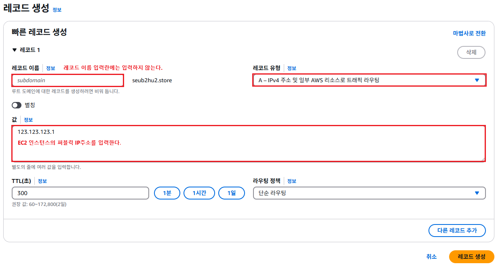

14. "호스팅 영역 세부 정보"의 레코드 목록에서 새로 추가된 레코드를 확인할 수 있다.
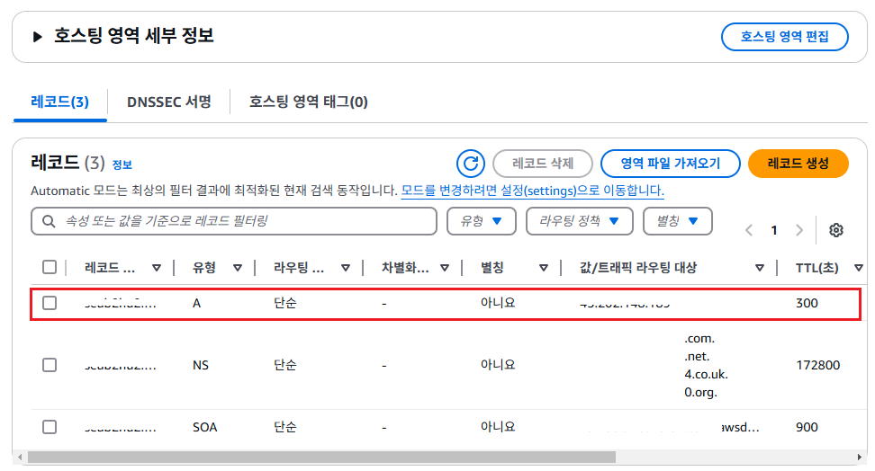

15. 도메인 연결 후 즉시 반영되지 않기 때문에, 1시간 혹은 2~3일 경과 후 도메인명으로 접속가능해 진다.
