# 배포하기

## EC2 설정하기
1. 이름 및 태그
   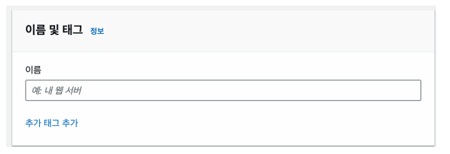

   - EC2 이름을 설정하는 곳이다.

2. Application and OS Images
   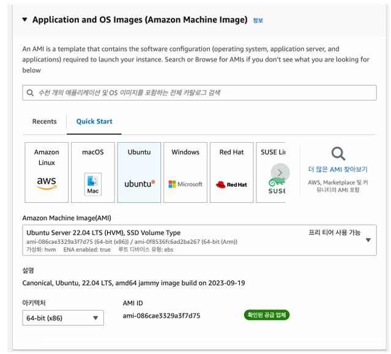

   - OS를 선택하는 단계다. Ubuntu를 선택한다.

3. 인스턴스 유형
   - 인스턴스 유형은 컴퓨터 사양을 의미한다. 프리티어에 해당하는 t2.micro를 사용한다.

4. 키 페어(로그인)
   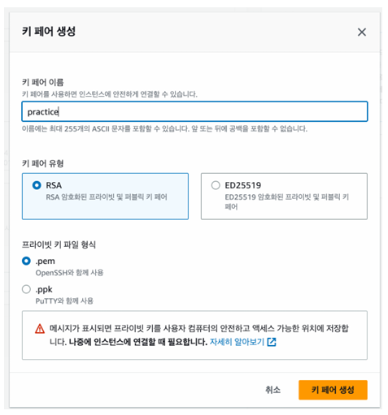

   - 키 페어는 EC2 컴퓨터에 접근할 때 사용하는 비밀번호다.
   - 키 페어 파일을 생성하면 파일이 하나 다운받아지는데, 잘 보관하자.
  
5. 네트워크 설정
   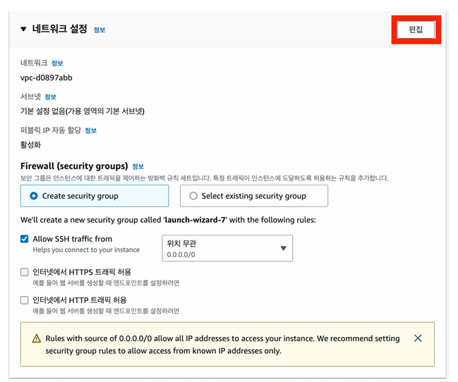
   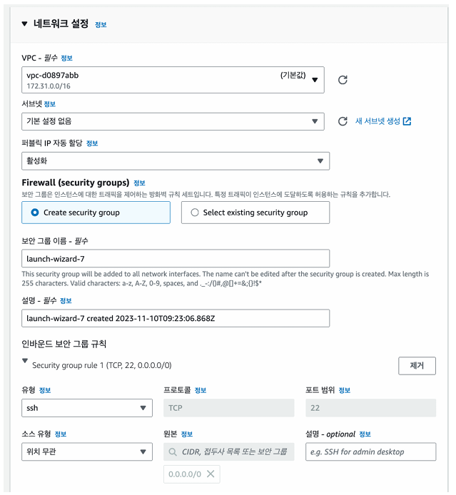

   - 네트워크 설정은 기본값을 그대로 사용한다.
  
6. 보안 그룹 설정
   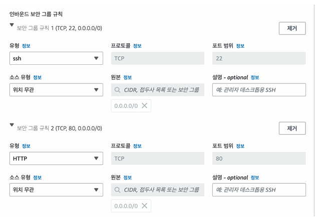

   - 보안 그룹은  AWS 클라우드에서의 네트워크 보안이다.
   - 인바운드 트래픽: 외부에서 EC2 인스턴스로 보내는 트래픽
   - 아웃바운드 트래픽: EC2 인스턴에서 외부로 나가는 트래픽
   - 보안 그룹을 설정할 때는 허용할 IP 범위와 port를 설정할 수 있다.
   - 외부에서 EC2로 접근할 포트는 22번 포트와 80번 포트라고 생각해서 인바운드 보안 그룹을 추가했다. 22번 포트는 우리가 EC2에 원격 접속할 때 사용하는 포트이고, 80번 포트는 백엔드 웹서버가 사용할 포트다.
  
7. 스토리지 구성
   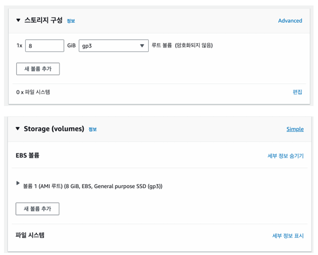
   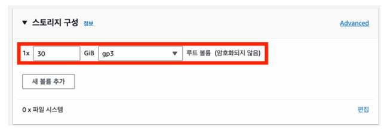
   
   - EBS는 EC2가 사용하는 저장공간이다.
   - gp3가 가장 가성비가 우수하다. 프리티어는 30GiB까지 사용가능하다.
   
8. 생성된 인스턴스 세부정보 확인하기
   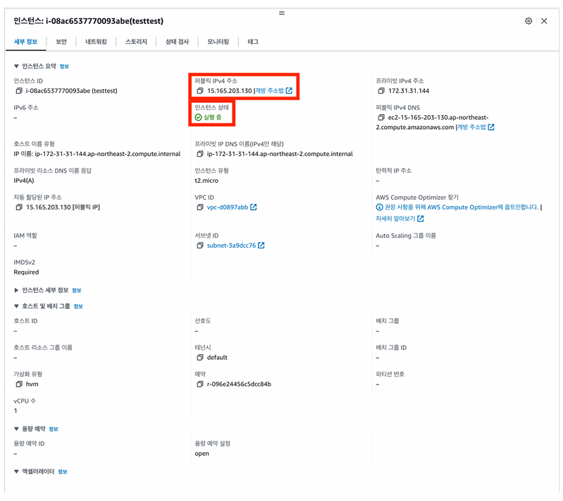
   
   - 세부정보에서 확인할 것은 퍼블릭 IPv4주소와 인스턴스 상태다.
   - 퍼블릭 IPv4 주소는 EC2 인스턴스가 생성되면서 부여받은 IP 주소다. EC2 인스턴에 접근하려면 이 IP주소로 접근하면 된다.
   - 인스턴스 상태는 EC2 인스턴스의 현재 상태를 나타낸다.

   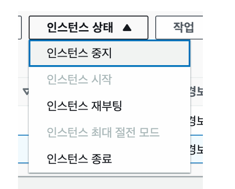

   - EC2인스턴스를 중지, 재부팅, 종료 할 수 있다.
   - EC2인스턴스를 중지했다가 재부팅하면 IP주소가 변경된다.
   - EC2인스턴스를 종료하면 인스턴스가 삭제된다.
  
9. 보안 그룹 확인하기
   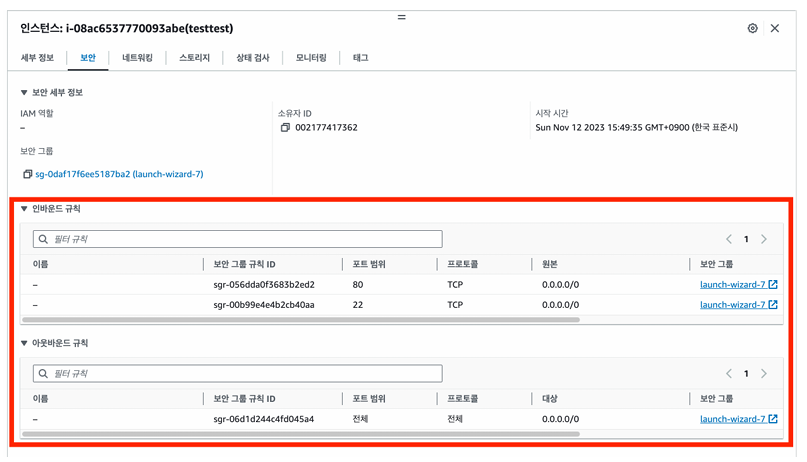

   - 인스턴스 생성 시 설정한 보안 그룹에 대한 정보가 표시된다.
  
10.  네트워크 정보 확인하기
   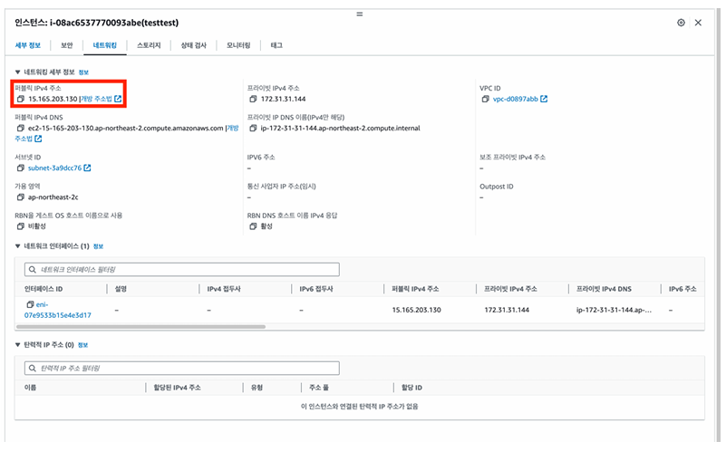
    
   - 퍼블릭 IPv4는 생성한 EC2 인스턴스의 IP주소다.

11. 모니터링 창 확인하기
   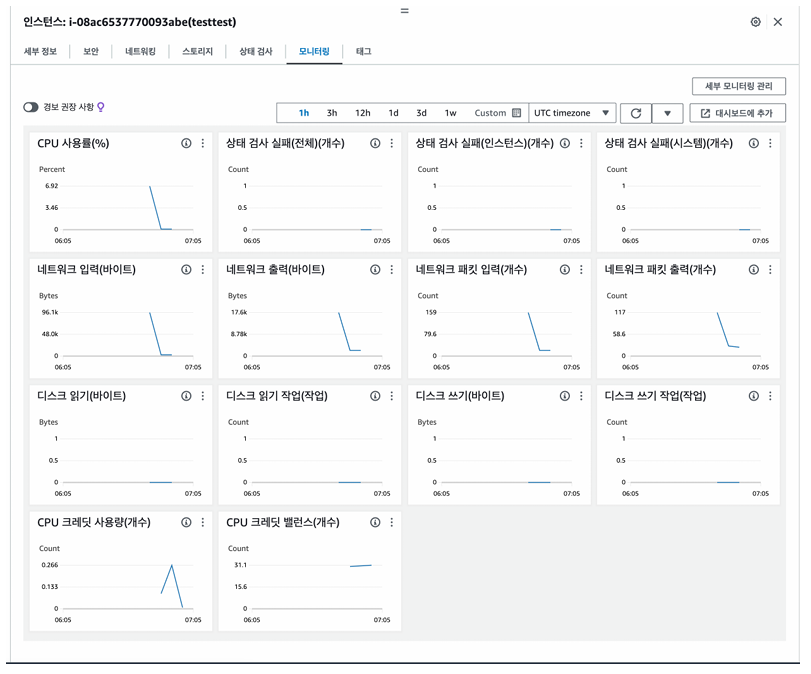

   - EC2 인스턴스에 대한 여러가지 정보를 확인할 수 있다.
   - 실제 서버를 운영할 때 자주 보는 메뉴다.
  
12. EC2에 접속하기
   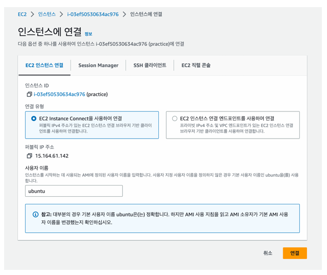

   - 연결 버튼을 클릭해서 EC2 서버에 연결할 수 있다.

13. 우분투에서 docker와 docker compose 설치하기
    ```bash
    sudo apt-get update && \
    sudo apt-get install -y apt-transport-https ca-certificates curl software-properties-common && \
    curl -fsSL https://download.docker.com/linux/ubuntu/gpg | sudo apt-key add - && \
    sudo apt-key fingerprint 0EBFCD88 && \
    sudo add-apt-repository "deb [arch=amd64] https://download.docker.com/linux/ubuntu $(lsb_release -cs) stable" && \
    sudo apt-get update && \
    sudo apt-get install -y docker-ce && \
    sudo usermod -aG docker ubuntu && \
    newgrp docker && \
    sudo curl -L "https://github.com/docker/compose/releases/download/2.27.1/docker-compose-$(uname -s)-$(uname -m
    sudo chmod +x /usr/local/bin/docker-compose && \
    sudo ln -s /usr/local/bin/docker-compose /usr/bin/docker-compose
    ```