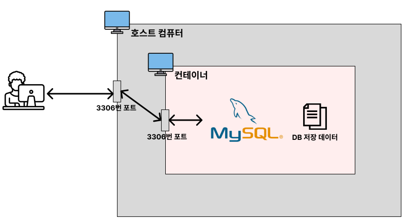
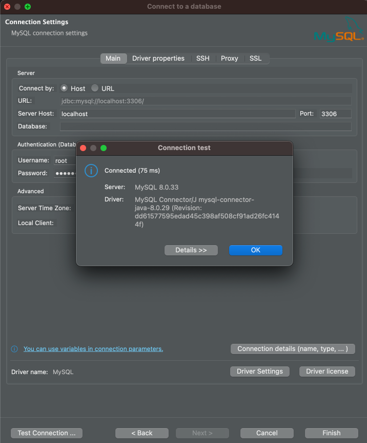

# Docker 명령어

## 도커 이미지 관리

### 1. 도커 이미지 다운로드

- 최신 버전(`latest`) 이미지 다운도르
    ```bash
    # docker pull 이미지명
    ```

    ```bash
    $ docker pull nginx

    Using default tag: latest
    latest: Pulling from library/nginx
    2d429b9e73a6: Pulling fs layer
    d550bb6d1800: Pulling fs layer
    06da587a7970: Pulling fs layer
    20c8b3871098: Pulling fs layer
    f7895e95e2d4: Pulling fs layer
    7b25f3e99685: Pulling fs layer
    dffc1412b7c8: Pulling fs layer
    dffc1412b7c8: Download complete
    f7895e95e2d4: Download complete
    d550bb6d1800: Download complete
    06da587a7970: Download complete
    7b25f3e99685: Download complete
    20c8b3871098: Download complete
    2d429b9e73a6: Download complete
    Digest: sha256:0c86dddac19f2ce4fd716ac58c0fd87bf69bfd4edabfd6971fb885bafd12a00b
    Status: Downloaded newer image for nginx:latest
    docker.io/library/nginx:latest
    ```
    - 이미지를 다운로드 할 때 **Dockerhub**에서 이미지를 다운받는다.
    - Dockerhub는 github처럼 **이미지를 저장 및 다운받을 수 있는 저장소 역할**을 한다.

- 특정 버전 이미지 다운로드
    ```bash
    # docker pull 이미지명:태그명
    ```

    ```bash
    $ docker pull nginx:stable-perl
    ```
    - 특정 버전을 나타내는 이름을 `태그명`이라고 한다. `태그명`은 dockerhub에서 확인할 수 있다.

### 2. 이미지 조회 및  삭제

- 다운받은 모든 이미지 조회
    ```bash
    # docker image ls
    ```

    ```bash
    $ docker image ls

    REPOSITORY   TAG       IMAGE ID       CREATED       SIZE
    nginx        latest    d1a364dc547c   2 days ago    133MB
    ```
    - `REPOSITORY` : 이미지 이름
    - `TAG` : 이미지 태그명
    - `IMAGE ID` : 이미지 아이디
    - `CREATED` : 이미지가 생성된 날짜
    - `SIZE` : 이미지 크기

### 3. 이미지 삭제

- 특정 이미지 삭제
    ```bash
    # docker image rm [이미지아이디 혹은 이미지이름]
    ```

    ```
    $ docker rmi nginx:latest
    ```
    - 컨테이너에서 사용하고 있지 않은 이미지만 삭제가 가능하다.
    - `IMAGE ID`를 입력할 때는 전체 ID를 다 입력하지 않고 ID의 일부만 입력해도 된다.

- 중지된 컨테이너에서 사용하고 있는 이미지 강제 삭제하기
    ```bash
    # docker image rm -f [이미지아이디 혹은 이미지이름]
    ```
    - 실행 중인 컨테이너에서 사용하고 있는 이미지는 강제로 삭제할 수 없다.
  
- 전체 이미지 삭제(컨테이너에서 사용하고 있지 않은 이미지)
    ```bash
    $ docker image rm $(docker images -q)
    ```
    - `docker images -q`는 시스템에 있는 모든 이미지의 ID를 반환한다. `-q`옵션은 각 이미지의 고유한 ID만 표시되도록 한다.
  
## 도커 컨테이너 관리

- 컨테이너 생성 및 실행
    ```bash
    # docker run [옵션] 이미지명[:태그]
    ```
    - 도커 이미지로 컨테이너를 생성하고 실행한다.
    - 이미지가 존재하지 않으면 Dockerhub에서 자동으로 다운로드한 후 실행한다.
  
    ```bash
    docker run -d --name my-nginx -p 4000:80 nginx:latest

    b79e835abdca46925b8c965877627f669a2d2a5e54f075102c44144513ebf32f
    ```
    - 옵션
      - `-d` : 백그라운드 실행
      - `--name 컨테이너이름` : 컨테이너 이름을 지정한다.
      - `-p [호스트 포트]:[컨테이너 포트]` : 포트를 매핑한다. 이 옵션이 없으면 외부에서 컨테이너에 접근할 수 없다.
  
    
  
- 실행 중인 컨테이너 확인
    ```bash
    # docker ps [옵션] 
    ```
    - 현재 실행 중인 컨테이너 정보를 확인한다.
  
    ```bash
    # 현재 실행 중인 컨테이너 정보를 출력한다.
    $ docker ps

    # 출력 예시
    CONTAINER ID   IMAGE     COMMAND                   CREATED          STATUS               PORTS                  NAMES
    7bd750612ea2   nginx     "/docker-entrypoint.…"   2 minutes ago    Up 2 minutes          0.0.0.0:8080->80/tcp   my-nginx


    # 모든 컨테이너 정보(종료된 컨테이너 포함)를 출력한다.
    $ docker pa -a

    # 출력 예시
    CONTAINER ID   IMAGE     COMMAND                   CREATED          STATUS               PORTS                  NAMES
    0ee3a502b7ef   tomcat    "catalina.sh run"         40 seconds ago   Exited 2 seconds                            my-tomcat
    7bd750612ea2   nginx     "/docker-entrypoint.…"   2 minutes ago    Up 2 minutes          0.0.0.0:8080->80/tcp   my-nginx
    ```

- 컨테이너 중지 및 재시작
    ```bash
    # docker stop [컨테이너 이름 혹은 컨테이너 아이디]
    # docker start [컨테이너 이름 혹은 컨테이너 아이디]
    ```
    - 컨테이너를 중지시키거나 재시작시킨다.
  
- 컨테이너 삭제
    ```bash
    # docker rm [컨테이너 이름 혹은 컨테이너 아이디]
    ```
    - 종료된 컨테이너를 삭제한다.
    - 실행 중이거나 일시정지 상태인 컨테이너는 삭제할 수 없다.
  
    ```bash
    # nginx 컨테이너 삭제하기
    $ docker rm 7bd750612ea2

    # 종료된 모든 컨테이너 삭제하기
    $ docker rm $(docker ps -a -q)
    ```

- 컨테이너 로그 조회
    ```bash
    # docker logs [옵션] [컨테이너 이름 혹은 컨테이너 아이디]
    ```
    - 컨테이너를 실행시키고 나서 실행시킨 컨테이너가 잘 실행되고 있는지, 에러가 발생하지 않았는지 로그를 확인할 수 있다.

    ```bash
    $ docker run -d nginx   # nginx 컨테이너 실행
    $ docker ps             # nginx 컨테이너 아이디 확인

    $ docker logs --tail 10 7bd750612ea2        # 최근 로그 10줄만 조회
    $ docker logs -f 7bd750612ea2               # 기존 로근 조회 + 생성되는 로그를 실시간으로 조회
    $ docker logs --tail 0 -f 7bd750612ea2      # 생성되는 로그를 실시간으로 조회
    ```

- 실행중인 컨테이너 내부에 접속하기
    ```bash
    # docker exec -it [컨테이너 이름 또는 컨테이너 아이디] bash
    ```
    - 실행 중인 컨테이너 내부에서 명령을 실행할 수 있게 한다.
    - 옵션
      - `it` : 인터랙티브 모드로 설정한다.
      - `bash` : 쉘(Shell)의 일종이다.
    - 컨테이너 내부에서 나오려면 `Ctrl + D` 또는 `exit`를 입력한다.

    ```bash
    $ docker exec -it my-7bd750612ea2 bash

    ######################################################################
    # nginx의 html 컨텐츠 저장 폴더로 이동한다.
    root@7bd750612ea2: cd /usr/share/nginx/html
    
    # hello.html 파일을 추가한다.
    root@7bd750612ea2:/usr/share/nginx/html:  echo '<html><h1>Hello nginx</h1></html>' > hello.html
    ```
    - 브라우저에서 http://localhost:8080/hello.html로 접속해서 페이지를 확인한다.

## 실습 

### 실습 1
Docker Desktop을 이용해서 Nginx 설치 및 실행하기를 실습한다.


  
1. Nginx 이미지 다운로드
    ```bash
    $ docker pull nginx
    ```

2. 다운로드된 이미지 확인하기
    ```bash
    $ docker image ls
    ```
  
3. 이미지를 이용해서 컨테이너를 생성하고 실행시키기
    ```bash
    $ docker run --name webserver -d -p 80:80 nginx
    ```
  
4. 웹브라우저 주소창에 `http://localhost:80`을 입력하고 결과 확인하기
    
5. 실행되고 있는 모든 컨테이너 상태 확인하기
    ```bash
    $ docker ps
    ```
  
6. Nginx 컨테이너 정지하기
    ```bash
    $ docker stop webserver
    ```
   
### 실습 2
Docker로 MySQL 실행하기



1. MySQL 이미지로 컨테이너 실행시키기
   ```bash
   $ docker run --name db-server -e MYSQL_ROOT_PASSWORD=zxcv1234 -p 3306:3306 -d mysql
   ```
   - `-e MYSQL_ROOT_PASSWORD=zxcv1234` : `-e` 옵션은 컨테이너의 환경 변수를 설정하는 옵션이다. Dockerhub의 MySQL 공싱 문서를 보면 다양한 환경변수를 확인할 수 있다.
   - 아래의 명령어로 컨테이너로 들어가서 환경변수 확인하기
        ```bash
        $ docker exec -it [MySQL 컨테이너 ID] bash

        $ echo $MYSQL_ROOT_PASSWORD     # MYSQL_ROOT_PASSWORD라는 환경변수 값 출력
        $ export                        # 설정되어 있는 모든 환경변수 출력
        ```

2. 컨테이너가 잘 실행되고 있는 확인하기
   ```bash
   $ docker ps

   CONTAINER ID    IMAGE    COMMAND                    CREATED              STATUS              PORTS                              NAMES
   76e59d50a22d    mysql    "docker-entrypint.s..."    About a minute ago   Up About a minute   0.0.0.0:3306->3306/tcp, 33060/tcp  bd-server
   ```

3. 컨테니어 실행될 때 에러 없이 잘 실행되었는지 로그 확인하기
   ```bas
   $ docker logs [컨테이너 이름 혹은 컨테이너 아이디]
   ```

4. DBeaver에서 연결하기
   