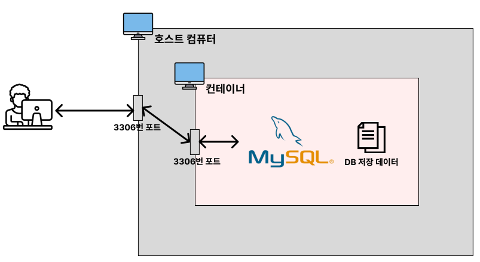

# 도커 볼륨
## 도커 볼륨 관리하기

### 볼륨 목록 확인 : ```docker volume ls```

```bash
docker volume ls

# 도커 볼륨 목록을 출력한다.

# 출력 예시
DRIVER    VOLUME NAME
local     mysql-volume
local     oracle-volume
```

### 도커 볼륨 생성하기 : ```docker volume create```

```bash
docker volume create --name [볼륨이름]

# 도커 볼륨을 생성한다.
```

```bash
docker volume create --name oracle-volume

# oracle-volume 이름의 도커 볼륨을 생성한다.

# 출력예시
oracle-volume
```

### 도커 볼륨 상세정보 조회 : ```docker volume inspect```

```bash
docker volume inspect [볼륨이름]

# 도커 볼륨의 상제정보를 조회한다.
```

```bash
docker volume inspect mysql-volume

# 도커 볼륨의 상제정보를 조회한다.

# 출력 예시
[
    {
        "CreatedAt": "2024-11-28T02:14:52Z",
        "Driver": "local",
        "Labels": null,
        "Mountpoint": "/var/lib/docker/volumes/oracle-volume/_data",
        "Name": "my-volume",
        "Options": null,
        "Scope": "local"
    }
]
```

### 도커 볼륨 삭제하기 : ```docker volume rm```

```bash
docker volume rm [볼륨이름]

# 지정된 볼륨을 삭제한다.
```

```bash
docker volume rm my-volume

# 지정된 볼륨을 삭제한다.
# 볼륨을 삭제하면 컨테이너의 모든 데이터가 영구적으로 삭제된다.
```

## 실습
### 실습 1
Docker로 MySQL 실행하기



1. MySQL 이미지로 컨테이너 실행시키기
   ```bash
   $ docker run --name db-server -e MYSQL_ROOT_PASSWORD=zxcv1234 -p 3306:3306 -d mysql
   ```
   - `-e MYSQL_ROOT_PASSWORD=zxcv1234` : `-e` 옵션은 컨테이너의 환경 변수를 설정하는 옵션이다. Dockerhub의 MySQL 공싱 문서를 보면 다양한 환경변수를 확인할 수 있다.
   - 아래의 명령어로 컨테이너로 들어가서 환경변수 확인하기
        ```bash
        $ docker exec -it [MySQL 컨테이너 ID] bash

        $ echo $MYSQL_ROOT_PASSWORD     # MYSQL_ROOT_PASSWORD라는 환경변수 값 출력
        $ export                        # 설정되어 있는 모든 환경변수 출력
        ```

2. 컨테이너가 잘 실행되고 있는 확인하기
   ```bash
   $ docker ps

   CONTAINER ID    IMAGE    COMMAND                    CREATED              STATUS              PORTS                              NAMES
   76e59d50a22d    mysql    "docker-entrypint.s..."    About a minute ago   Up About a minute   0.0.0.0:3306->3306/tcp, 33060/tcp  bd-server
   ```

3. 컨테니어 실행될 때 에러 없이 잘 실행되었는지 로그 확인하기
   ```bas
   $ docker logs [컨테이너 이름 혹은 컨테이너 아이디]
   ```

### 실습 2
Docker로 MySQL 사용하기

1. MySQL 컨테이너에 접속하기
   ```bash
   $ docker exec -it [MySQL 컨테이너 아이디] bash
   ```
2. 컨테이너에서 MySQL 접근하기
   ```bash
   $ mysql -u root -p
   ```
3. MySQL에서 데이터베이스 조회해보기
   ```sql
   mysql> show databases;
   ```
4. 사용자정의 데이터베이스 생성하기
   ```sql
   mysql> create database mydb;

   mysql> show databases;
   ```
5. 컨테이너 종료 후 다시 생성하기
   ```bash
   # 컨테이너 종료
   $ docker stop [MySQL 컨테이너 아이디]
   $ docker rm [MySQL 컨테이너 아이디]

   # 컨테이너 새로 생성
   $ docker run --name db-server -e MYSQL_ROOT_PASSWORD=zxcv1234 -p 3306:3306 -d mysql

   $ docker exec -it [MySQL 컨테이너 아이디] bash

   $ mysql -u root -p
   ```
6. MySQL에서 데이터베이스 조회해보기
   ```sql
   mysql> show databases;
   -- 아까 생성했던 mydb가 조회되지 않는다.
   ```

### 실습 3
볼륨(Volume)을 활용해서 MySQL 컨테이너 실행하기
1. 볼륨  생성하기(c:/volumes/mysql-volume 폴더를 생성한다.)
   
2. 볼륨을 연결해서 도터 컨테이너 생성하기
   ```bash
   $ docker run --name db-server -e MYSQL_ROOT_PASSWORD=zxcv1234 -p 3306:3306 -v C:/volumes/mysql-volume:/var/lib/mysql -d mysql
   ```
3. MySQL 컨테이너에 접속해서 데이터베이스 만들기
   ```bash
   $ docker exec -it [MySQL 컨테이너 아이디] bash
   $ mysql -u root -p

   mysql> show databases;
   mysql> create database mydb;
   mysql> show databases;
   ```
4. 컨테이너 종료 후 다시 생성하기
   ```bash
   # 컨테이너 종료
   $ docker stop [MySQL 컨테이너 아이디]
   $ docker rm [MySQL 컨테이너 아이디]

   # 컨테이너 새로 생성
   $ $ docker run --name db-server -e MYSQL_ROOT_PASSWORD=zxcv1234 -p 3306:3306 -v C:/volumes/mysql-volume:/var/lib/mysql -d mysql

   $ docker exec -it [MySQL 컨테이너 아이디] bash

   $ mysql -u root -p
   ```
5. MySQL에서 데이터베이스 조회해보기
   ```sql
   mysql> show databases;
   -- mydb가 존재한다.
   ```