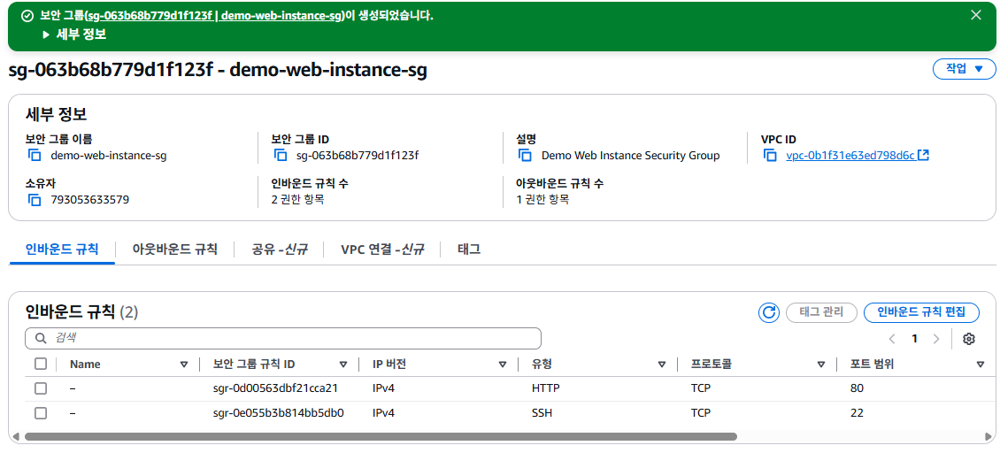

# 오토 스케일링에 적용할 보안 그룹 생성하기

1. EC2 서비스의 왼쪽 메뉴에서 [보안 그룹]을 클릭하고, [보안 그룹 생성] 버튼을 클릭한다.
   

2. "보안 그룹 생성"화면의 **보안 그룹 이름**항목에 `demo-web-instance-sg`를 입력한다. **설명**항목에 `Demo Web Instance Security Group`를 입력한다. 
   

3. [규칙 추가]버튼을 클릭한다. **유형**항목에 `HTTP`를 선택하고, **소스**항목에 `Anywhere-IPv4`를 선택한다. [규칙 추가]버튼을 한번 더 클릭한다. 인스턴스에 접근하기 위해 SSH 통신이 필요하기 때문에에 **유형**항목에 `SSH`를 선택하고, **소스**항목에 `내 IP`를 선택한다. 
   

4. [보안 그룹 생성]버튼을 클릭한다.
   

5. 생성된 보안 그룹의 세부 정보를 확인한다.
   