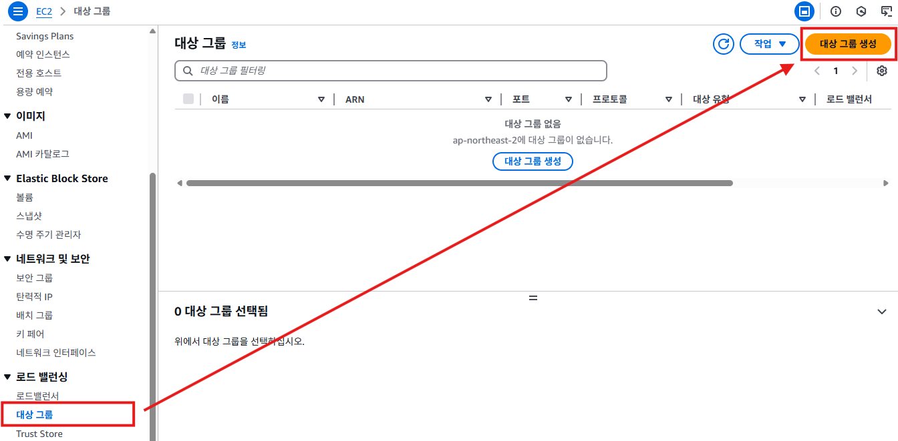

# 대상 그룹(Target Group) 생성
- 대상 그룹은 AWS ELB(Elastic Load Balancer)가 트래픽을 분산할 대상의 집합을 의미한다.
- 대상 그룹은 ELB가 트래픽을 분산할 수 있는 대상(EC2 인스턴스, Lambda 함수, IP 주소, 컨테이너)을 정의하는 논리적 그룹이다.
- 로드 밸런서가 수신한 트래픽을 대상 그룹에 포함된 대상에게 자동으로 전달한다.

## 대상 그룹(Target Group) 생성하기
1. EC2 서비스의 왼쪽 메뉴에서 **대상 그룹**을 찾아서 클릭한다. [대상 그룹 생성] 버튼을 클릭한다.
   

2. 대상 그룹 생성 화면에서 **대상 유형 선택** 항목에서 **인스턴스**를 선택한다. (대상 그룹에 포함된 인스턴스 단위로 트래픽을 분산할 것이기 때문에 대상 유형을 인스턴스로 지정하는 것이다.)
   

3. "그룹 세부 정보 지정"화면의 **대상 그룹 이름** 항목에서 이름을 입력한다. `demo-tg`로 한다.
   
   
4. "그룹 세부 정보 지정"화면의 다른 항목은 기본값 그대로 설정하고, [다음]버튼을 클릭한다.
   

5. "대상 등록"화면의 **사용 가능한 인스턴스**항목에서 미리 생성한 `demo-instance`를 선택하고 [아래에 보류 중인 것으로 포함]버튼을 클릭해서 대상 그룹에 포함시킨다.
   

6. **사용 가능한 인스턴스** 등록이 완료되면, [대사 그룹 생성]버튼을 클릭한다.
   

7. 생성된 대상 그룹의 세부 정보(`demo-tg`)를 확인할 수 있다. 아직 **로드밸런서**가 "연결된 항목이 없음"으로 표시된다. **등록된 대상**항목에는 `demo-instance`가 표시된다.
   
   