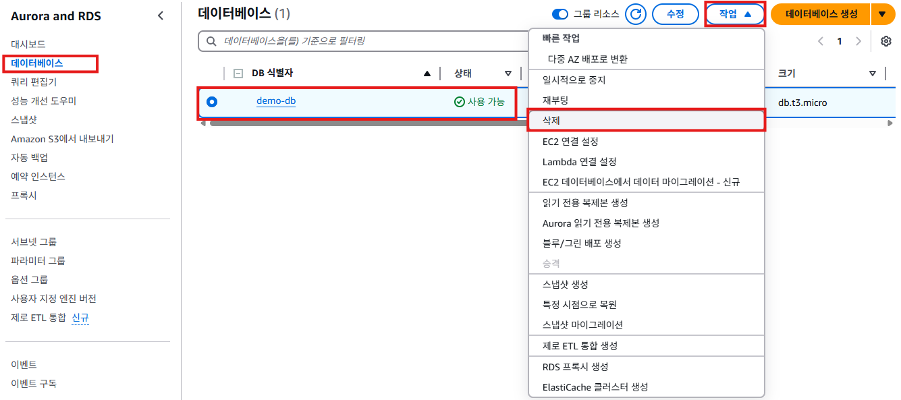
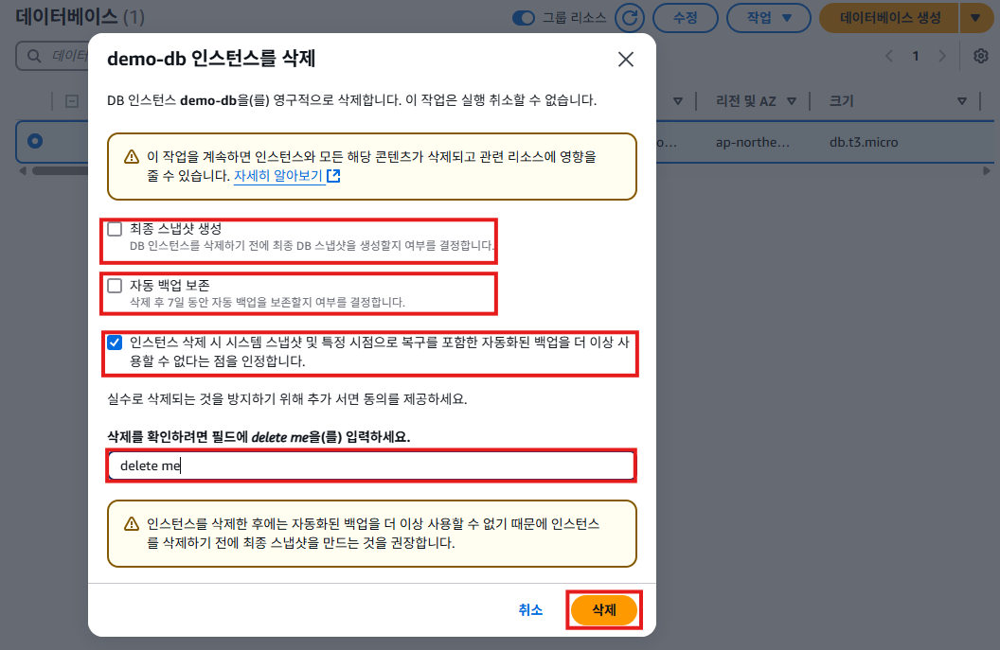
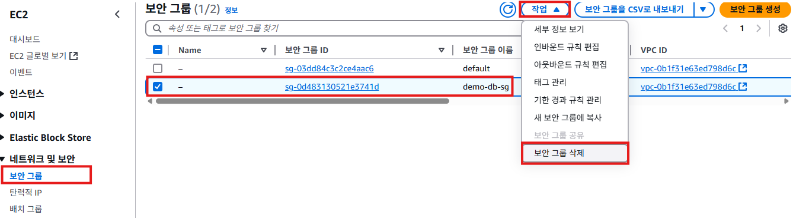
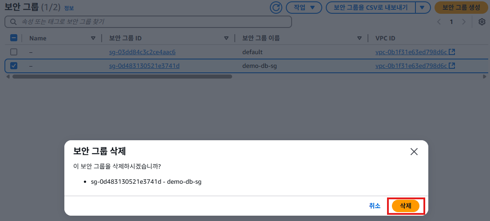

# 리소스 삭제

## RDS 삭제
1. Aurora and RDS의 왼쪽 메뉴에서 [데이터베이스]를 클릭한다. `demo-db`를 선택하고, [작업] -> [삭제]를 클릭한다.
   

2. "rds 삭제"팝업창에서 **최종 스냅샷 생성**항목을 체크해제 한다. **자동 백업 보존**항목을 체크해제 한다. *인스턴스 삭제 시 시스템 스냅샷 및 특정 시점으로 복구를 포함한 자동화된 백업을 더 이상 사용할 수 없다는 점을 인정합니다* 항목을 체크한다. 입력란에 `delete me`를 입력하고, [삭제] 버튼을 클릭한다.
   

## 보안 그룹 삭제
1. EC2 서비스의 왼쪽 메뉴에서 [보안 그룹]을 클릭한다. 'demo-db-sg'를 체크하고, [작업] -> [보안 그룹 삭제]를 클릭한다.
   

2. 보안 그룹 삭제 팝업창에서 [삭제]버튼을 클릭한다.
   