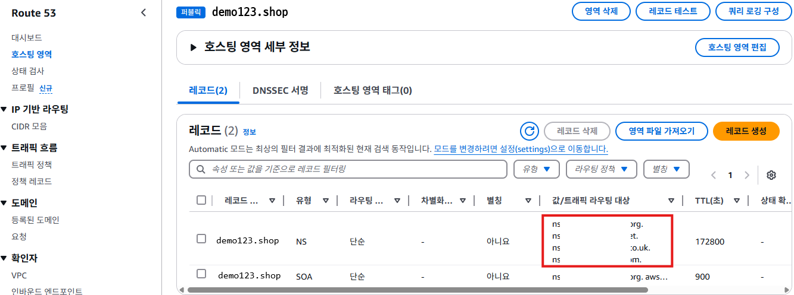
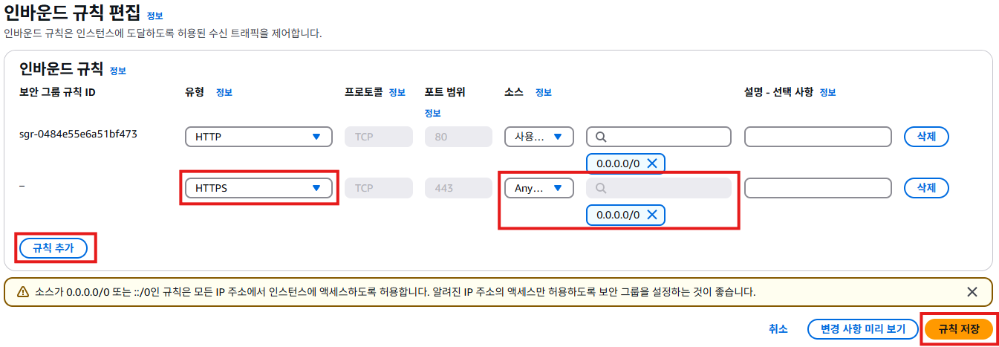
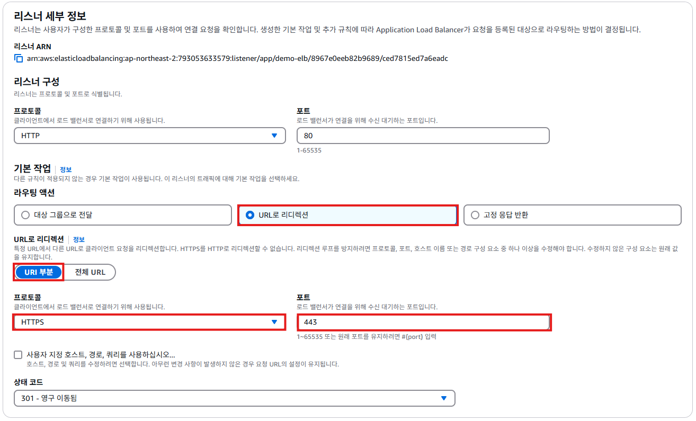

# 도메인 등록 및 연결하기

## 도메인 등록하기
1. 가비아(https://www.gabia.com/)에 접속한다.
   

2. 원하는 도메인을 고르고 등록한다.
   

3. 관리 콘솔의 검색 메뉴에서 `Route 53`를 검색하여 [Route 53]를 클릭한다.
   

4. Route 53 서비스의 메뉴에서 [호스팅 영역]을 클릭한다. [호스팅 영역 생성]버튼을 클릭한다.
   

5. "호스팅 영역 생성"화면에서 **도메인 이름**항목에 `demo123.shop`을 입력한다. **설명**항목에 `demo123.shop 웹사이트 호스팅 영역`을 입력한다. [호스팅 영역 생성]버튼을 클릭한다.
   

6. 호스트 생성이 완료되면 아래와 같은 화면이 표시된다.
   

7. "호스팅 영역 세부 정보"의 **레코드**탭을 클릭한다. **레코드**에서 **값/트래픽 라우팅 대상**정보를 복사한다.
   

8. 가비아 홈 페이지에서 [My가비아]를 클릭한다.
   

9. My가비아 페이지에서 [서비스 관리]를 클릭하고, [관리]버튼을 클릭한다.
   

10. 도메인 상세 페이지에서 네임서버 [설정]버튼을 클릭한다.
   

11. 네임서버 설정 화면의 각 필드에 7번에서 복사한 **값/트래픽 라우팅 대상**정보를 입력한다. 입력할 때 주소 끝의 `.`은 입력하지 않는다.
   

## 퍼블릭 인증서 요청
1. 관리 콘솔의 검색 메뉴에서 `certificate manager`를 검색하여 [Certificate Manager]를 클릭한다.
   

2. ACM 서비스 화면에서 [인증서 나열]을 클릭한다. [요청]버튼을 클릭한다.
   

3. "인증서 요청"화면에서 **인증서 유형**항목의 `퍼블릭 인증서 요청`을 체크한다. [다음]버튼을 클릭한다.
   

4. "퍼블릭 인증서 요청"화면에서 **완전희 정규화된 도메인 이름**항목에 구매한 도메인 이름을 입력한다. 나머지 항목은 전부 기본값을 그대로 사용한다. [요청]버튼을 클릭한다.
   
   

5. 퍼블릭 인증서 요청이 생성되면 아래와 같은 화면이 표시된다. 도메인 부분의 **상태**가 `검증 대기중`으로 표시된다. [Route 53에서 레코드 생성]버튼을 클릭한다.
   

6. 요청한 도메인이 선택되어 있는지 확인한 후 [레코드 생성] 버튼을 클릭한다.
   

7. **DNS 레코드를 성공적으로 생성했습니다.** 메세지를 확인한다.
   

8. "도메인"의 **상태**항목이 `성공`으로 변경되면 인증서 발급이 완료된 것이다.
   

## ELB와 도메인 연결
1. 관리 콘솔의 검색 메뉴에서 `Route 53`를 검색하여 [Route 53]를 클릭한다.
   

2. Route 53 서비스의 메뉴에서 [호스팅 영역]을 클릭한다. **호스팅 영역**목록에서 `demo123.shop`을 클릭한다.
   

3. `demo123.shop`과 관련된 레코드가 표시된다. 트래픽을 AWS 리소스로 라우팅하기 위한 레코드를 추가할 예정이다. [레코드 생성]버튼을 클릭한다.
   

4. "레코드 생성"화면에서 **레코드 유형**항목을 `A-IPv4 주소 및 일부 AWS 리소스로 트래픽 라우팅`을 선택한다. **별칭**항목을 활성화한다. **트래픽 라우팅 대상**항목에서 `Application/Classic Load Balancer에 대한 별칭`을 선택한다. `아시아 태평양(서울)`리전을 선택한다. 미리 만들어둔 `로드 밸런서 주소`를 선택한다. [레코드 생성]버튼을 클릭한다.
   

5. 레코드 생성이 완료되면, 유형 A라고 만들어진 레코드를 확인할 수 있다.
   

6. 웹 브라우저를 열고, 주소창에 `http://demo123.shop`을 입력하고 접속해본다.
   

## https 접속 설정하기
1. EC2 서비스 메뉴에서 [보안 그룹]을 클릭한다. `demo-elb-sg`를 체크한다. **인바운드 규칙**탭을 클릭한다. [인바운드 규칙 편집]버튼을 클릭한다.
   

2. [규칙 추가]버튼을 클릭한다. **유형**항목에서 `HTTPS`를 클릭한다. **소스**항목에서 `Anywhere-IPv4`를 선택한다. [규칙 저장]버튼을 클릭한다.
   

3. EC2 서비스 메뉴에서 [로드밸런서]를 클릭한다. `demo-elb`를 체크한다. **리스너 및 규칙**탭을 클릭한다. [리스너 추가]버튼을 클릭한다.
   

4. "리스너 세부 정보"화면에서 **프로토콜**항목에서 `HTTPS`를 선택한다. **라우팅 액션**항목에서 `대상 그룹으로 전달`을 체크한다. **대상 그룹**항목에서 `demo-tg`를 선택한다.
   

5. "보안 리스너 설정"화면에서 **인증서 소스**항목에서 `ACM에서`를 체크한다. **인증서(ACM에서)**항목에서 `demo123.shop`인증서를 선택한다. [추가]버튼을 클릭한다.
   
   

6. 로드밸런서의 **리스너 및 규칙**탭을 확인해보면 `HTTP:443` 리스너 규칙이 추가된 것을 확인할 수 있다.
   

7. 웹 브라우저를 열고, 주소창에 `https://demo123.shop`을 입력하고 접속해본다.
   

## HTTP > HTTPS redirect 설정
1. EC2 서비스 메뉴에서 [로드밸런서]를 클릭한다. `demo-elb`를 체크한다. **리스너 및 규칙**탭을 클릭한다. `HTTP:80`릉 클릭한다.
   

2. **리스너 규칙**의 `기본값`을 체크하고, [작업] -> [규칙 편집]을 클릭한다.
   

3. **리스너 세부 정보**에서 **라우팅 액션**항목에서 `URL로 리디렉션`을 체크한다. **URL로 리디렉션**항목에서 `URI 부분`을 선택한다. **프로토콜**항목에서 `HTTPS`를 선택하고, **포트**항목에서 `443`을 입력한다.
   
   

4. 리스너 규칙이 아래와 같이 변경된다.
   

5. 웹 브라우저에서 `http://demo123.shop`으로 접속해도, `https://demo123.shop`으로 redirect한다.
