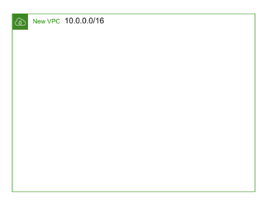
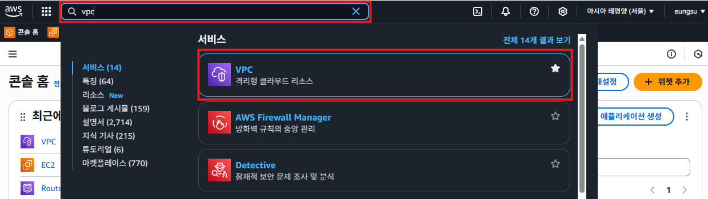
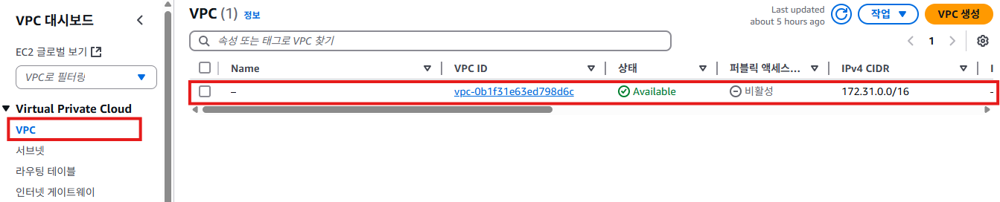
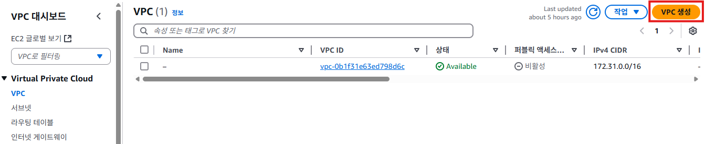
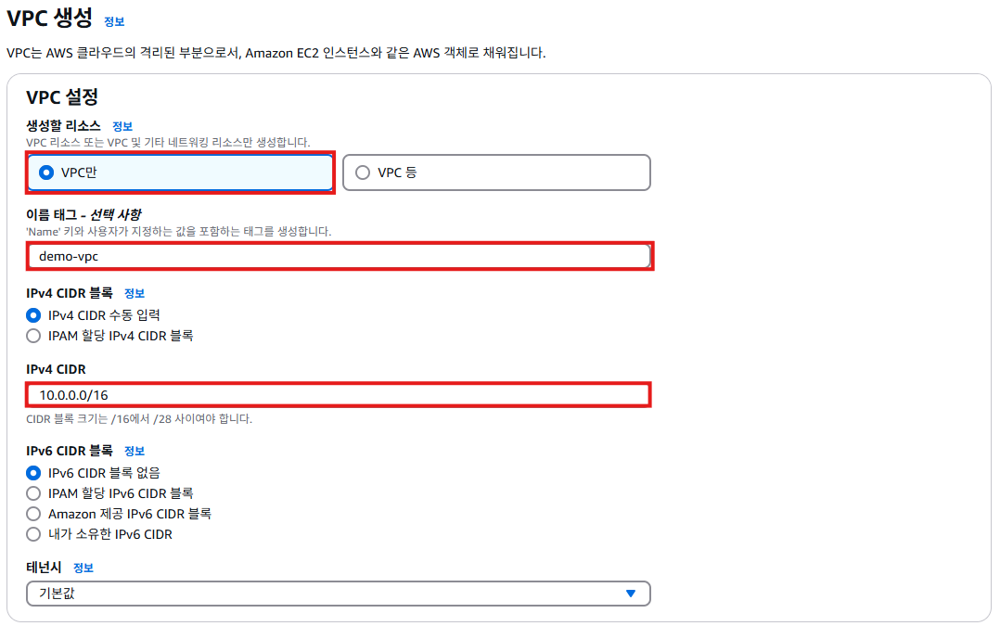
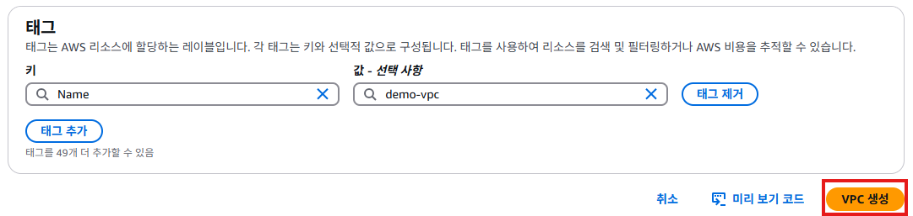
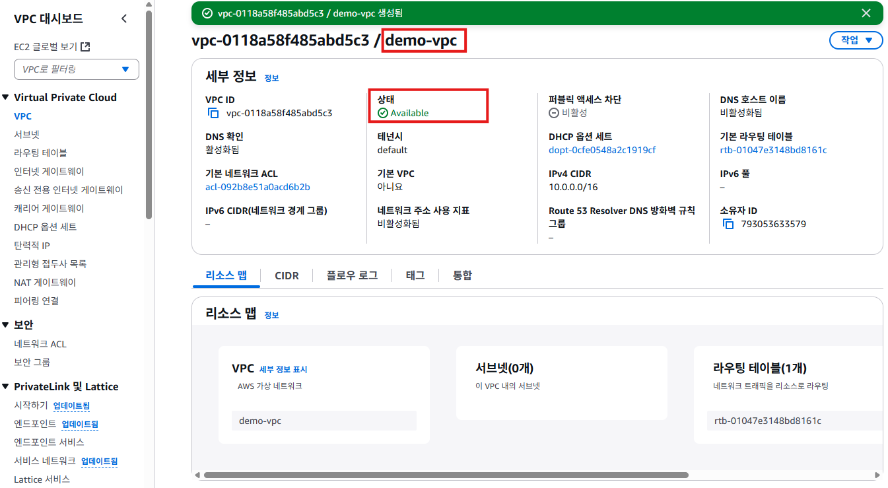
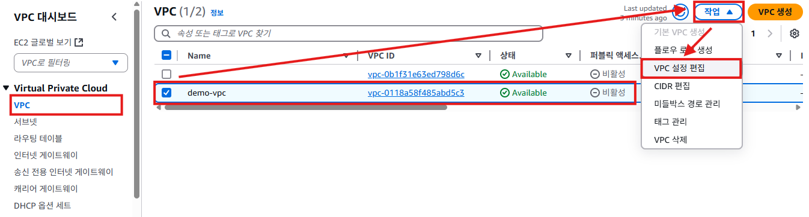

# VPC 생성
- CIDR범위가 `10.0.0.0/16`인 VPC를 생성한다.
  

## VPC 생성하기
1. 관리 콘솔 검색 메뉴에 `VPC`를 입력하고 [VPC]를 클릭한다.
    

2. VPC 서비스 메뉴에서 [VPC]를 클릭한다. **Name**항목이 `-`인 default VPC를 확인할 수 있다.
   

3. [VPC 생성] 버튼을 클릭해서 새로운 VPC를 생성한다.
   

4. "VPC 생성"화면에서 **생성할 리소스**항목에서 `VPC만`을 선택한다. **이름 태그**항목에 `demo-vpc`를 입력한다. **IPv4 CICR 블록**항목에는 `10.0.0.1/16`입력한다. [VPC 생성]버튼을 클릭한다.
   
   

5. `demo-vpc`가 생성되고, 아래와 같은 화면이 표시된다.
   

6. `demo-vpc`내부에서 만들어지는 인스턴스에 DNS 이름을 자동으로 붙이는 기능을 활성화한다. VPC 서비스에서 [VPC]를 클릭한다. `demo-vpc`를 체크한다. [작업] -> [VPC 설정 편집]을 클릭한다.
   

7. "VPC 설정 편집"화면에서 **DNS 설정**항목의 `DNS 호스트 이름 활성화`를 체크한다. [저장]버튼을 클릭한다.
   

8. `demo-vpc` 수정이 완료되면 아래와 같은 화면이 표시된다.
   

## 정리
- `demo-vpc`가 생성되었다.
- `demo-vpc`의 CIDR은 `10.0.0.0/16`이다.
- `demo-vpc`의 네트워크를 용도별로 나누기 위해서 서브넷을 생성할 수 있다.

## AWS VPC 설정에서 "DNS 호스트 이름 활성화"
AWS VPC(Virtual Private Cloud)에서 "DNS 호스트 이름 활성화 (Enable DNS Hostnames)" 옵션은 VPC 내의 EC2 인스턴스가 자동으로 퍼블릭 DNS 호스트 이름을 받을 수 있도록 하는 설정이다.

### 1. 주요 개념
- DNS 호스트 이름 (DNS Hostnames):
  - EC2 인스턴스에 할당된 퍼블릭 IP 주소(또는 엘라스틱 IP 주소)에 매핑되는 DNS 이름이다.
  - 형식: ec2-[퍼블릭-IP].region.compute.amazonaws.com
- 퍼블릭 DNS vs 프라이빗 DNS:
  - 퍼블릭 DNS: 퍼블릭 IP 주소와 연결된 DNS 호스트 이름.
  - 프라이빗 DNS: VPC 내부에서 사용할 수 있는 프라이빗 IP 주소와 연결된 DNS 호스트 이름.

### 2. . 동작 방식
- "DNS 호스트 이름 활성화"를 켜면:
  - 퍼블릭 서브넷의 EC2 인스턴스는 자동으로 퍼블릭 DNS 이름을 받는다.
  - 프라이빗 서브넷의 인스턴스는 퍼블릭 DNS를 받지 않으며, 프라이빗 DNS는 여전히 작동한다.
- 퍼블릭 DNS가 활성화되는 조건:
  - VPC에서 "DNS 호스트 이름 활성화"가 설정되어야 한다.
  - 인스턴스에 퍼블릭 IP가 있어야 한다.
  - 서브넷이 퍼블릭 서브넷이어야 한다. (라우팅 테이블에 인터넷 게이트웨이가 연결된 경우).

### 3. 예시
| 인스턴스 유형| 퍼블릭 IP | DNS 호스트 이름 (퍼블릭) |	DNS 호스트 이름 (프라이빗) |
|---|---|---|---|
| 퍼블릭 서브넷 | 3.94.24.1 |	ec2-3-94-24-1.compute.amazonaws.com | ip-172-31-0-2.ec2.internal |
| 프라이빗 서브넷 |	없음 | 없음 | ip-172-31-0-3.ec2.internal |

### 4. 활용 예제
웹 서버: 퍼블릭 서브넷의 웹 서버가 퍼블릭 DNS 이름으로 직접 외부에서 접근 가능.

비공개 통신: 프라이빗 DNS를 사용하여 VPC 내부에서의 인스턴스 간 통신 가능.
