# 서브넷
- 서브넷은 `demo-vpc`를 더 작은 크기의 네트워크 영역으로 나눈다.
- VPC안에 용도별로 서브넷을 여러 개 만들 수 있다.
- 인터넷에 접근해도되는 영역인 퍼블릭 서브넷 영역과 인터넷을 통해 직접 접근하지 못하는 영역인 프라이빗 서브넷을 만들어서 적절히 인스턴스들을 위치 시킨다.
  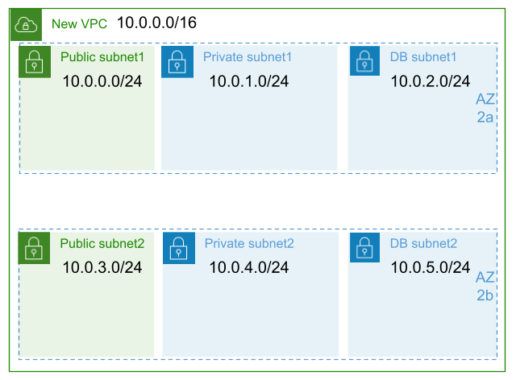
- 각각의 서브넷을 만들 때는 똑같은 서브넷을 2개씩 만든다.
- 각각의 서브넷을 만들 때 가용영역을 선택하는데, 2개의 서브넷을 각각 다른 가용영역에 만들어서 한쪽의 가용영역이 장애가 발생하더라도 다른 가용영역이 정상동작하여, 전체 시스템이 중단되는 문제를 막는다.
- 위 그림은 퍼블릭 서브넷 2개, 프라이빗 서브넷 4개가 있다. 프라이빗 서브넷 2개는 데이터베이스용으로 사용한다.
- 서브넷 구조
  
  | 서브넷 이름 | 가용영역 | CIDR 블록 |
  |---|---|---|
  | **demo-public-subnet-1** | `ap-northeast-2a` | `10.0.0.0/24` |
  | **demo-private-subnet-1** | `ap-northeast-2a` | `10.0.1.0/24` |
  | **demo-db-subnet-1** | `ap-northeast-2a` | `10.0.2.0/24` |
  | **demo-public-subnet-2** | `ap-northeast-2c` | `10.0.3.0/24` |
  | **demo-private-subnet-2** | `ap-northeast-2c` | `10.0.4.0/24` |
  | **demo-db-subnet-2** | `ap-northeast-2c` | `10.0.5.0/24` |

## 서브넷 생성하기
1. VPC 서비스 메뉴에서 [서브넷]을 클릭한다. [서브넷 생성]버튼을 클릭한다.
   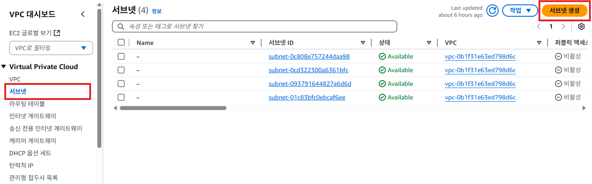

2. "서브넷 생성"화면에서 **VPC**의 **VPC ID**항목에서 `demo-vpc`를 선택한다.
   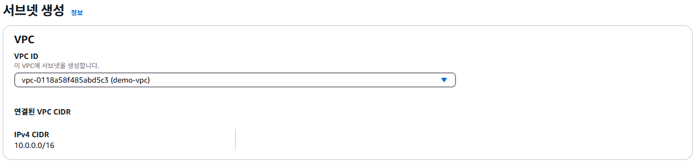

3. "서브넷 생성"화면에서 **서브넷 설정**의 **서브넷 이름**항목에 `demo-public-subnet-1`을 입력한다. **가용 영역**항목에서 `아이사/태평양(서울)/ap-northeast-2a`를 선택한다. **IPv4 서브넷 CIDR 등록**항목에서 `10.0.0.0/24`를 입력한다. [서브넷 생성]버튼을 클릭한다. 이 작업을 표를 참고해서 5번 반복한다.
   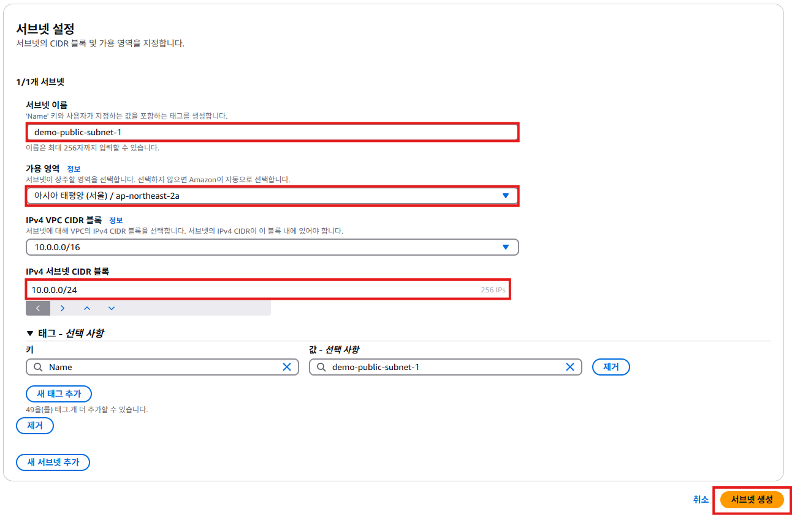
   
   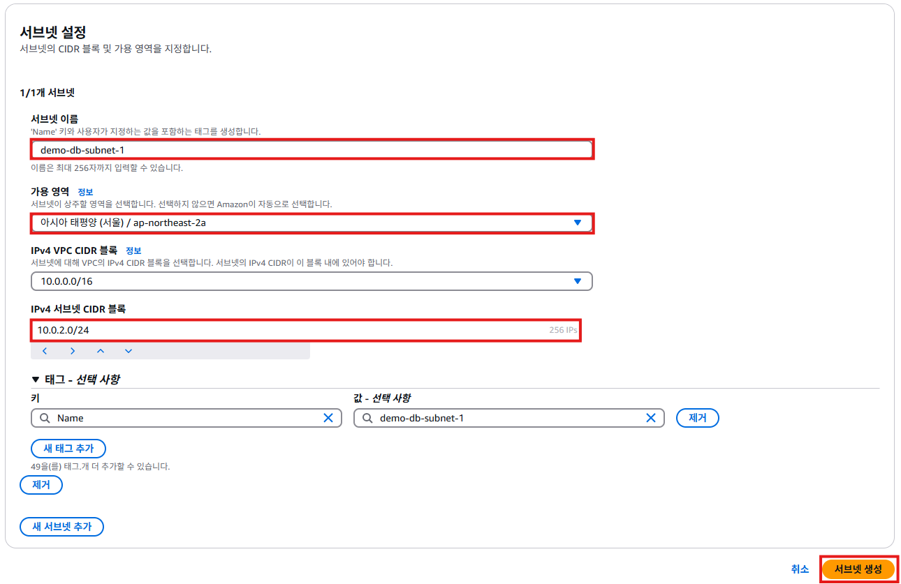
   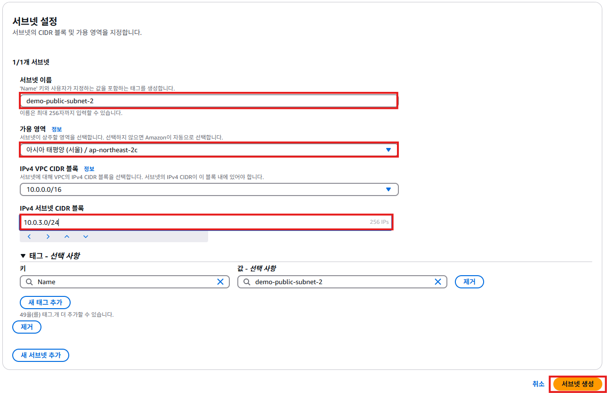
   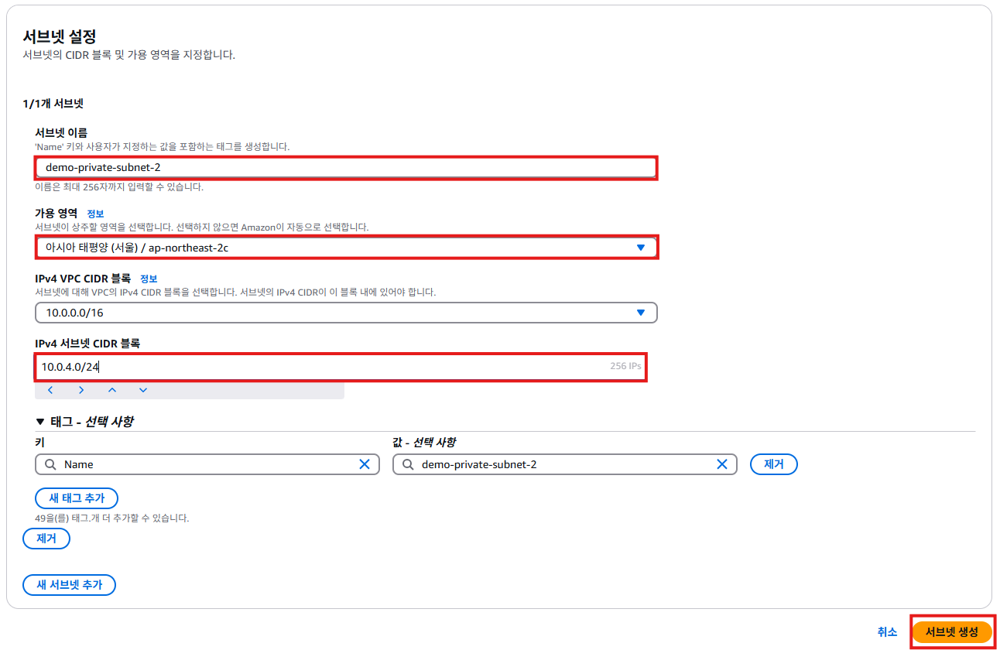
   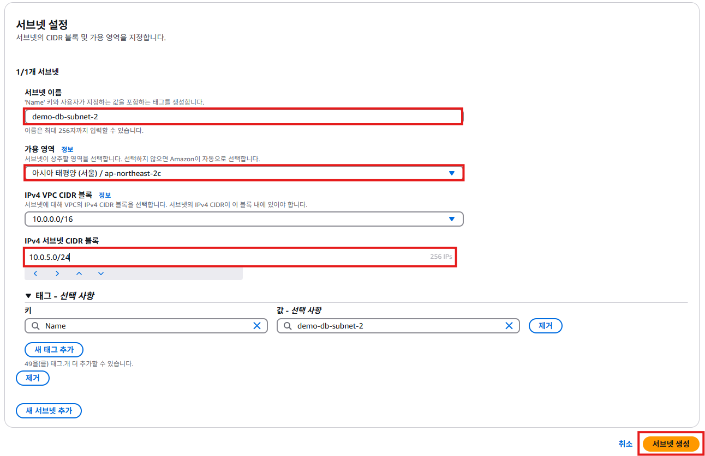

4. 모든 서브넷  생성이 완료되면 아래와 같은 화면이 표시된다.
   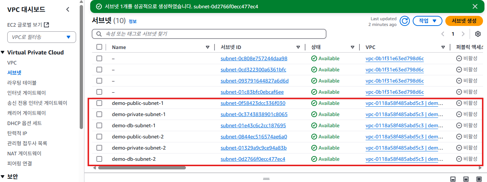

5. 퍼블릿 서브넷에 **퍼블릭 IPv4 주소 자동 할당**을 활성화한다. 이 작업은 퍼블릭 서브넷에 인스턴스가 만들어 질 때, 공인 IP가 자동으로 할당되도록 하는 설정이다. 생성된 서브넷 중에서 `demo-public-subnet-1`을 체크한다. [작업] -> [서브넷 설정 편집]을 클릭한다.
   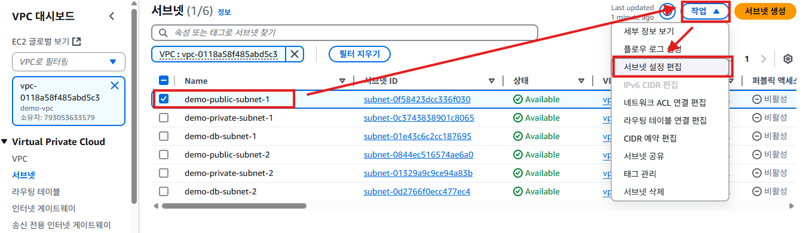

6. "서브넷 설정 편집"화면에서 **자동 할당 IP 설정**항목의 `퍼블릭 IPv4 주소 자동 할당 활성화`를 체크한다.
   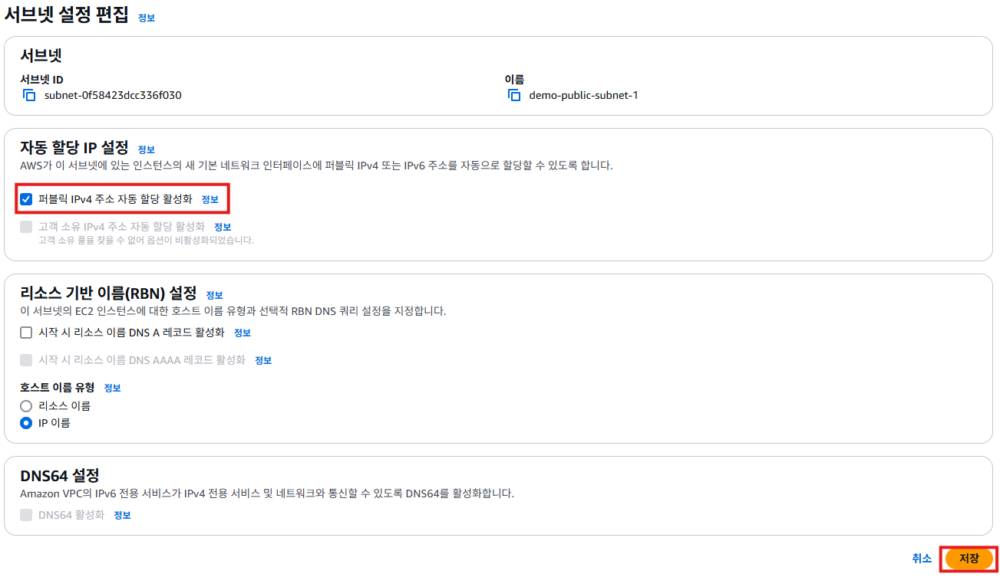

7. 생성된 서브넷 중에서 `demo-public-subnet-2`을 체크한다. [작업] -> [서브넷 설정 편집]을 클릭한다.
   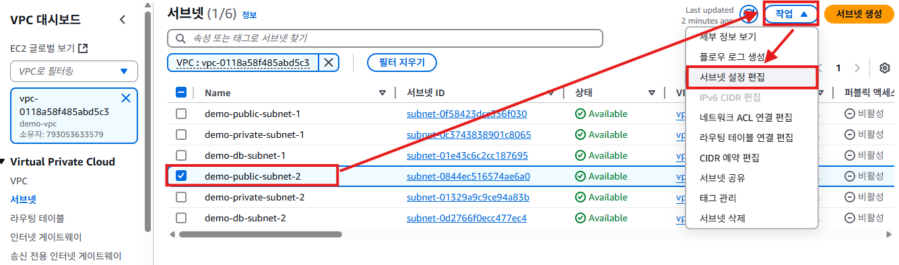

8. "서브넷 설정 편집"화면에서 **자동 할당 IP 설정**항목의 `퍼블릭 IPv4 주소 자동 할당 활성화`를 체크한다.
   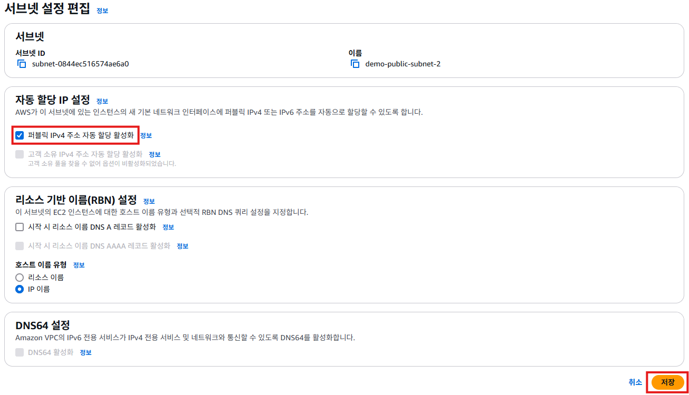

## 정리
- `demo-vpc`에 6개의 서브넷을 만들었다.
- `demo-private-subnet-1`, `demo-private-subnet-2`, `demo-db-subnet-1`, `demo-db-subnet-2` 프라이빗 서브넷에서 생성되는 인스턴스는 공인 IP가 필요없다.
- `demo-public-subnet-1`과 `demo-public-subnet-2` 서브넷은 `퍼블릭 IPv4 주소 자동 할당 활성화`를 체크해서 해당 서브넷에서 인스턴스가 생성될 때 공인 IP가 자동으로 할당되도록 하였다.
-  퍼블릭 서브넷에서 만들어지는 인스턴스가 공인 IP를 할당받고 인터넷에 연결되기 위해서는 **인터넷 게이트웨이**가 필요하다.
