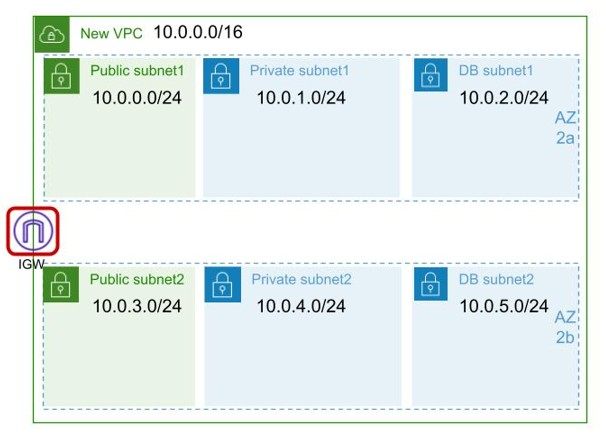
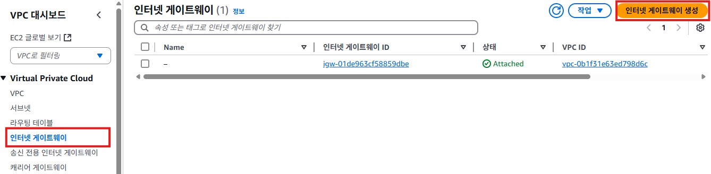
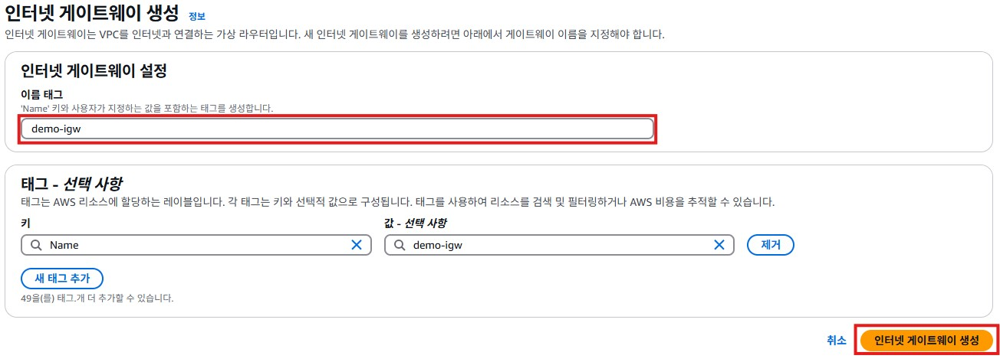
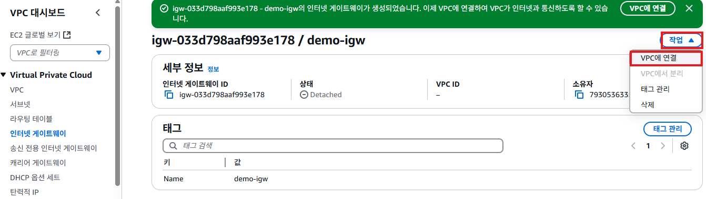
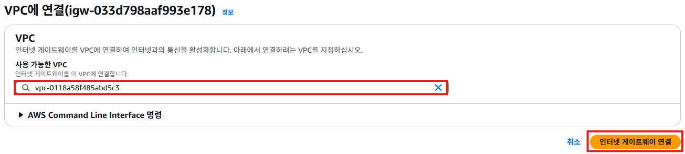
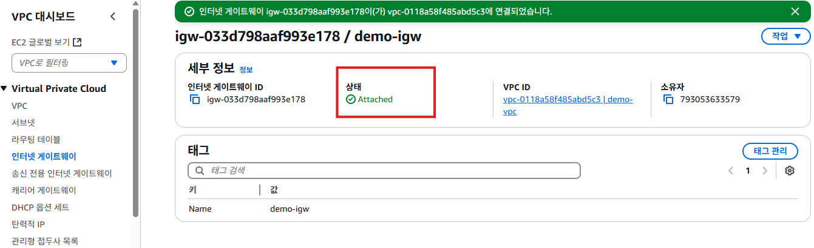

# 인터넷 게이트웨이
- AWS의 **인터넷 게이트웨이(Internet Gateway, IGW)**는 VPC(Virtual Private Cloud) 내의 퍼블릭 서브넷이 외부 인터넷과 통신할 수 있도록 연결해주는 네트워크 컴포넌트다.
- IGW는 AWS VPC에서 퍼블릭 서브넷을 설정할 때 필수적인 요소로, EC2 인스턴스가 인터넷을 통해 외부와 통신할 수 있도록 한다.
  
- 인터넷 게이트웨이를 통해 VPC라는 격리된 네트워크와 인터넷이 연결된다. VPC에서 인터넷으로 나가고, 들어오는 모든 트래픽은 인터넷 게이트웨이를 통한다.

## 인터넷 게이트웨이 생성하기
1. VPC 서비스 메뉴에서 [인터넷 게이트웨이]를 클릭한다. [인터넷 게이트웨이 생성]버튼을 클릭한다.
   

2. "인터넷 게이트웨이 생성"화면의 **인터넷 게이트웨이 설정**의 **이름 태그**항목에 `demo-igw`를 입력한다. [인터넷 게이트웨이 생성]버튼을 클릭한다.
   

3. 인터넷 게이트웨이 생성이 완료되면 아래와 같은 화면이 표시된다. [작업] -> [VPC에 연결]을 클릭한다.
   

4. "VPC에 연결"화면에서 **사용 가능한 VPC**항목에서 `demo-vpc`를 선택한다. [인터넷 게이트웨이 연결] 버튼을 클릭한다.
   

5. VPC 연결이 완료되면 아래와 같은 화면이 표시된다. **상태**항목에 `Attached`로 표시된다.
   
