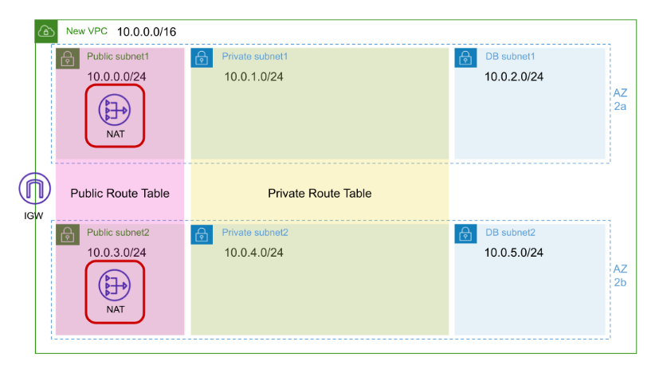
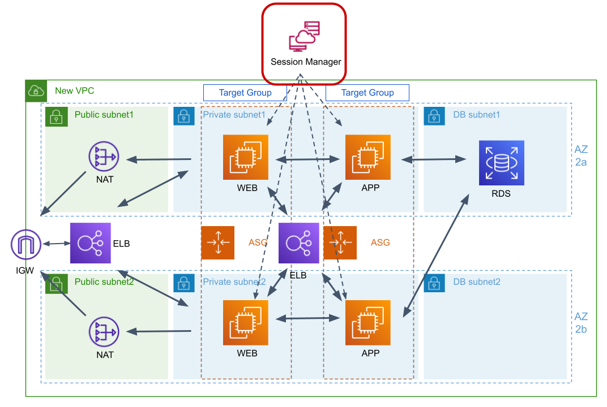

# VPC (Virtual Private Network)

## VPC란 무엇인가?
VPC(가상 사설 클라우드, Virtual Private Cloud)는 AWS에서 사용자가 정의할 수 있는 격리된 네트워크 환경이다. VPC는 클라우드 내에서 사용자가 자신의 네트워크 환경을 직접 구성할 수 있도록 지원한다. 사용자가 지정한 IP 주소 범위, 서브넷, 라우팅 테이블, 인터넷 게이트웨이, 네트워크 ACL(Access Control List) 등 다양한 네트워크 리소스를 포함한다.
- VPC는 AWS 클라우드 내에서 독립적인 네트워크 공간을 제공한다.
- 사용자는 VPC를 통해 프라이빗 네트워크 환경을 구축할 수 있다.
- 보안 그룹과 네트워크 ACL을 통해 네트워크 트래픽을 제어할 수 있다.
  
## VPC의 주요 구성 요소
### CIDR (Classless Inter-Domain Routing) 블록
- VPC의 IP 주소 범위를 정의한다.
- CIDR(Classless Inter-Domain Routing)은 IP 주소를 효율적으로 할당하고 라우팅할 수 있도록 개발된 표준이다. 전통적인 클래스 기반 IP 주소 방식(A, B, C 클래스)을 대체하여 유연하고 효율적인 네트워크 주소 관리를 가능하게 한다.
- CIDR 표기법
  ```nginx
  IP Address/PrefixLength
  ```
- CIDR 블록의 크기는 /16에서 /28까지 설정할 수 있다.
- CIDR블록의 IP 주소 범위
  

### 서브넷 (Subnet)
- VPC 내에서 논리적으로 구분된 네트워크 섹션이다.
- **퍼블릭 서브넷(Public Subnet)**: 인터넷 게이트웨이를 통해 외부 인터넷과 연결된 서브넷.
  - Default VPC는 퍼블릭 서브넷만 있다.
- **프라이빗 서브넷(Private Subnet)**: 외부 인터넷과 직접 연결되지 않는 서브넷.
- 서브넷은 AWS 가용 영역(AZ, Availability Zone)별로 생성할 수 있다.

### 라우팅 테이블 (Route Table)
- VPC 내에서 네트워크 트래픽의 흐름을 제어한다.
- 기본적으로 각 VPC에는 기본 라우팅 테이블이 생성되며, 사용자는 추가 라우팅 테이블을 정의할 수 있다.
- 각 서브넷은 라우팅 테이블과 연결되어 있어, 트래픽의 방향을 제어할 수 있다.

### 인터넷 게이트웨이 (Internet Gateway, IGW)
- VPC와 외부 인터넷 간의 연결을 제공하는 네트워크 장치.
- 퍼블릭 서브넷을 외부 네트워크와 연결할 수 있도록 한다.

### NAT 게이트웨이 (NAT Gateway)
- 프라이빗 서브넷에서 외부 인터넷에 연결할 수 있도록 지원하지만, 외부에서 프라이빗 서브넷으로의 직접적인 연결은 차단한다.
- 프라이빗 네트워크 내의 인스턴스가 외부 API나 소프트웨어 업데이트를 위해 외부 네트워크에 액세스할 수 있도록 한다.

### 보안 그룹 (Security Group)
- 인스턴스 수준에서 인바운드 및 아웃바운드 트래픽을 제어하는 가상 방화벽이다.
- 상태 저장(Stateful) 방식으로, 인바운드 트래픽을 허용하면 자동으로 아웃바운드 트래픽도 허용된다.

### 네트워크 ACL (Network Access Control List)
- 서브넷 수준에서 트래픽을 제어하는 네트워크 방화벽이다.
- 상태 비저장(Stateless) 방식으로, 인바운드 및 아웃바운드 규칙을 별도로 정의할 수 있다.

### VPC 피어링 (VPC Peering)
- 서로 다른 VPC 간의 프라이빗 네트워크 연결을 설정할 수 있다.
- 동일한 AWS 리전에 있는 VPC 또는 서로 다른 리전에 있는 VPC 간 연결이 가능하다.

### VPC 엔드포인트 (VPC Endpoint)
- VPC 내에서 AWS 서비스에 안전하게 액세스할 수 있도록 하는 네트워크 인터페이스.
- 퍼블릭 인터넷을 통하지 않고 AWS 서비스(S3, DynamoDB 등)에 직접 연결할 수 있다.

## VPC의 역할
### 격리된 네트워크 환경 제공
- 각 VPC는 AWS 클라우드 내에서 다른 VPC와 완전히 격리된 독립적인 네트워크를 생성한다.
- 사용자 네트워크 설정에 따라 퍼블릭 및 프라이빗 네트워크를 분리할 수 있다.

### 네트워크 보안 제어
- 보안 그룹(Security Group)과 네트워크 ACL을 통해 인바운드 및 아웃바운드 트래픽을 제어할 수 있다.
- IP 주소 기반 또는 포트 기반의 세부적인 제어가 가능하다.

### 다양한 네트워크 아키텍처 구성 지원
- 퍼블릭 서브넷, 프라이빗 서브넷, 하이브리드 네트워크 구성 등 다양한 아키텍처를 지원한다.
- 인터넷 게이트웨이, NAT 게이트웨이, VPC 피어링 등을 통해 다양한 네트워크 연결을 설정할 수 있다.

### 고가용성 및 확장성 지원
- VPC는 여러 가용 영역(AZ, Availability Zone)에서 서브넷을 생성할 수 있어 고가용성을 보장한다.
- 추가 서브넷 생성, 라우팅 테이블 추가 등으로 네트워크 확장이 용이하다.

## VPC의 사용예제
다음은 VPC를 활용한 일반적인 아키텍처 예제다.
- **퍼블릭 서브넷**: 웹서버가 위치하여 외부에서 직접 접근 가능
- **프라이빗 서브넷**: 데이터베이스 서버, 애플리케이션 서버가 위치하며 외부에서 직접 접근 불가
- **인터넷 게이트웨이**: 퍼블릭 서브넷의 웹 서버가 인터넷에 연결될 수 있도록 지원
- **NAT 게이트웨이**: 프라이빗 서브넷의 서버가 외부 인터넷에 접근할 수 있도록 지원


## 서브넷 (Subnet)

### 서브넷이란?
- AWS VPC(Virtual Private Cloud)에서 **서브넷(Subnet)** 은 VPC 내의 IP 주소 범위를 기반으로 네트워크를 세분화한 논리적 네트워크 구획이다.
- 서브넷을 통해 VPC 내에서 퍼블릭 및 프라이빗 네트워크를 구성할 수 있으며, 애플리케이션의 보안, 네트워크 트래픽 관리, IP 주소 할당을 효율적으로 수행할 수 있다. 
  - **서브넷(Subnet)**: VPC 내에서 IP 주소 블록(CIDR 블록)을 기반으로 네트워크를 세분화한 논리적 구획.
  - **CIDR (Classless Inter-Domain Routing)**: IP 주소 블록 형식을 지정하는 방식 (예: 10.0.1.0/24).
  - **IPv4 또는 IPv6**: 서브넷은 IPv4 또는 IPv6 주소를 사용할 수 있으며, 두 버전을 동시에 사용할 수도 있습니다.
  - **퍼블릭 서브넷(Public Subnet)**: 인터넷 게이트웨이(Igw)와 연결되어 외부 인터넷에 직접 연결할 수 있는 서브넷.
  - **프라이빗 서브넷(Private Subnet)**: NAT 게이트웨이 또는 프라이빗 링크를 통해서만 외부와 통신할 수 있는 서브넷.
  
### 서브넷의 종류
AWS에서는 서브넷을 두 가지로 나눌 수 있습니다:

#### 퍼블릭 서브넷 (Public Subnet)
- 인터넷 게이트웨이(Igw)가 연결된 서브넷.
- 서브넷의 라우팅 테이블에 "0.0.0.0/0 → 인터넷 게이트웨이" 규칙이 포함되어 있음.
- EC2 인스턴스에 퍼블릭 IP 주소가 자동 할당되며 외부에서 직접 접근 가능.
- 주로 웹 서버, API 서버 등 외부 접근이 필요한 자원을 배치할 때 사용.

#### 프라이빗 서브넷 (Private Subnet)
- 인터넷 게이트웨이와 연결되지 않은 서브넷.
- 외부와 직접 통신하지 않으며, NAT 게이트웨이 또는 VPN을 통해서만 외부에 접근 가능.
- EC2 인스턴스는 프라이빗 IP만 할당받아 외부에서 직접 접근 불가.
- 데이터베이스, 내부 서비스, 백엔드 애플리케이션 등 외부로부터 보호가 필요한 자원에 적합.

## 인터넷 게이트웨이 (Internet Gatewary, IGW)

### 인터넷 게이트웨이란?
- AWS의 **인터넷 게이트웨이(Internet Gateway, IGW)**는 VPC(Virtual Private Cloud) 내의 퍼블릭 서브넷이 외부 인터넷과 통신할 수 있도록 연결해주는 네트워크 컴포넌트다.
- IGW는 AWS VPC에서 퍼블릭 서브넷을 설정할 때 필수적인 요소로, EC2 인스턴스가 인터넷을 통해 외부와 통신할 수 있도록 한다.

### 인터넷 게이트웨이의 핵심 개념
- 외부 통신 지원: IGW는 VPC의 퍼블릭 서브넷에 위치한 인스턴스가 인터넷과 통신할 수 있도록 한다.
- 수평적 확장: IGW는 자동으로 수평적 확장되어 성능에 제한이 없다.
- 고가용성: AWS 리전 내 모든 가용 영역에서 동시 사용 가능하며, 특정 가용 영역(AZ)에 의존하지 않는다.
- 내부/외부 트래픽 처리: IGW는 인바운드(수신) 및 아웃바운드(발신) 인터넷 트래픽을 모두 처리할 수 있다.

### 인터넷 게이트웨이의 주요 특성
- 퍼블릭 IP 필수: VPC의 퍼블릭 서브넷에서 외부 인터넷과 통신하려면 인스턴스에 퍼블릭 IP 또는 엘라스틱 IP가 할당되어야 한다.
- 라우팅 테이블 연결: 퍼블릭 서브넷의 라우팅 테이블에 0.0.0.0/0 → 인터넷 게이트웨이 경로가 설정되어야 한다.
- 보안 그룹 및 네트워크 ACL: IGW를 통한 외부 통신은 보안 그룹 및 네트워크 ACL 규칙에 의해 보호된다.

## 라우팅 테이블(Routing Table)
### 라우팅 테이블이란?
- **라우팅 테이블(Routing Table)** 은 네트워크 트래픽이 어디로 향해야 하는지를 결정하는 규칙 집합이다.
- AWS에서는 VPC (Virtual Private Cloud) 내의 서브넷에서 네트워크 트래픽이 외부 또는 다른 네트워크로 어떻게 전달될지 정의한다.
- AWS에서의 라우팅 테이블은 VPC 내의 네트워크 통신을 효율적이고 안전하게 관리하기 위한 핵심 요소다.

### 라우팅 테이블의 역할
1. 네트워크 트래픽 제어
   - VPC 내부 및 외부로의 트래픽 흐름을 결정
   - 퍼블릭 서브넷은 인터넷 게이트웨이(Internet Gateway)를 통해 외부 인터넷으로 트래픽을 전달할 수 있고, 프라이빗 서브넷은 NAT 게이트웨이를 통해 인터넷 액세스를 제어할 수 있다.
2. 트래픽 경로 지정
   - 각 라우팅 규칙(Route)에는 트래픽 목적지(CIDR)와 해당 트래픽을 전달할 대상(Target)이 정의된다.
   - 목적지: 특정 IP 주소 범위 (CIDR 형식).
   - 대상(Target): 트래픽을 전달할 네트워크 장치 (예: 인터넷 게이트웨이, NAT 게이트웨이, VPC 피어링, VPN, Direct Connect 등).
3. 보안 강화
   - 라우팅 규칙을 통해 프라이빗 네트워크와 퍼블릭 네트워크를 분리하고 제어할 수 있다.
   - 민감한 데이터가 외부로 유출되는 것을 방지할 수 있으며, 허용된 대상에게만 트래픽이 전달되도록 설정할 수 있다.

### 라우팅 테이블의 구성
#### 기본 요소
- **Destination (목적지)**: 네트워크 트래픽의 대상 IP 주소 범위 (CIDR).
- **Target (대상)**: 트래픽을 전달할 네트워크 장치.
- **Status (상태)**: 라우팅 규칙이 활성화(Active) 상태인지 여부.
#### 대상 유형
- **Local**: VPC 내의 네트워크 간 통신을 허용.
- **Internet Gateway (igw)**: VPC에서 인터넷으로의 트래픽을 허용.
- **NAT Gateway (nat)**: 프라이빗 서브넷에서 아웃바운드 인터넷 트래픽을 허용.
- **VPC Peering**: 다른 VPC와의 네트워크 연결.
- **VPN Gateway**: 온프레미스 네트워크와의 보안 연결.
- **Direct Connect**: AWS와 온프레미스 네트워크 간의 전용 네트워크 연결.
#### 라우팅 테이블 예시

| Destination | Target | Status |
|---|---|---|
| 10.0.0.0/16 | local | Active |
| 0.0.0.0/0 | igw-12345678 | Active |
| 172.31.0.0/16 | peering-12345678 | Active |

- 첫번째 규칙 
  - 목적지: `10.0.0.0/16`은 VPC의 기본 네트워크 범위를 의미한다.
  - 대상: `local`은 VPC 내부에서의 통신을 의미하며, VPC 내부의 인스턴스 간 통신이 자동으로 가능하도록 설정한다.
  - 동작: VPC 내의 모든 인스턴스는 동일한 VPC CIDR 블록(10.0.0.0/16)에 속한 다른 인스턴스와 직접 통신할 수 있다.
- 두번째 규칙
  - 목적지: `0.0.0.0/0`은 모든 IP 주소를 의미하며, 전 세계 모든 네트워크를 대상으로 한다.
  - 대상: `igw-12345678`은 인터넷 게이트웨이(Internet Gateway)다.
  - 동작: VPC 내의 인스턴스가 외부 인터넷에 접근할 수 있도록 허용하는 규칙이다. 인터넷 게이트웨이(IGW)를 통해 외부 네트워크와 연결이 가능하게 한다.
  - 적용대상: 이 규칙은 퍼블릭 서브넷에서 주로 사용된다. 퍼블릭 서브넷에 연결된 인스턴스는 IGW를 통해 인터넷에 직접 접근할 수 있다.
- 세번째 규칙
  - 목적지: `172.31.0.0/16`은 다른 VPC의 IP 주소 범위다.
  - 대상: `peering-12345678`은 VPC 피어링 연결 (VPC Peering)이다.
  - 동작: 이 규칙은 VPC 피어링을 통해 다른 VPC (IP 범위 172.31.0.0/16)와 통신할 수 있도록 설정한다. VPC 피어링은 두 VPC 간에 프라이빗 IP 주소로 통신할 수 있는 네트워크 연결을 제공한다.
- **LPM(Longest Prefix Match) 알고리즘**
  - 라우팅 테이블에 적용되는 알고리즘이다.
  - LPM 알고리즘은 가장 긴 Prefix를 가진 목적지 IP 주소가 더 높은 우선 순위를 갖는 것이다.
  - `10.0.0.0/16`과 `0.0.0.0/0` 중에서 `10.0.0.0/16`가 우선 순위가 높기 때문에 `10.0.0.0/16`의 IP 범위 트래픽은 `local`로 트래픽을 보내서 처리하게 하고, 나머지는 인터넷 게이트웨이로 보낸다.
  
## NAT 게이트웨이
### NAT 게이트웨이란?
- **NAT (Network Address Translation) 게이트웨이**는 **프라이빗 서브넷에 있는 인스턴스가 인터넷으로 나가는 트래픽을 허용**하면서, **외부에서 해당 인스턴스로 직접 접근하는 것은 차단하는 기능**을 갖고 있다.

### NAT 게이트웨이 사용목적

| 목적 | 설명 |
|---|---|
| 보안성 확보 | 프라이빗 서브넷의 리소스를 외부 공격으로부터 보호함 |
| 아웃바운드 인터넷 통신 | 소프트웨어 패치, API 호출, S3 접근 등 외부 서비스 사용 가능 |
| 인바운드 트래픽 차단 | 인터넷에서 직접 접근 불가 → 보안 강화 |

### 구성 예시



- 퍼블릭 서브넷에 NAT 게이트웨이를 설치한다.
- 고가용성을 위해서 2개의 NAT 게이트웨이를 각 가용 영역에 1개씩 만들고, 프라이빗 라우팅 테이블도 각각 만들어서 설정한다.

### 비용 관련 주의 사항
- NAT 게이트웨이는 시간당 요금 + 데이터 전송 요금이 부과된다.
- 사용량이 많으면 요금이 급증할 수 있으므로 비용 모니터링이 필수다.
- 실습 후 반드시 삭제하자.

## Session Manager
- **AWS Session Manager**는 AWS Systems Manager의 기능 중 하나로, **EC2 인스턴스에 안전하게 셸(Shell) 또는 CLI로 접속할 수 있게 해주는 관리형 서비스**다. SSH나 Bastion Host 없이도 **IAM 권한 기반으로 인스턴스에 접속**할 수 있어 보안성과 감사 기능이 뛰어나다.
- 운영 서버에는 SSH 접속을 완전히 막고 Session Manager만 사용하면 보안성이 대폭 향상된다.



- Session Manager로 인스턴스를 관리하려면 인스턴스에 Systems Manager Agent라는 프로그램을 설치하고, 인스턴스에 Systems Manager를 사용하기 위한 `AmazonSSMManagedInstanceCore` 권한을 적용하면 된다.
- Amazon Linux 2, Amazon Linux 2023, Ubuntu, Windows EC2 운영체제에는 Systems Manager Agent가 이미 설치되어 있다.