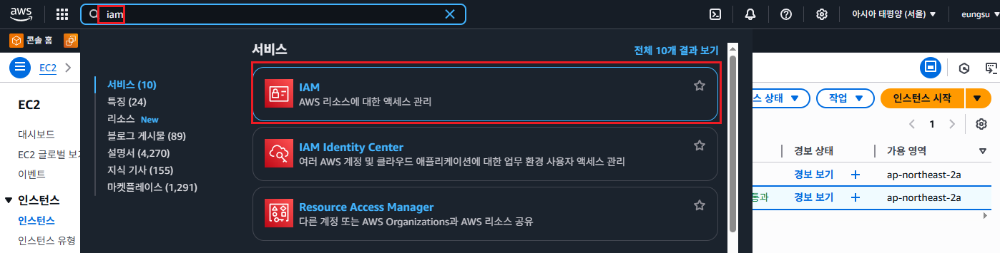
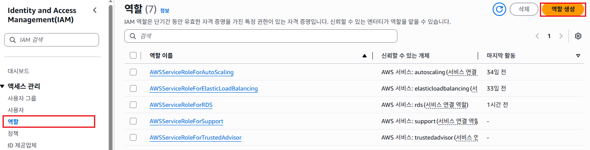
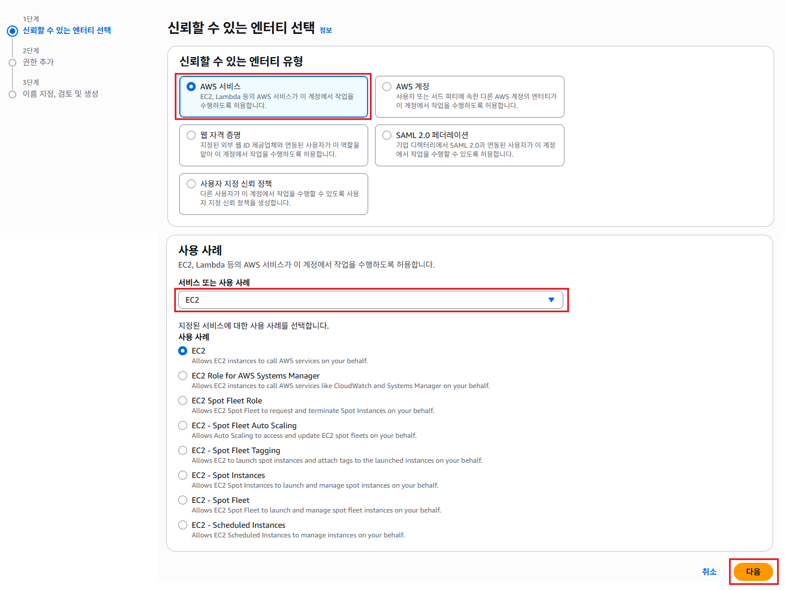
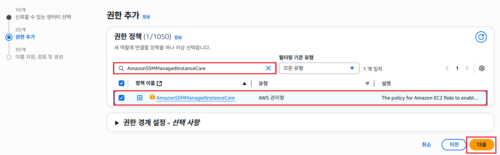
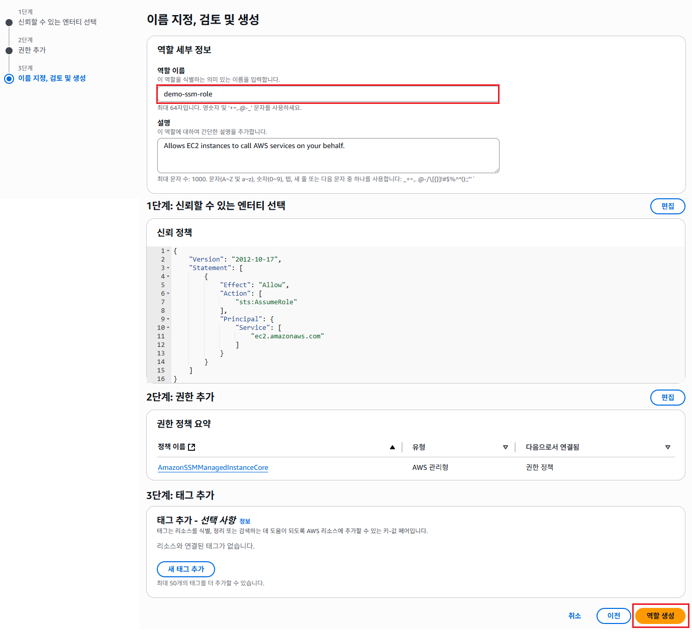
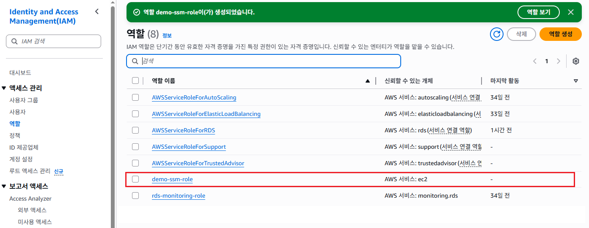

#  Session Manager 사용을 위한 IAM 역할 생성

1. 검색창에 `iam`을 입력하고, IAM을 선택한다.
   

2. IAM 메뉴에서 [역할]을 클릭하고, [역할 생성]버튼을 클릭한다.
   

3. "신뢰할 수 있는 엔터티 선택"화면에서 **신뢰할 수 있는 엔터티 유형**항목에서 `AWS 서비스`를 선택한다. **서비스 또는 사용 사례**항목에서 `EC2`를 선택하고, [다음]버튼을 클릭한다.
   

4. "권한 추가"화면의 **권한 정책**항목에서 검색 필터에 `AmazonSSMManagedInstanceCore`를 입력하고, **정책 이름**에서 `AmazonSSMManagedInstanceCore`를 선택한다. [다음]버튼을 클릭한다.
   

5. "이름 지정, 검토 및 생성"화면의 **역할 이름**항목에 `demo-ssm-role`을 입력한다. [역할 생성]버튼을 클릭한다.
   

6. `demo-ssm-role`이 생성된 것을 확인한다.
   
