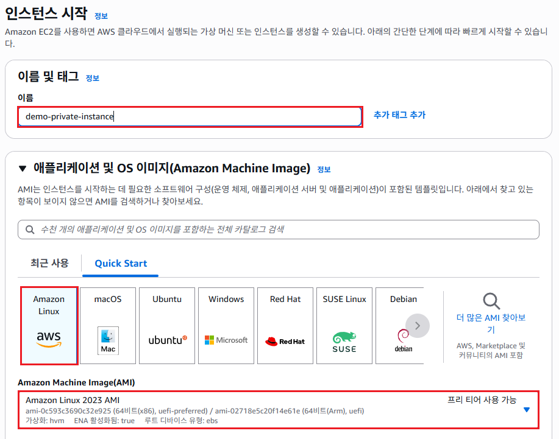
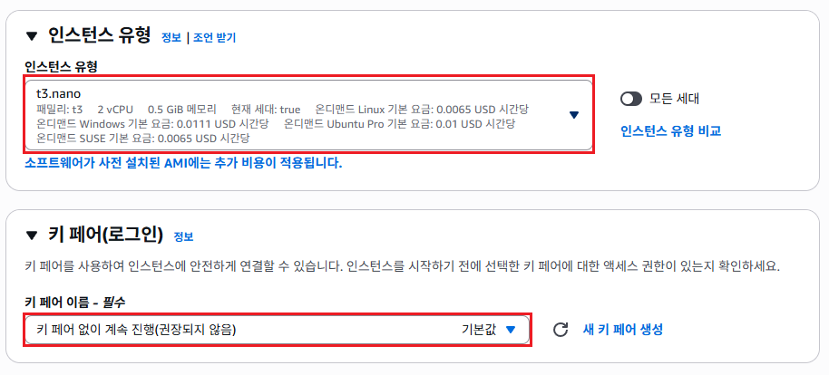
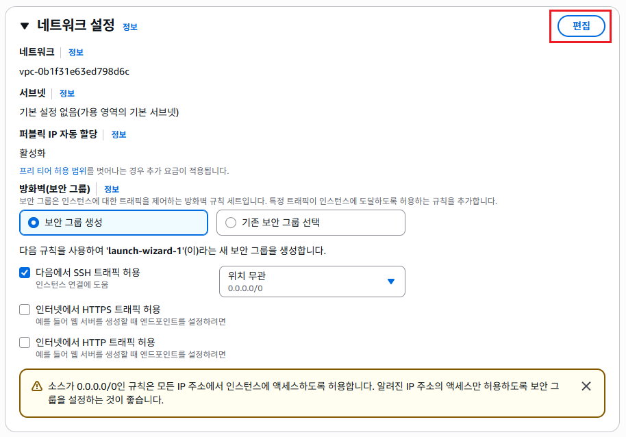
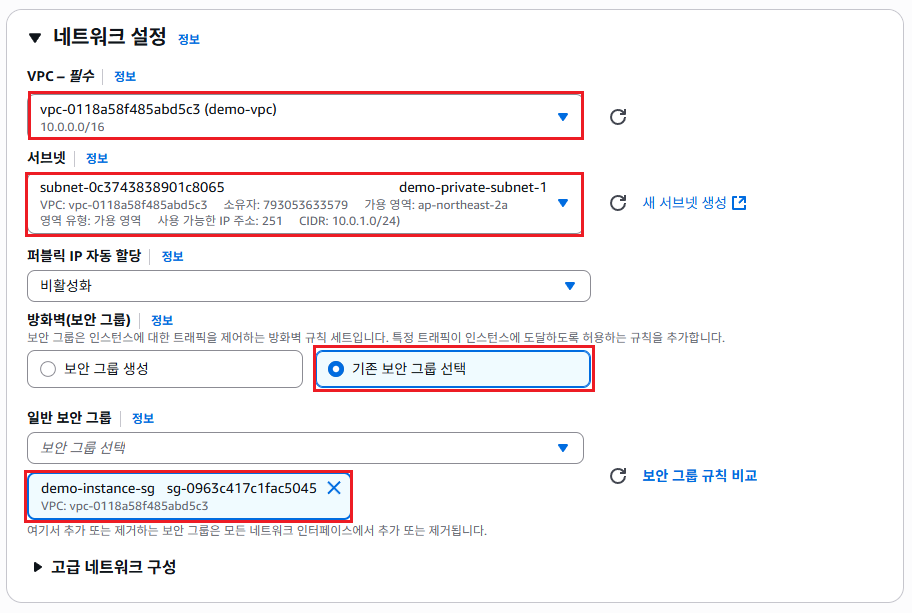
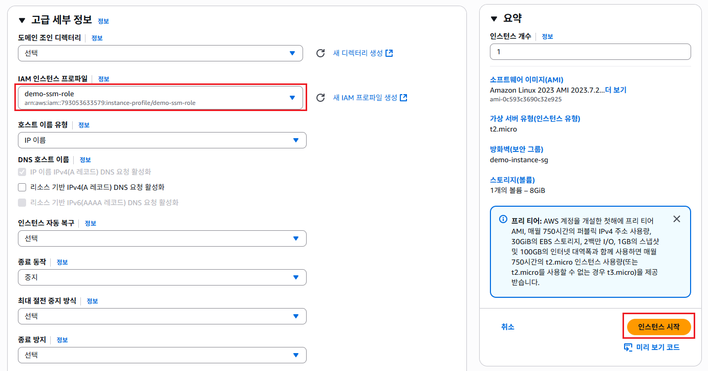
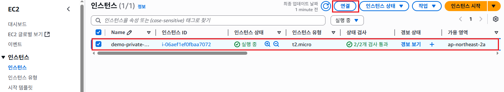
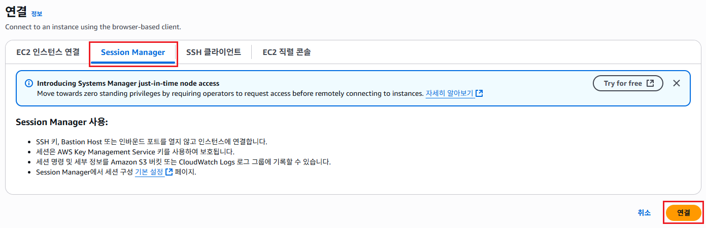
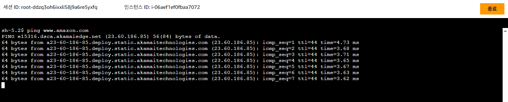

# 인스턴스 생성
- 프라이빗 서브넷에 인스턴스를 생성하고, IAM 인스턴스 프로파일을 적용한다.

## 인스턴스 생성하기
1. EC2 서비스 메뉴에서 [인스턴스]를 클릭한다. [인스턴스 시작]버튼을 클릭한다.
   

2. "인스턴스 시작"화면의 **이름**항목에 `demo-private-instance`를 입력한다. **애플리케이션 및 OS 이미지**항목에서 `Amazon Linux`를 선택하고, `Amazon Linux 2023 AMI`를 선택한다.
   

3. **인스턴스 유형**항목에서 `t3.nano`를 선택하고, *키 페어(로그인)**항목에서 `키 페어 없이 계속 진행(권장하지 않음)`을 선택한다.
   

4. 새로 만든 VPC를 사용하기 때문에,  "네트워크 설정"에서 [편집]버튼을 클릭한다. 
   

5. **VPC-필수**항목에서 `demo-vpc`를 선택한다. **서브넷**항목에서 `demo-private-subnet-1`을 선택한다. **방화벽**항목에서 `기존 보안 그룹 선택`을 체크하고, **일반 보안 그룹**에서 이전에 만들었던 `demo-instance-sg`를 선택한다.
   
   
6. "고급 세부 정보"에서 **IAM 인스턴스 프로파일**항목에 `demo-ssm-role`를 검색해서 선택한다. [인스턴스 시작]버튼을 클릭한다.
   

7. 인스턴스를 선택하고, [연결]버튼을 클릭한다.
   

8. "연결"화면에서 **Session Manager**탭을 클릭한다. [연결]버튼을 클릭한다.
   

9. `ping www.amazon.com`을 명령어를 입력하여 인터넷에 연결되는지 확인한다. 아래와 같은 출력되면 정상적으로 연결된 것이다.
   
