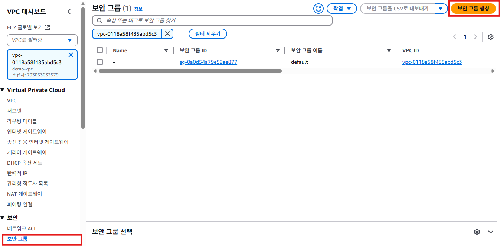
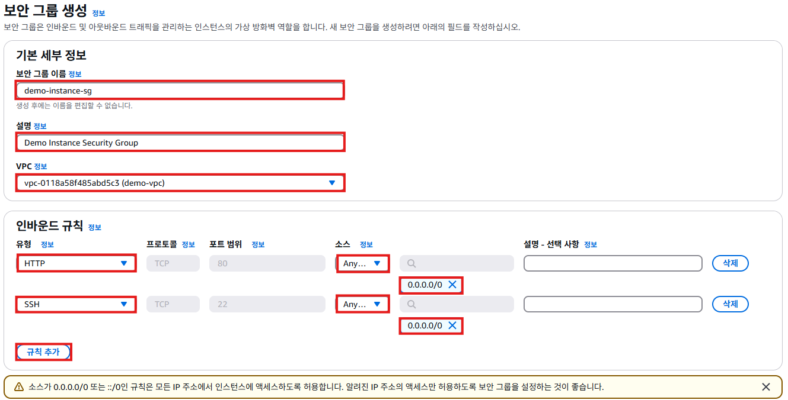
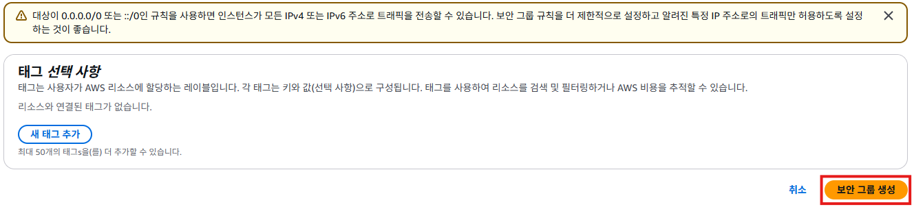
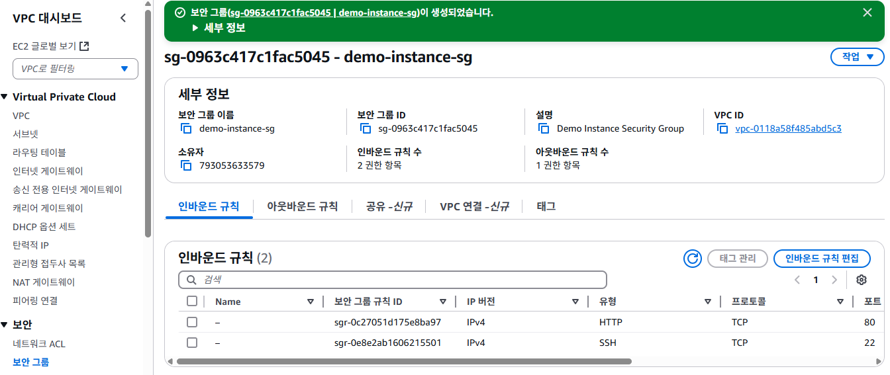

# 보안 그룹
- 인스턴스 생성전에 보안그룹을 생성한다. 보안그룹은 VPC에 종속되기 때문에 새로운 VPC가 만들어졌으면, 보안 그룹도 새로 만든다.

## 보안 그룹 생성하기
1. VPC 서비스 메뉴에서 [보안 그룹]을 클릭한다. [보안 그룹 생성]버튼을 클릭한다.
   

2. "보안 그룹 생성"화면에서 **보안 그룹 이름**항목에 `demo-instance-sg`를 입력한다. **설명**항목에 `Demo Instance Security Group`를 입력한다. **VPC**항목에서 `demo-vpc`를 선택한다. [규칙 추가]버튼을 클릭한다. **유형**항목에 `HTTP`를 선택한다. **소스**는 `Anywhere-IP4`를 선택한다. [규칙 추가]버튼을 클릭한다. **유형**항목에 `SSH`를 선택한다. **소스**는 `Anywhere-IP4`를 선택한다. [보안 그룹 생성]버튼을 클릭한다.
   
   

3. 보안그룹 생성이 완료되면 아래와 같은 화면이 표시된다.
   
