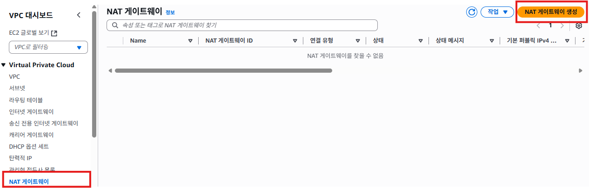
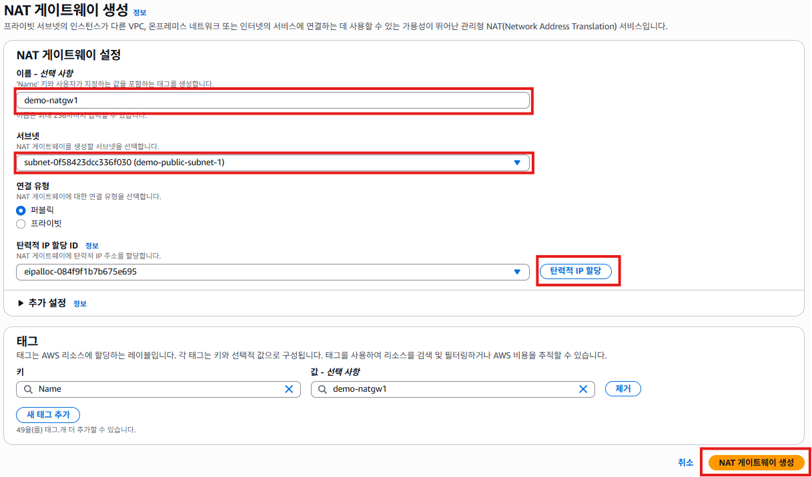
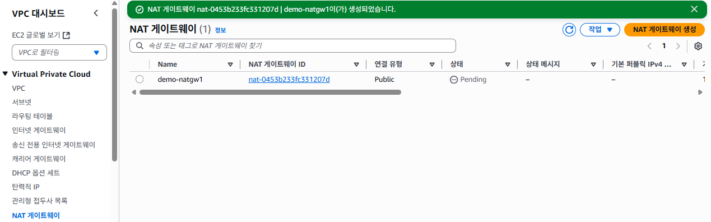
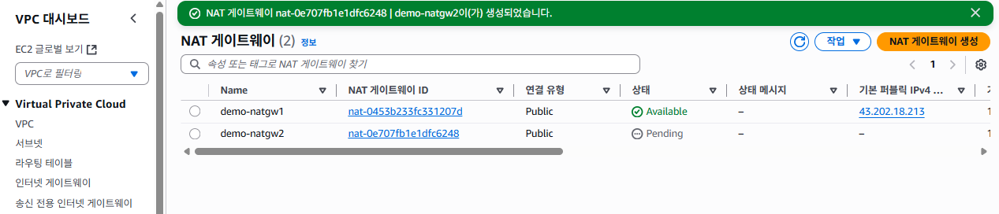

# NAT 게이트웨이 생성
- 퍼블릭 서브넷에 NAT 게이트웨이를 생성한다.

## NAT 게이트웨이 생성하기
1. VPC 서비스 메뉴에서 [NAT 게이트웨이]를 클릭한다. [NAT 게이트웨이 생성] 버튼을 클릭한다.
   

2. NAT 게이트웨이 설정에서 **이름**항목에 `demo-natgw1`을 입력한다. **서브넷**항목에 `demo-public-subnet-1`을 선택한다. [탄력적 IP 할당]버튼을 클릭해서 탄력적 IP를 할당받는다. [NAT 게이트웨이 생성]버튼을 클릭한다.
   

3. NAT 게이트웨이 생성이 완료되면 아래의 화면이 표시된다. 
   

4. 위 작업을 반복해서 `demo-natgw1`을 생성한다. 서브넷은 `demo-public-subnet-1`를 선택하여 NAT 게이트웨이를 하나 더 생성한다.
   