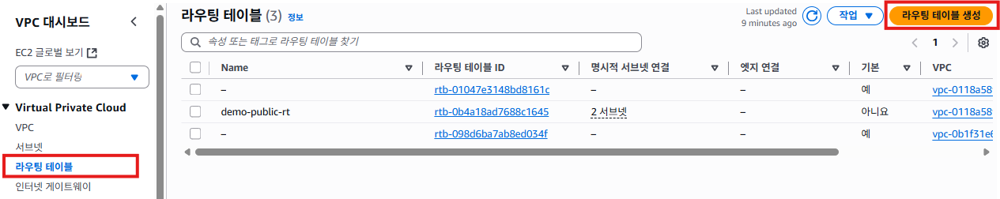
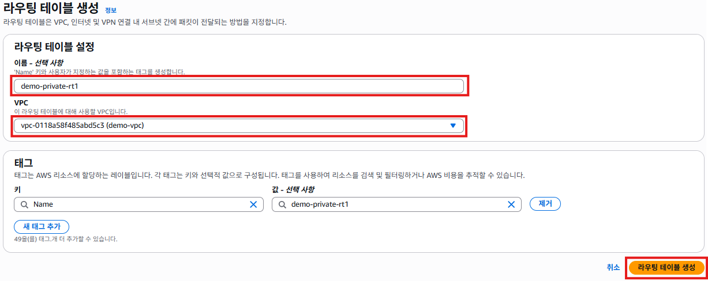
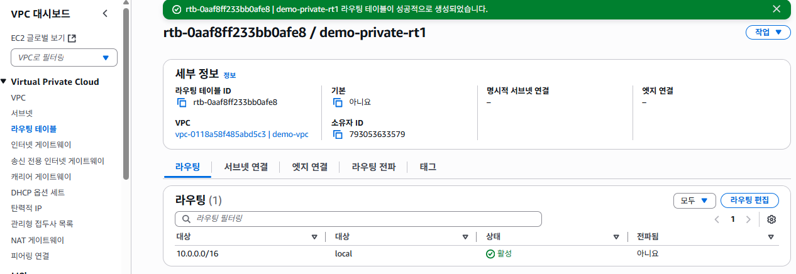
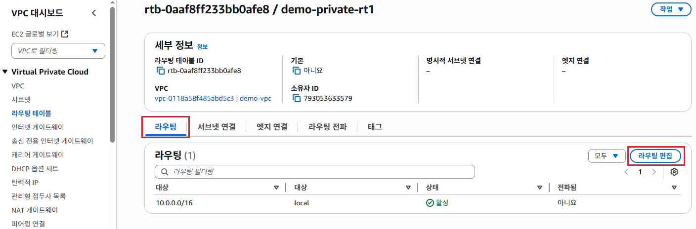
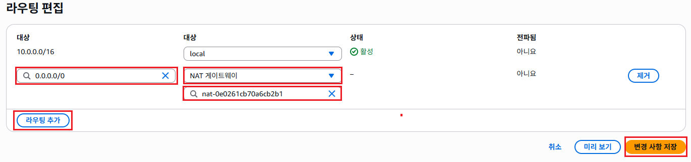
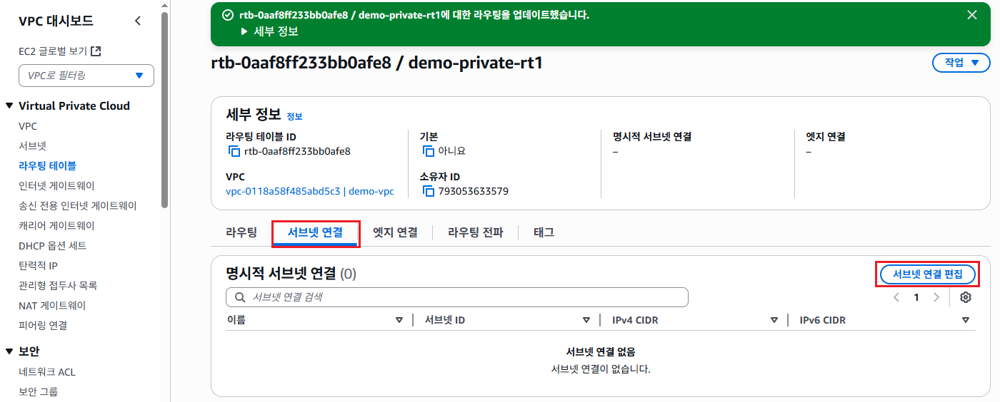
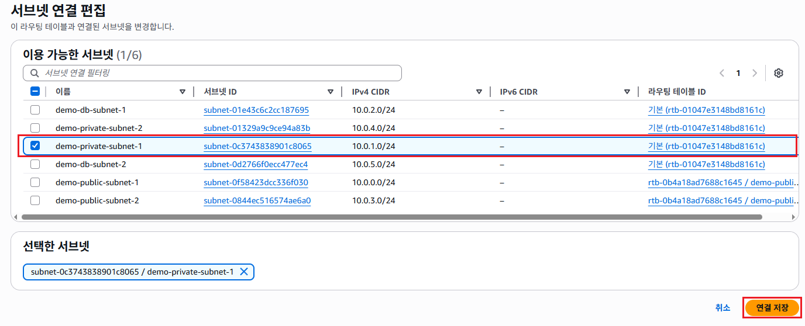
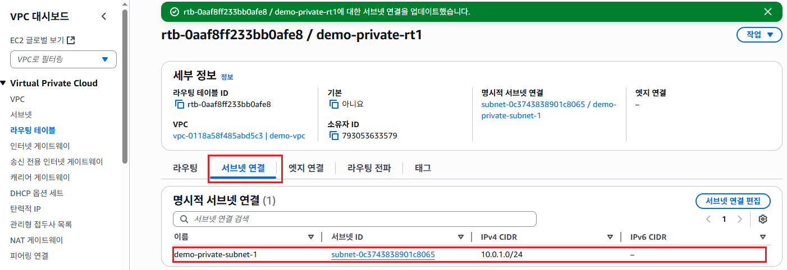

# 프라이빗 라우팅 테이블 생성

## 프라이빗 라우팅 테이블 생성하기
1. VPC 서비스 메뉴에서 [라우팅 테이블]을 클릭한다. [라우팅 테이블 생성]을 클릭한다.
   

2. 라우팅 테이블 설정에서 **이름**항목에 `demo-private-rt1`을 입력한다. **VPC**항목에 `demo-vpc`를 선택한다. [라우팅 테이블 생성]버튼을 클릭한다.
   

3. 라우팅 테이블 생성이 완료되면, 아래의 화면이 표시된다.
   

4. [라우팅] 탭을 클릭하고, [라우팅 편집]버튼을 클릭한다.
   

5. [라우팅 추가]버튼을 클릭하고, 왼쪽 **대상**항목에서 `0.0.0.0/0`을 선택한다. 오른쪽 **대상**항목에서 `NAT 게이트웨이`을 선택하고, 미리 생성한 `demo-natgw1`을 선택한다. [변경 사항 저장]을 클릭한다.
   

6. [서브넷 연결]탭을 클릭한다. [서브넷 연결 편집] 버튼을 클릭한다. 
   

7. 서브넷 목록에서 `demo-private-subnet-1`을 체크한다. [연결 저장]버튼을 클릭한다.
   

8. [서브넷 연결]탭에서 **명시적 서브넷 연결**에 1개의 프라이빗 서브넷이 연결된 것을 확인한다.
   

9. 1~8번까지 반복해서 `demo-private-rt2`이름으로 프라이빗 라우팅 테이블을 하나 더 만든다. 라우팅 탭에서 `0.0.0.0/0`의 대사을 `demo-natgw2`로 라우팅을 추가한다. 마지막으로 **서브넷 연결**에서 `demo-private-subnet-2`를 연결한다.
