# AWS 가입하기

1. 아래의 링크를 이용하여 AWS 공식 페이지로 이동한다.
    https://aws.amazon.com/ko/
    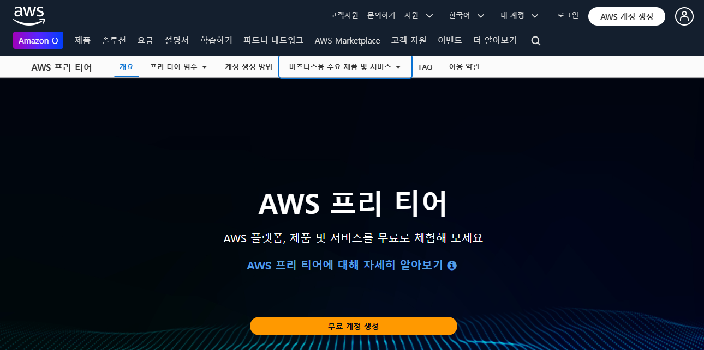
2. [AWS 계정 생성] 버튼을 클릭한다.
   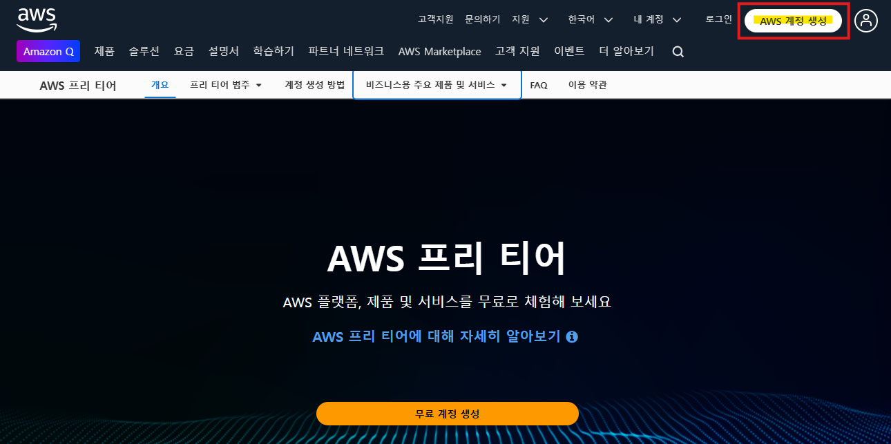
3. 루트 사용자 이메일 주소와 AWS 계정 이름을 입력하고, [이메일 주소 확인] 버튼을 클릭한다.
   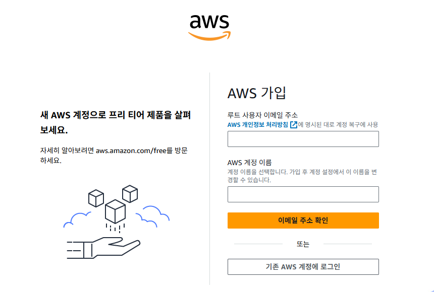
4. 이메일을 확인하여, 확인코드를 입력하고 [확인] 버튼을 클릭한다.
   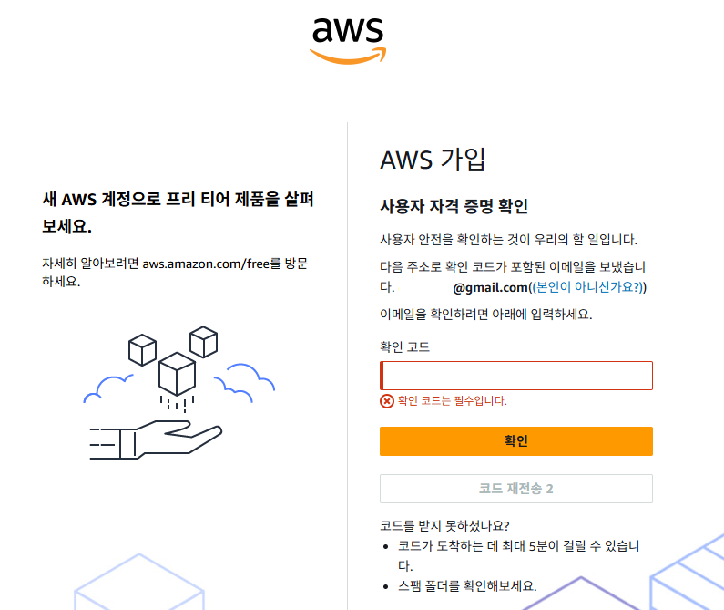
5. 루트 사용자 암호와 루트 사용자 암호 확인에 사용할 암호를 입력하고, [계속] 버튼을 클릭한다.
   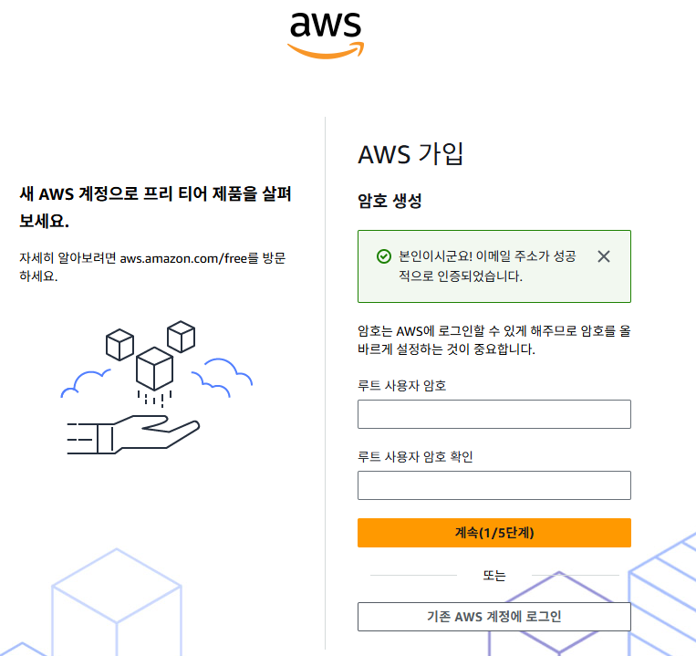
6. 개인 정보를 영어로로 입력하고 [계속] 버튼을 클릭한다.
   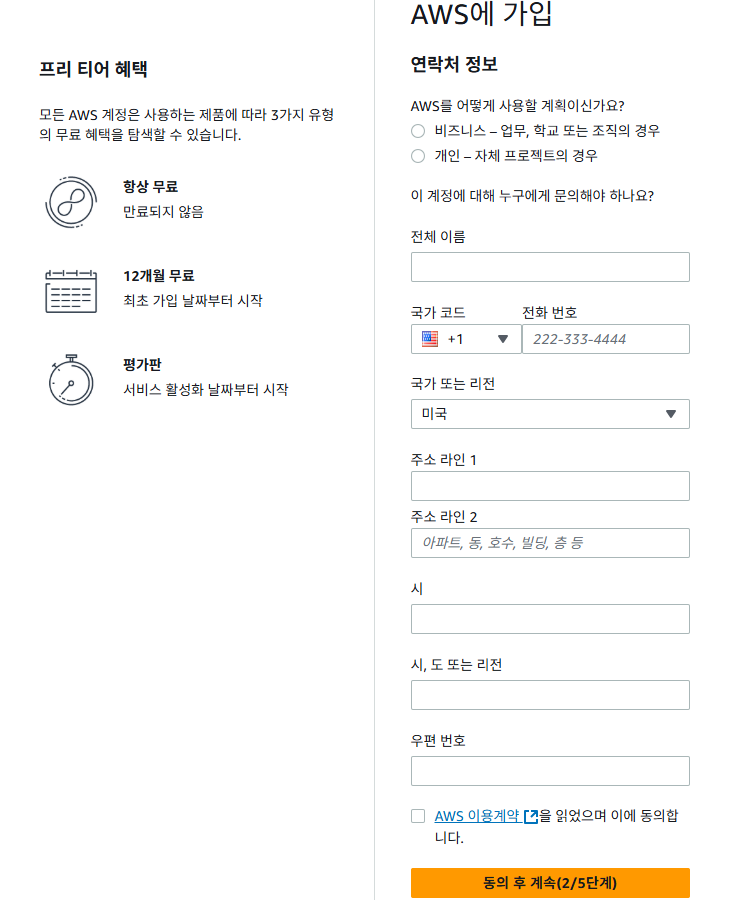
7. 결제 정보를 입력하고, [확인 및 계속] 버튼을 클릭한다.
   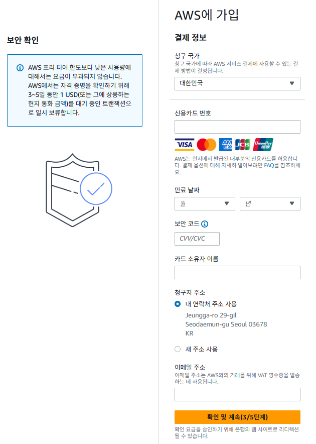
8. 카드 인증 정보를 입력한다.
   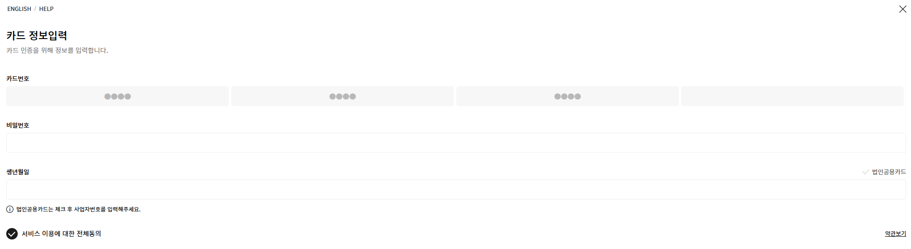
9. 확인 코드를 받을 수 있는 전화번호를 입력하고 [SMS 전송] 버튼을 클릭한다.
   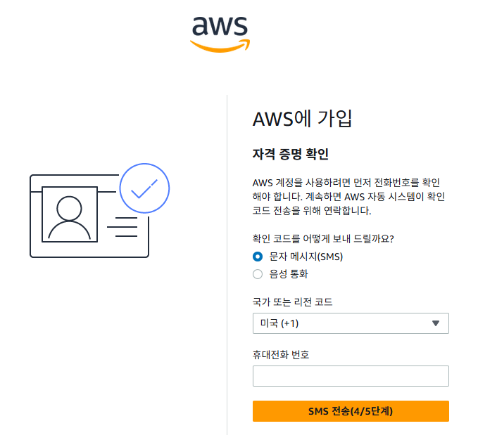
10. SMS로 받은 코드를 입력하고 [계속] 버튼을 클릭한다.
   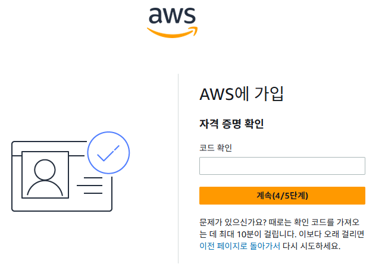
11. AWS에서 어떤 지원을 받을지 선택하는 메뉴다. 무료를 선택하고, [가입완료] 버튼을 클릭한다.
   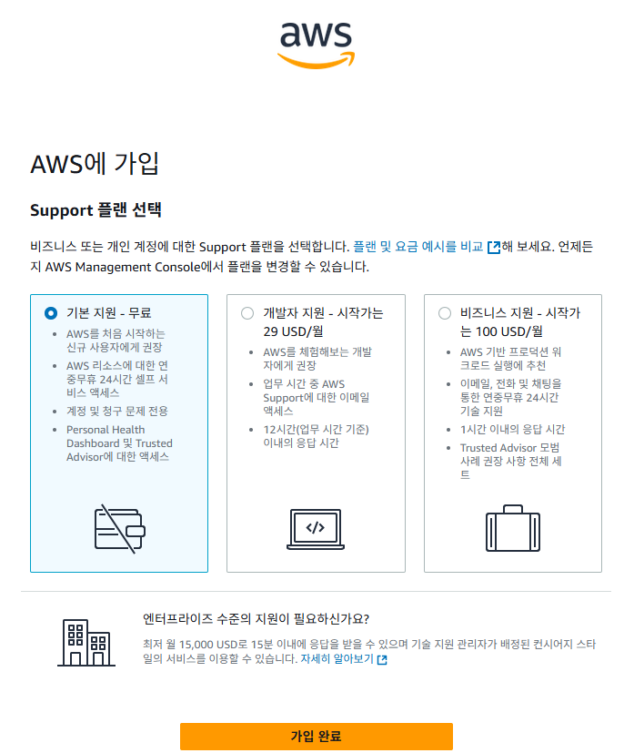
12. 가입이 완료되면, 아래의 화면이 표시된다. [AWS Management Console로 이동]버튼을 클릭한다.
   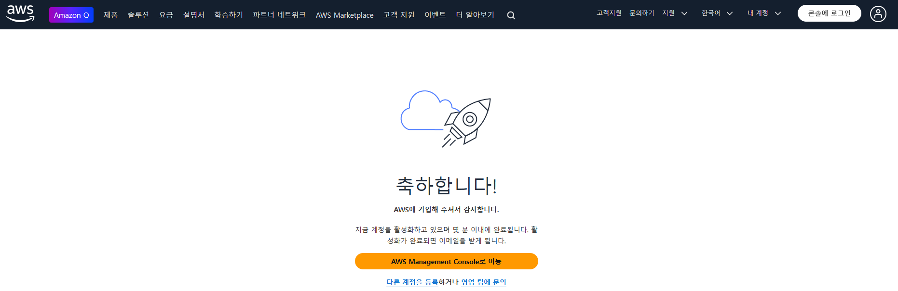
13. 콘솔 홈이 표시된다.
   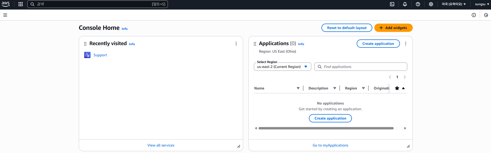