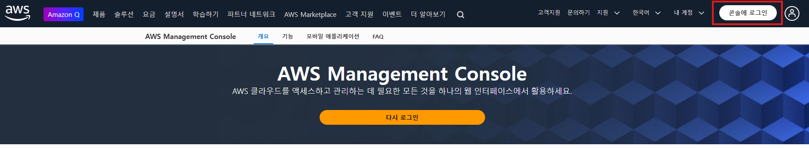
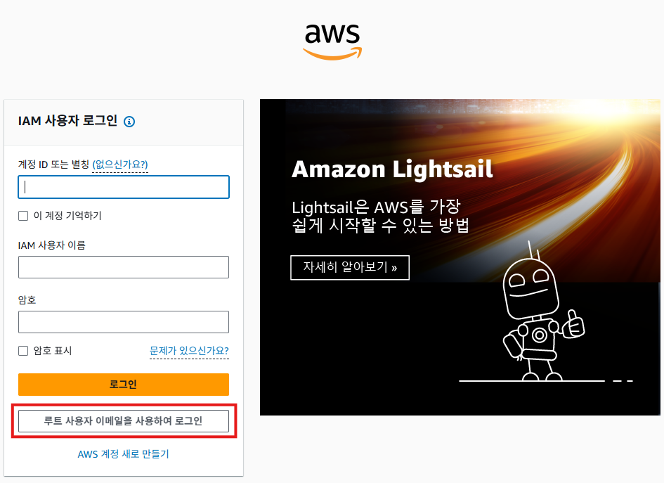
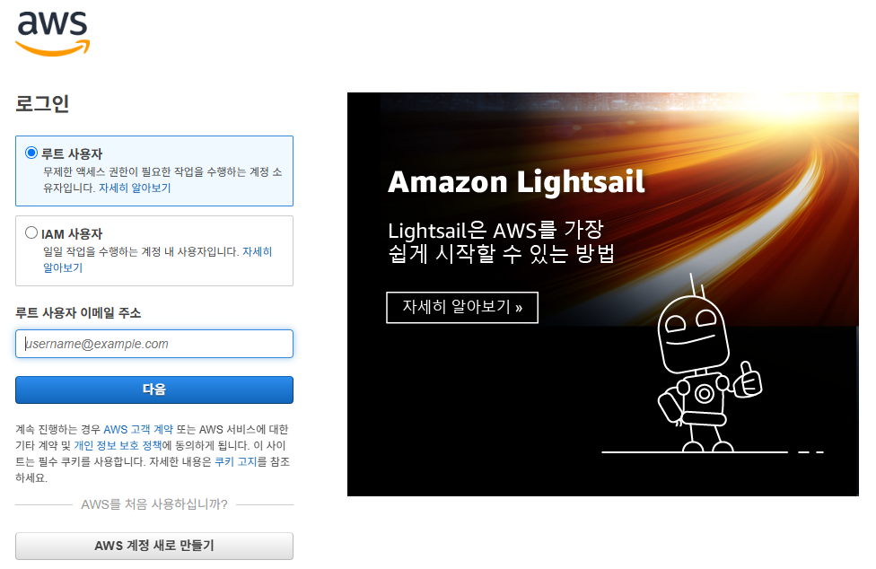
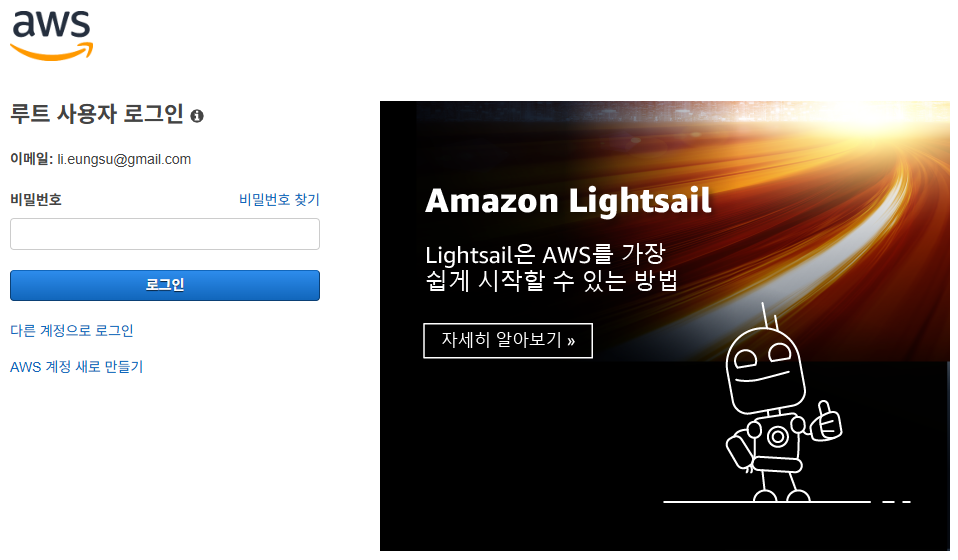
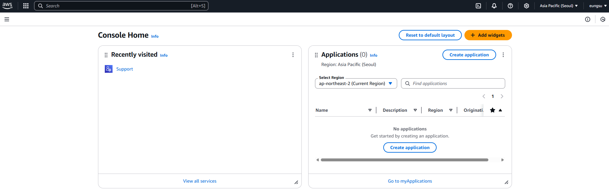
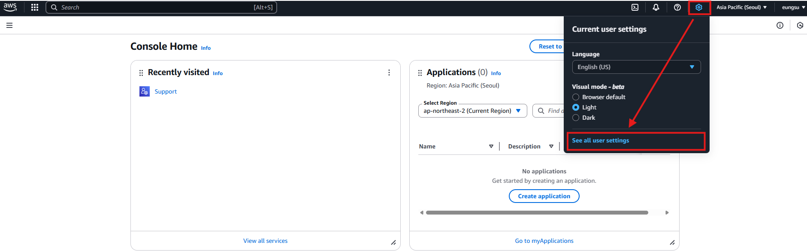
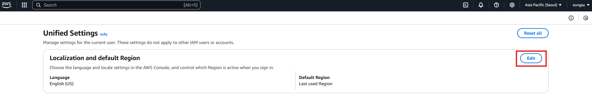
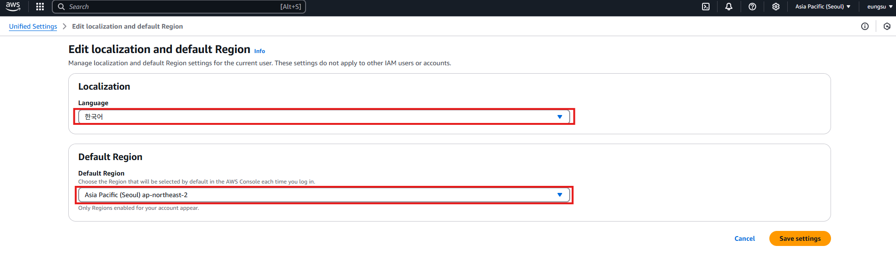
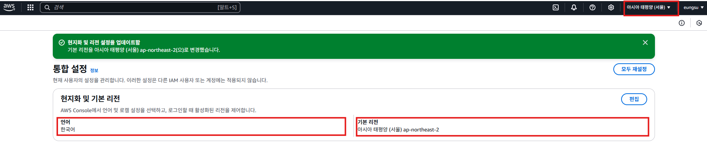
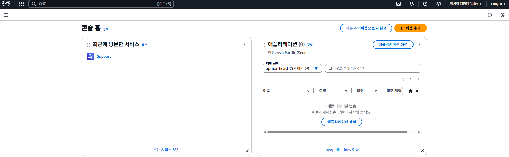

# AWS 로그인

1. [콘솔에 로그인] 버튼을 클릭하여 로그인 화면으로 이동한다.
   

2. 현재는 루트 사용자 밖에 없기 때문에 [루트 사용자 이메일을 사용하여 로그인] 버튼을 클릭한다.
   > 보안상 루트 사용자는 처음에 AWS를 만들때 만 사용하고, 일반적으로 일반 사용자를 만들어서 사용해야 한다.
   
   

3. 루트 사용자를 선택하고, 이메일 주소를 입력한 후, [다음] 버튼을 클릭한다.
   

4. 비밀번호를 입력한 후, [로그인] 버튼을 클릭한다.
   

5. AWS에 로그인 한 화면이다
   

6. 아래의 화면을 따라 통합 설정 화면으로 이동한다.
   

7. [Edit] 버튼을 클릭한다.
   

8. "Edit localization and default Region"화면에서 언어를 한국어, 기본 리전을 Seoul로 설정하고, [Save settings] 버튼을 클릭한다.
   

9. 통합 설정 화면에서 언어와 기본 리전이 변경된 것을 확인할 수 있다.
   
   
10. 메뉴의 AWS를 클릭하면 콘솔 홈 화면이 다시 표시된다.
   
