# 오토 스케일링 그룹 테스트
- 오토스케일링이 동작하는 방식은 **대상 추적 크기 정책**에 따라 우리가 정해준 **지표 유형**은 **평균 CPU 사용률**을 기반으로 **대상 값(50으로 설정)** 에 따라, AWS가 알아서 인스턴스를 생성,삭제하는 작업을 한다. 
- 실습을 빠르게 수행하기 위한 사전작업
  - **평균 CPU 사용률**의 **대상 값**을 `20`으로 설정한다.
  - **대상 그룹**에서 오토스케일링이 자동으로 생성하지 않은 인스턴스를 삭제한다.

## 오토 스케일링 그룹 테스트 하기
1. EC2 서비스의 왼쪽 메뉴에서 [Auto Scaling 그룹]을 클릭하고, `demo-asg`를 클릭한다.
   
   
2. **Acutomatic Scaling** 탭을 선택하고 [동적 크기 조정 정책 생성] 버튼을 클릭한다.
   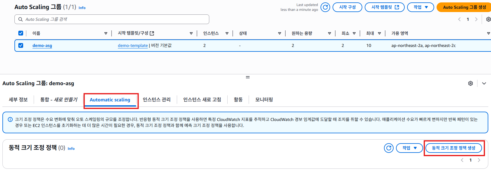

3. "동적 크기 조정 정책 생성"화면에서 **대상 값**항목에 `20`을 입력한다. [생성] 버튼을 클릭한다.
   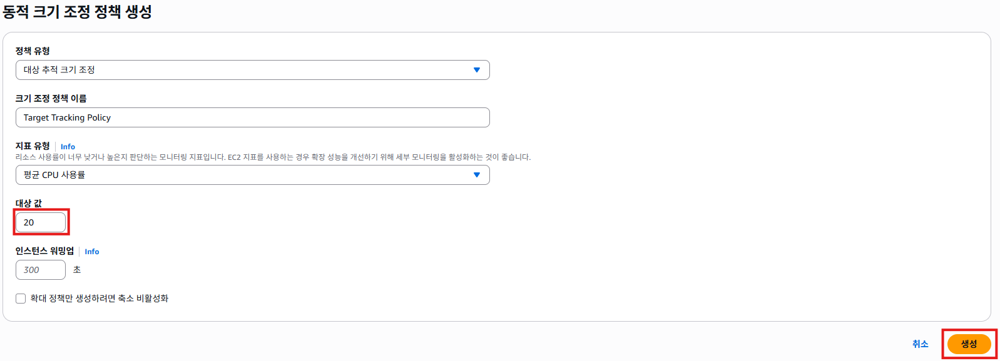

4. 동적 크기 조정 정책이 새로 추가된 것을 확인할 수 있다.
   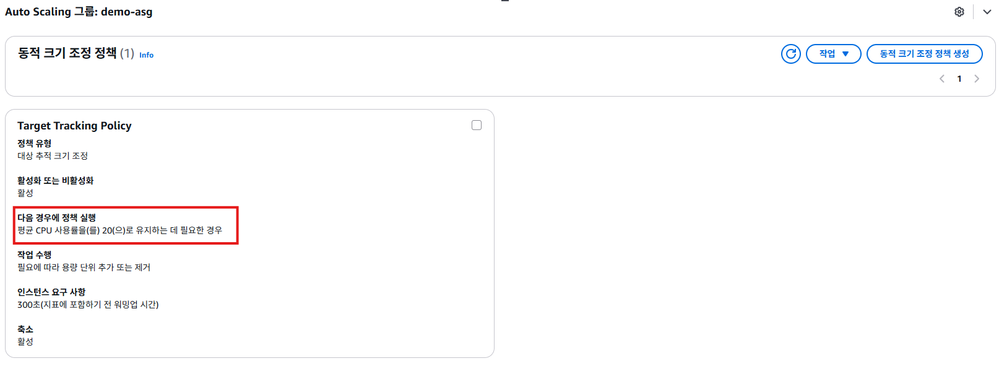

5. EC2 서비스의 왼쪽 메뉴에서 [대상 그룹]을 클릭하고, `demo-tg`를 클릭한다.
   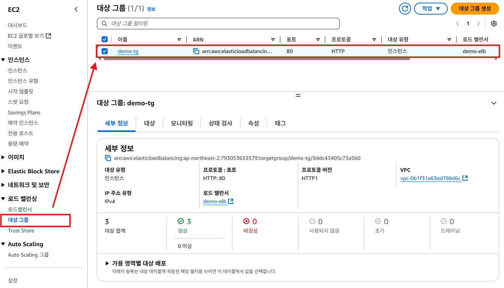

6. 화면 아래쪽의 **대상**탭을 클릭하면 3개의 인스턴스가 표시된다. `Demo-Web-Instance`는 오토스케일링이 생성한 인스턴스고, `demo-instance`는 우리가 직접 생성한 인스턴스다. 오토스케일링은 자신이 생성한 인스턴스만 관리하기 때문에 우리가 직접 생성한 인스턴스를 제거한다. 이미 운영중인 인스턴스를 제거할 때는 사용자가 인스턴스에서 작업을 수행할 수도 있기 때문에 트래픽 드레인(drain) 작업을 먼저하고, 인스턴스를 삭제한다. `demo-instance`를 선택하고 [등록 취소]버튼을 클릭한다.
   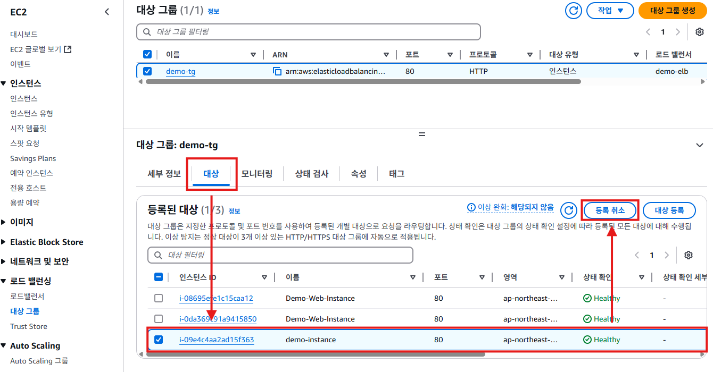

7. [등록 취소]버튼을 클릭하면 해당 인스턴스의 **상태 확인**이 `Draining`으로 변경된다. 이 인스턴스에는 로드밸런스가 더이상 트래픽을 전달하지 않는다. 이미 들어왔던 트래픽만 처리하고 내보내는 작업을 수행한다. `Draining` 작업을 5분 정보가 소요되고, 5분 후에 **대상 그룹**에서 `demo-instance`는 배제된다.
   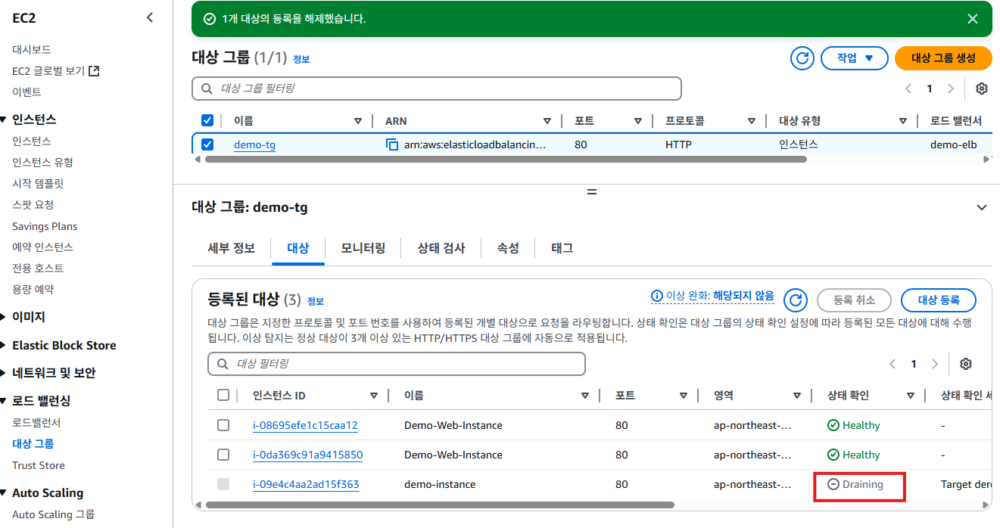

8. **대상 그룹**에서 배제가 되면, 인스턴스 메뉴로 이동하여 해당 인스턴스를 종료시킨다.
   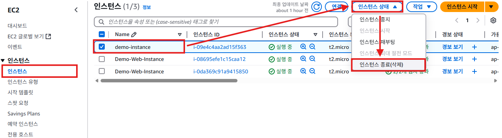

   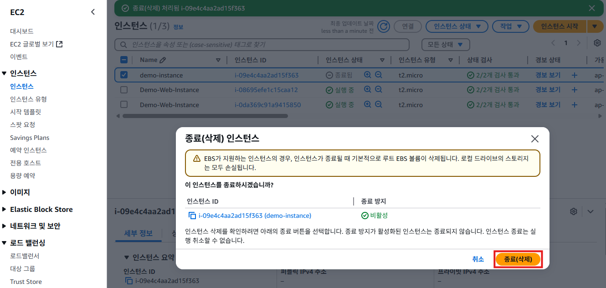

9. 오토스케일링의 동작을 테스트하기 위해, 오토스케일링이 만든 `Demo-Web-Instance` 중 하나를 선택하고, [연결]버튼을 클릭한다.
   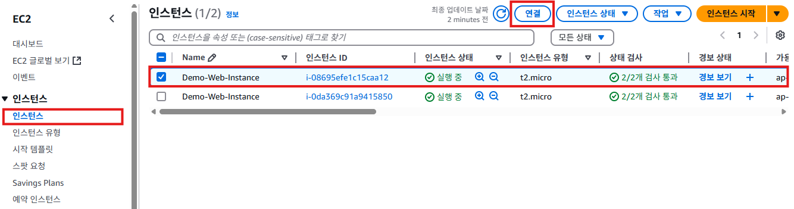

10. "인스턴스 연결"화면의 **EC2 인스턴스 연결**탭에서 아래와 같이 선택하고, [연결] 버튼을 클릭한다.
   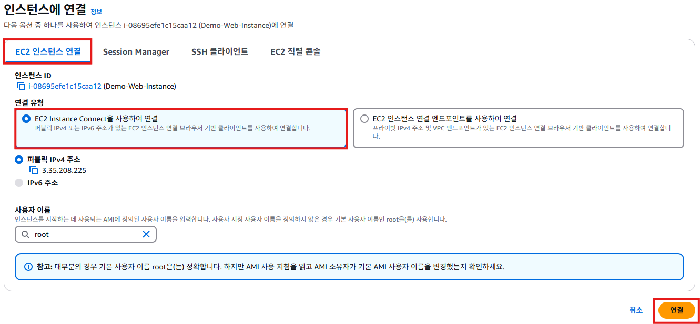

11. 아래와 같이 터미널 화면이 나오면, CPU 부하을 증가시키기 위해서 아래의 명령어를 입력하고 실행한다. 일정 시간이 지나면 오토스케일링이 새로운 인스턴스를 만들어 **대상 그룹**에 추가하는 것을 확인할 수 있다. 확인 후 `Ctrl+C`를 눌러 명령어를 종료시키고 일정 시간이 지나면 오토스케일링에 의해 인스턴스가 삭제되는 것을 확인할 수 있다.
    
    ```bash
    while true;do true;done
    ```

    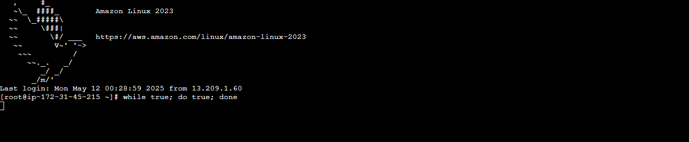
    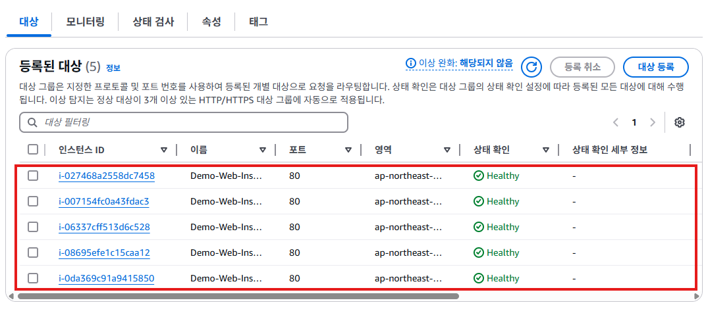
   