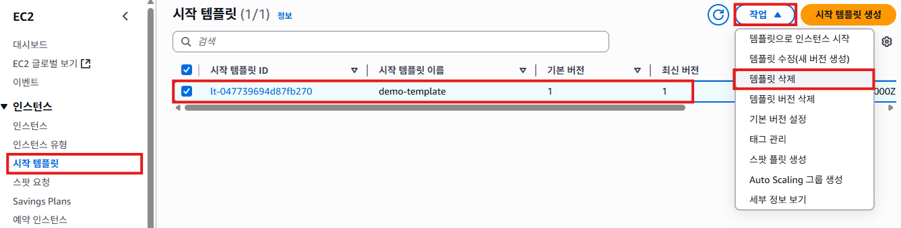

# 리소스 삭제

## 오토 스케일링 그룹 삭제
1. EC2 서비스의 왼쪽 메뉴에서 [Auto Scaling 그룹]을 클릭한다. `demo-asg`를 선택하고, [작업] -> [삭제] 클릭한다.
   

2. **Auto Scaling 삭제**팝업창의 입력란에 `삭제`를 입력하고, [삭제]버튼을 클릭한다.
   

## 시작 템플릿 삭제
1. EC2 서비스의 왼쪽 메뉴에서 [시작 템플릿]을 클릭한다. `demo-template`를 선택하고, [작업] -> [템플릿 삭제] 클릭한다.
   
   
2. **시작 템플릿 삭제**팝업창의 입력란에 `삭제`를 입력하고, [삭제]버튼을 클릭한다.
   

## AMI 삭제
1. EC2 서비스의 왼쪽 메뉴에서 [AMI]를 클릭한다. `demo-ami`를 선택하고, [작업] -> [AMI 등록 취소] 클릭한다.
   

2. **AMI 등록 취소**팝업창에서 [AMI 등록 취소]버튼을 클릭한다.
   

## 로드밸런서 삭제
1. EC2 서비스의 왼쪽 메뉴에서 [로드밸런서]를 클릭한다. `demo-elb`를 선택하고, [작업] -> [로드 밸런서 삭제]를 클릭한다.
   

2. **로드 밸런서 삭제**팝업창에서 입력란에 `확인`을 입력하고, [삭제]버튼을 클릭한다.
   

## 대상 그룹 삭제
1. EC2 서비스의 왼쪽 메뉴에서 [대상그룹]을 클릭한다. `demo-tg`를 선택하고, [작업] -> [삭제] 클릭한다.
   

2. **대상 그룹을 삭제하시겠습니까?**팝업창에서 [예, 삭제합니다]버튼을 클릭한다.
   

## 보안 그룹 삭제
1. EC2 서비스의 왼쪽 메뉴에서 [보안 그룹]을 클릭한다. `demo-elb-sg`, `demo-web-instance-sg`, `launch-wizard-x`를 선택하고, [작업] -> [보안 그룹 삭제] 클릭한다.
   

2. **보안 그룹 삭제**팝업창에서 입력란에 `삭제`를 입력하고, [삭제]버튼을 클릭한다.
   