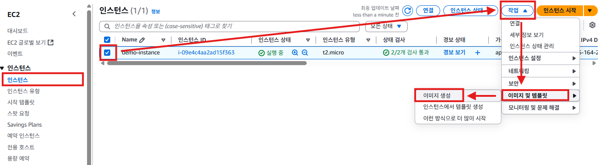
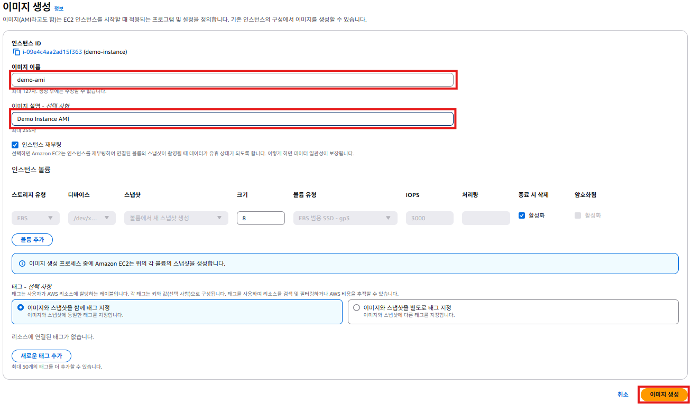
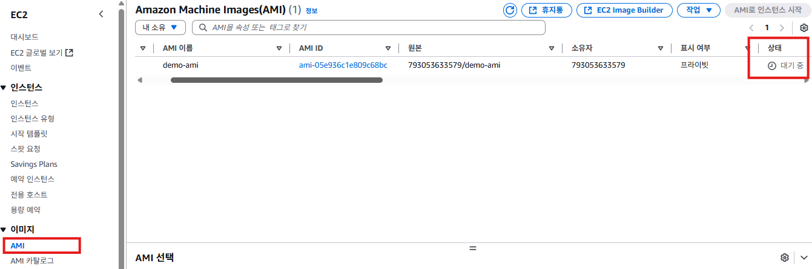

# AWS AMI
- 오토스케일링을 사용하기 위해서 시작 템플릿이 필요하고, 시작 템플릿을 만들려면 AMI(Amazon Machine Image)가 필요하다.
- Amazon Machine Image (AMI) 는 AWS EC2 인스턴스를 생성할 때 사용하는 이미지 템플릿이다.
- AMI는 OS, 애플리케이션, 파일 시스템 설정 등 인스턴스 생성에 필요한 모든 소프트웨어 설정을 포함하고 있습니다.
- AMI를 기반으로 EC2 인스턴스를 생성하면 사전 구성된 환경에서 서버를 빠르게 시작할 수 있다.

## AWS AMI 생성하기
1. EC2 서비스의 왼쪽 메뉴에서 [인스턴스]를 클릭한다. 인스턴스 목록에서 `demo-instance`를 체크한다. [작업] -> [이미지 및 템플릿] -> [이미지 생성] 순서로 클릭한다.
   

2. "이미지 생성"화면에서 **이미지 이름**항목에 `demo-ami`를 입력한다. **이미지 설명**항목에 `Demo Instance AMI`를 입력한다. [이미지 생성] 버튼을 클릭한다.
   

3. EC2 서비스의 왼쪽 메뉴에서 [AMI]를 클릭한다. AMI 목록에 생성된 AMI가 표시된다. 
   