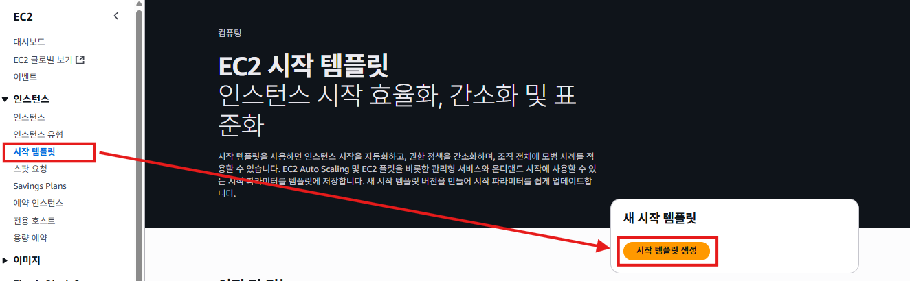
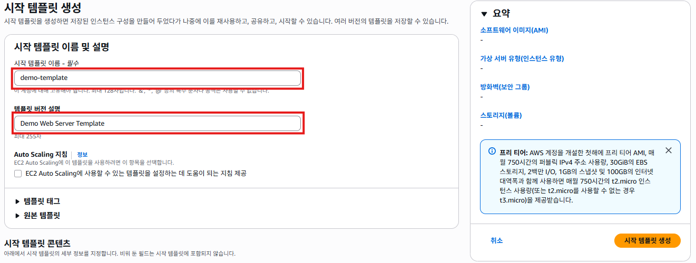
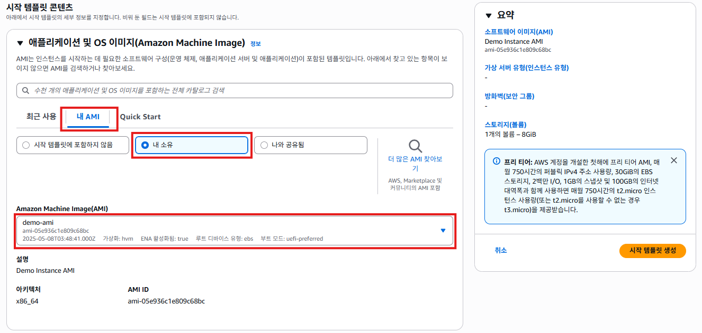
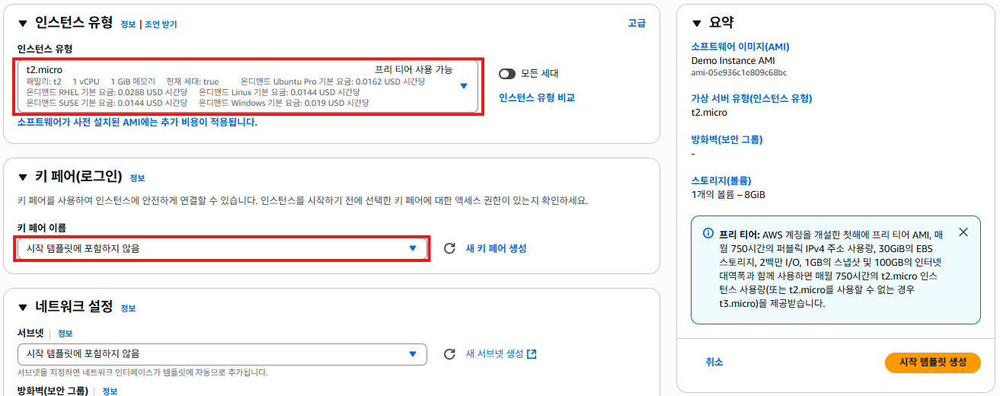
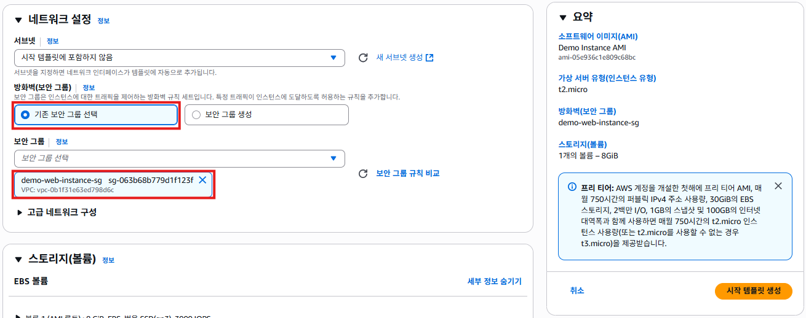
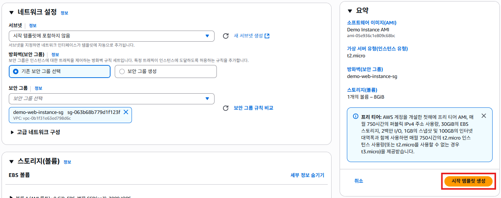
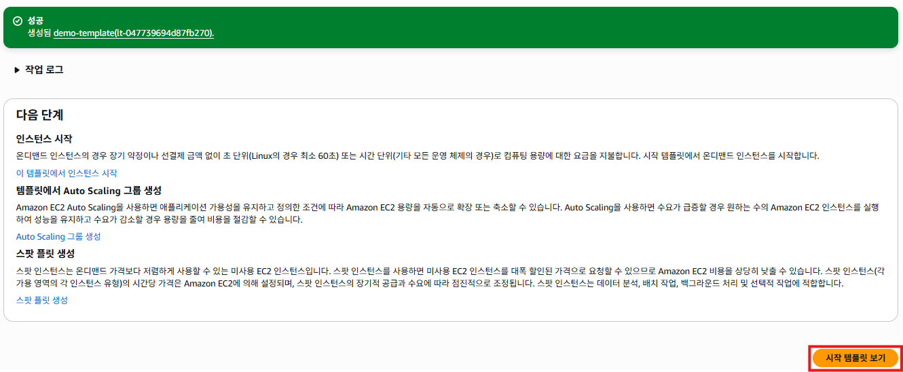
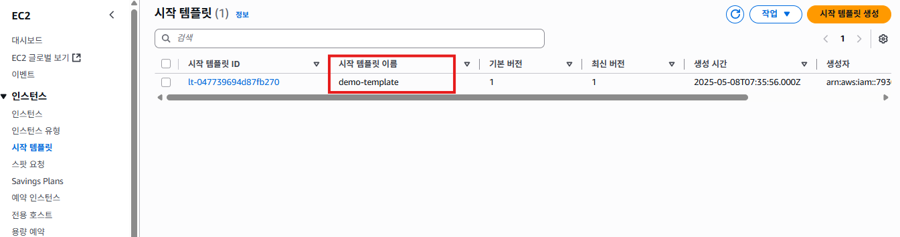

# 시작 템플릿 (launch Template)
- EC2 시작 템플릿 (Launch Template) 은 AWS EC2 인스턴스를 생성할 때 필요한 모든 설정을 사전 정의하여 일관된 서버 환경을 자동으로 배포할 수 있도록 하는 템플릿이다.
- EC2 인스턴스를 수동으로 구성하는 번거로움을 줄이고, Auto Scaling 그룹, Spot 인스턴스, On-Demand 인스턴스 등 다양한 배포 환경에서 동일한 설정을 사용하여 서버를 빠르고 일관되게 생성할 수 있다.

## 시작 템플릿 (launch Template) 생성하기
1. EC2 서비스의 왼쪽 메뉴에서 [시작 템플릿]을 선택한다. [시작 템플릿 생성]버튼을 클릭한다.
   

2. "시작 템플릿 생성"화면의 **시작 템플릿 이름**항목에 `demo-template`를 입력한다. **템플릿 버전 설명**항목에 `Demo Web Server Template`를 입력한다.
   

3. "시작 템플릿 생성"화면의 **애플리케이션 및 OS 이미지**항목에서 **내 AMI** -> **내 소유** -> `demo-ami`를 선택한다.
   

4. "시작 템플릿 생성"화면의 **인스턴스 유형**항목에서  **인스턴스 유형**항목에 `t2.micro`를 선택한다. **키 페어 이름**항목에 `시작 템플릿에 포함하지 않음`을 선택한다.
   

5. "시작 템플릿 생성"화면의 **네트워크 설정**항목에서  **방화벽(보안 그룹)**항목에 `기존 보안 그룹 선택`를 선택하고, **보안 그룹**항목에 `demo-web-instance-sg`을 선택한다. 
   
   
6. 요약정보를 확인하고, [시작 템플릿 생성]버튼을 클릭한다.
   

7. "시작 템플릿 생성 완료" 화면이 표시된다. [시작 템플릿 보기]버튼을 클릭한다.
   

8. "시작 템플릿"화면에서 `demo-template`이 표시된다.
   