# 오토 스케일링 그룹(Auto Scaling Group)
- **Auto Scaling 그룹(ASG)** 은 AWS에서 지정된 조건에 따라 EC2 인스턴스의 수를 자동으로 조정하여 서비스의 가용성과 성능을 최적화하는 서비스다.
- 주로 웹 애플리케이션 서버, API 서버, 마이크로서비스 아키텍처에서 자동 확장 및 축소를 위해 사용된다.
- Auto Scaling 그룹은 사용자의 정의된 조건에 따라 EC2 인스턴스를 자동으로 추가하거나 삭제하여 서비스의 고가용성을 보장한다.
- Auto Scaling 그룹 실습이 완료되면 아래와 같은 아키텍처가 만들어진다.
   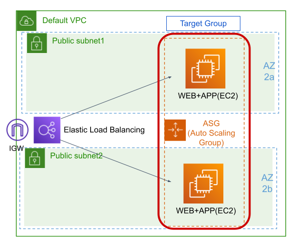

## 오토 스케일링 그룹 생성하기
1. EC2 서비스의 왼쪽 메뉴에서 [Auto Scaling 그룹]을 클릭한다. [Auto Scaling 그룹 생성]버튼을 클릭한다.
   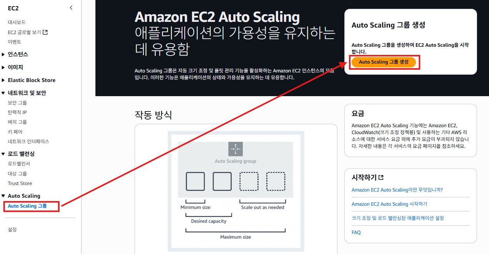

2. "시작 템플릿 선택"화면에서 **Auto Scaling 그룹 이름**항목에 `demo-asg`를 입력한다. **시작 템플릿**항목에 `demo-template`를 선택한다.
   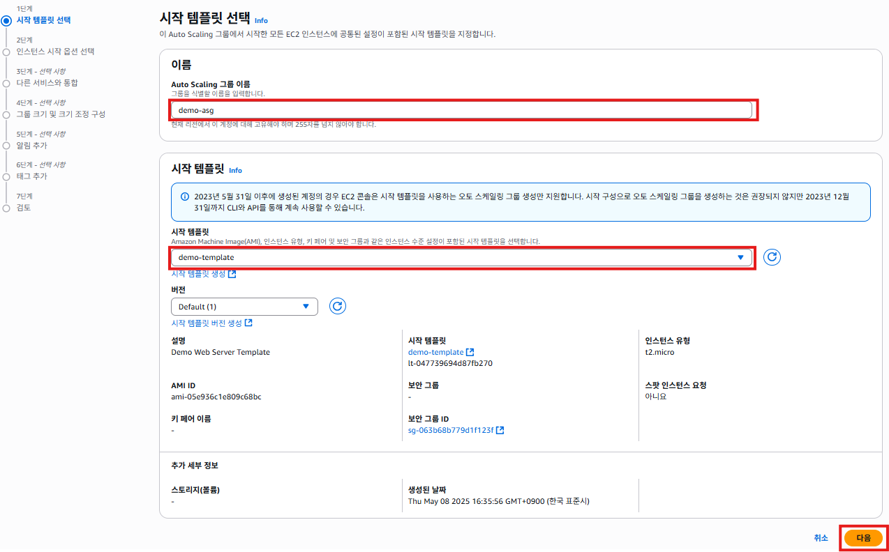

3. "인스턴스 시작 옵션 선택"화면에서 **네트워크**항목의 **가용 영역 및 서브넷**항목에서 2개 이상의 서브넷을 선택한다. 선택된 2개의 가용 영역에 걸쳐서 오토 스케일링이 동작된다. 인스턴스 유형이 `t2.micro`인 경우 `ap-northeast-2b`와 `ap-northeast-2d`를 사용할 수 없다. [다음]버튼을 클릭한다.
   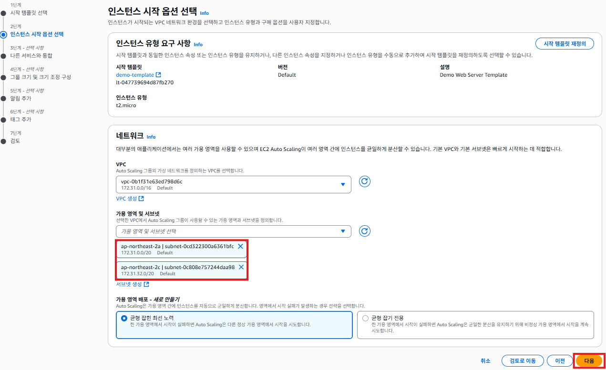

4. "다른 서비스와 통합"화면에서 오토 스케일링 그룹을 기존 로드밸런서와 연결한다. **로브 밸런싱**항목에서 `기존 로드 밸런서 연결`을 선택한다. **기존 로드 밸런서에 연결**항목에서 `로드 밸런서 대상 그룹에서 선택`을 선택한다. **기존 로드 밸런서 대상 그룹**에서 로드밸런서(`demo-elb`)와 연결된 대상그룹(`demo-tg`)을 선택한다.
   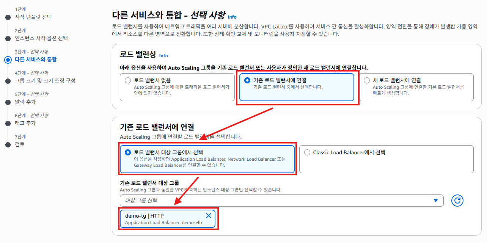

5. "다른 서비스와 통합"화면의 **상태 확인**항목에서 **Elastic Load Balanacer 상태 확인 켜기**를 체크한다. 로드밸런스가 인스턴스의 상태를 확인하고 문제가 있다면 오토 스케일링이 인스턴스를 교체하게 하는 옵션이다. 오토스케일링은 단지 트래픽에 맞춰 인스턴스를 생성, 삭제만 하는게 아니다. 문제가 있다면 안스턴스를 삭제하고 다시 생성하는 작업도 한다 [다음] 버튼을 클릭한다.
   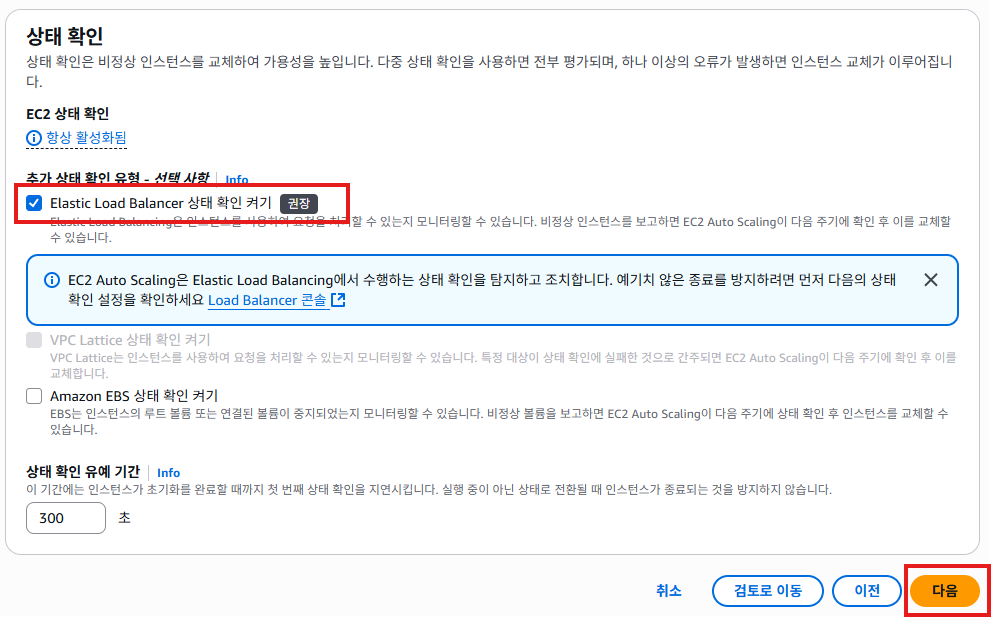

   - EC2 Auto Scaling 그룹의 상태 확인 구성
     - **EC2 상태 확인만 사용**: 기본 설정, EC2 인스턴스의 상태를 모니터링한다.
     - **ELB 상태 확인만 사용**: ELB 상태 확인 결과를 기반으로 인스턴스의 상태를 판단하고, 문제가 발생할 경우 자동으로 대체한다.
   
6. "그룹 크기 및 크기 조정 구성"화면에서 오토 스케일링의 크기 값을 설정한다. **그룹 크기**항목에서 **원하는 용량**에 `2`를 입력한다. **크기 조정**항목에서 **원하는 최소 용량**에 `2`를 입력하고, **원하는 최대 용량**에 `10`을 입력한다. **원하는 용량**은 초반에 만들어지는 인스턴스 갯수다.
   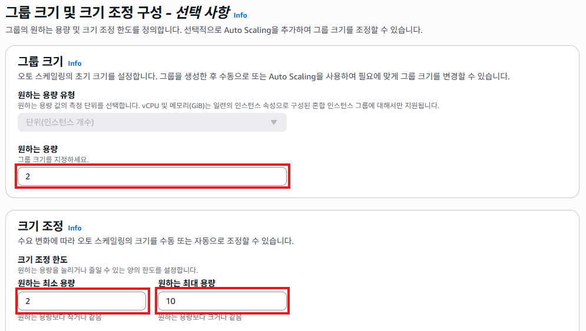
   
7. "그룹 크기 및 크기 조정 구성"화면에서 어떤 기준으로 인스턴스를 생성하고 삭제할지 **Acutomatic Scaling** 정책을 설정한다. **대상 추적 정책 사용 여부 선택**항목에서 `대상 추적 크기 조정 정책`을 선택한다. **지표 유형**항목에서 `평균 CPU 사용률`을 선택한다. **대상 값**항목에 `50`을 입력한다.
   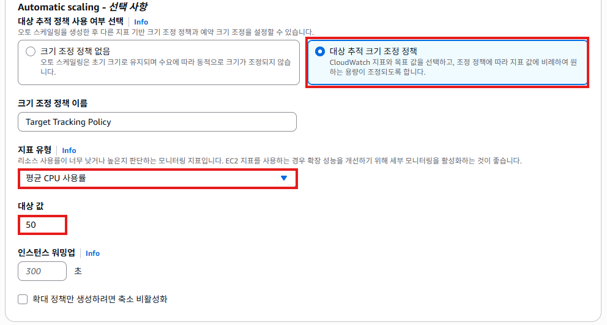

8. 나머지는 기본값으로 그대로 사용하고, [다음] 버튼을 클릭한다.
   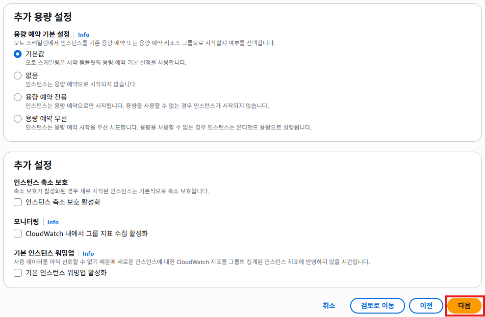

9. "알림 추가"화면에서는 오토 스케일링이 인스턴스가 늘어나거나 줄어들때 이메일이나 문자를 받을수 있도록 설정하는 부분이다. SNS라는 서비스를 미리 설정해줘야 하기 때문에 설정 없이 [다음] 버튼을 클릭한다.
   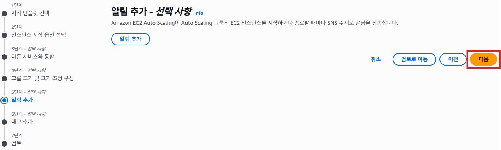

10. "태그 추가"화면에서 [태그 추가] 버튼을 클릭하고, **키**항목에 `Name`를 입력하고, **값**항목에 `Demo-Web-Instance`를 입력한다. [다음]버튼을 클릭한다.
   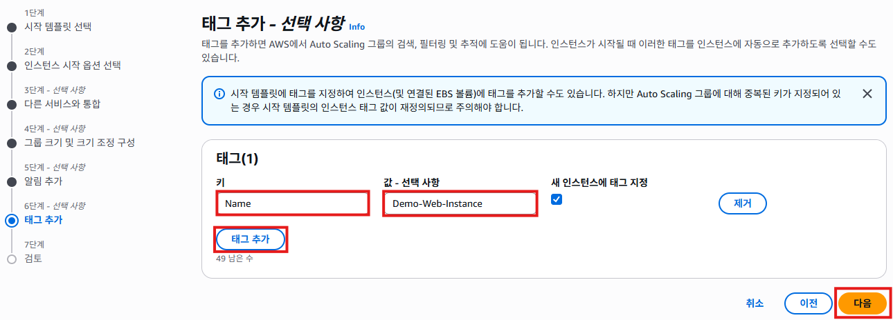

11. "검토"화면에서 설정값을 확인하고 [Auto Scaling 그룹 생성]버튼을 클릭한다.
   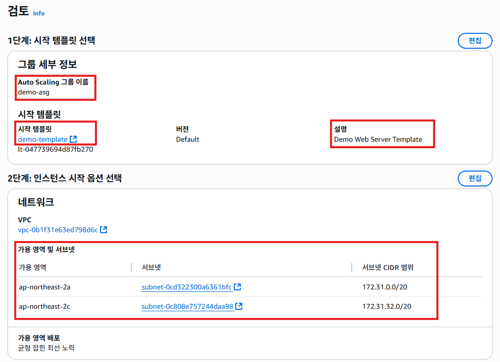
   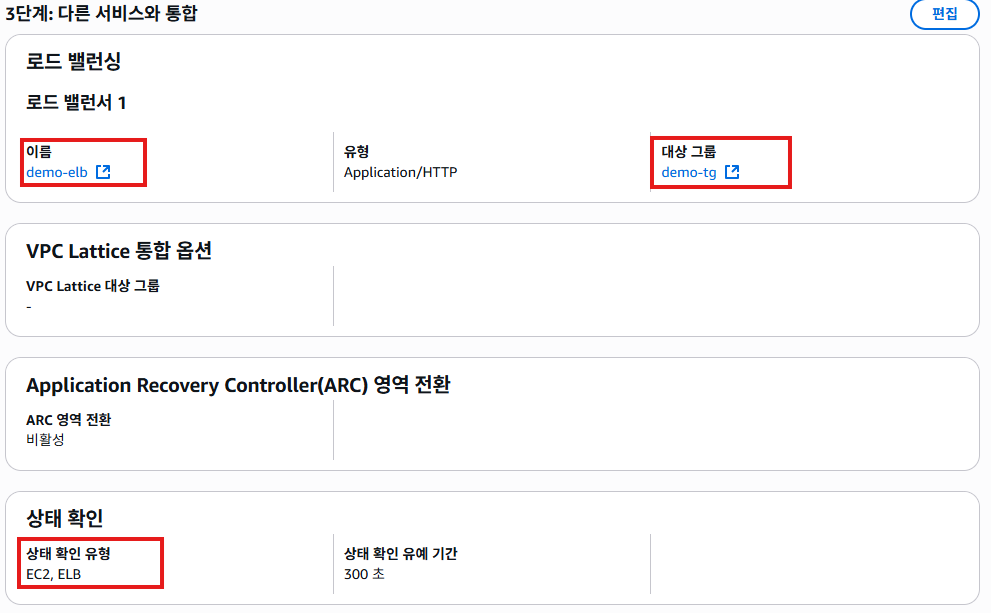
   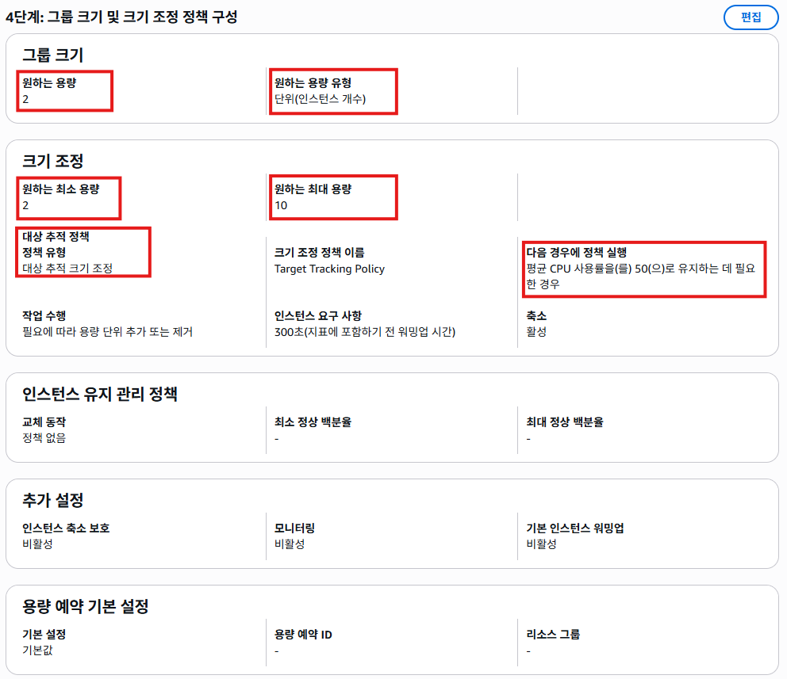
   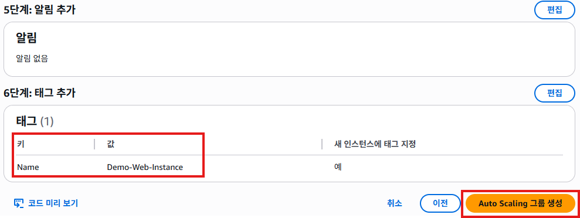

12. "Auto Scaling 그룹"화면에서 새로 생성된 오토스케일링 그룹(`demo-asg`)를 확인할 수 있다. 
   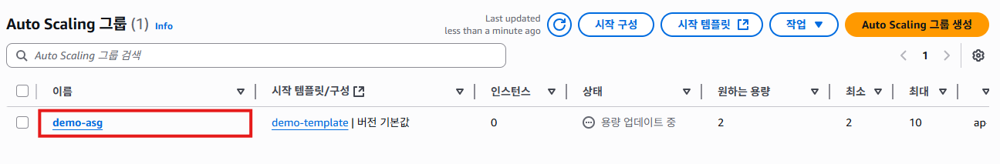

13. `demo-asg`를 클릭해서 **활동**탭을 클릭해서 **작업 기록**을 보면 2개의 기록을 볼 수 있다. 오토스케일링이 2개의 인스턴스를 생성한 작업 기록이 있다. **원하는 용량**을 `2`로 지정했기 때문에 인스턴스를 2개 생성한 것이다.
   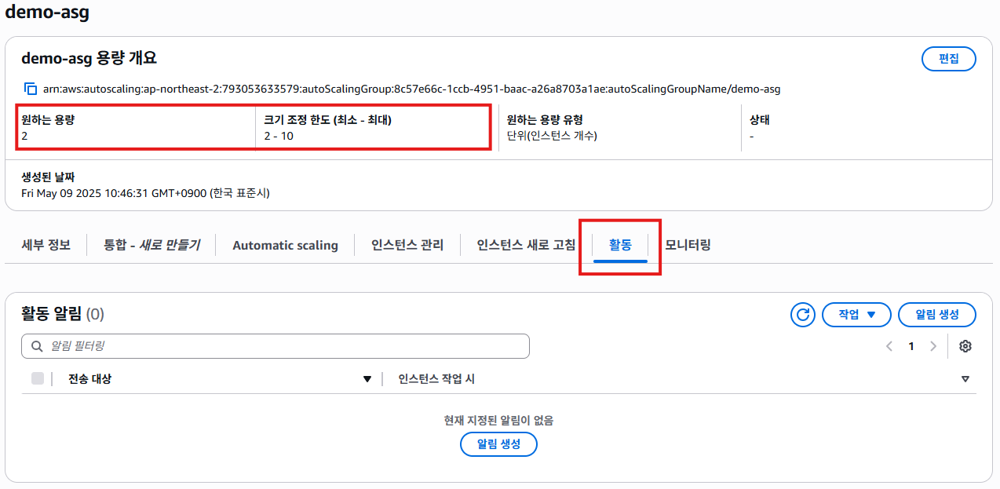
   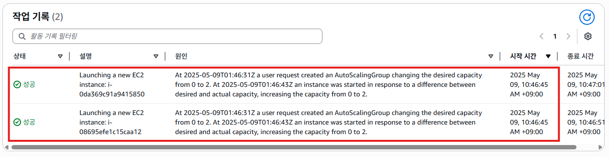

14. EC2 서비스의 좌측 메뉴에서 [인스턴스]를 클릭해서 확인해보면, `Demo-Web-Instance`라는 이름의 2개의 인스턴스가 생성되는 것을 확인할 수 있다.
   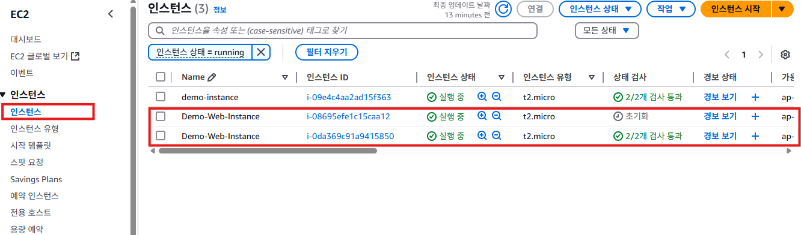
