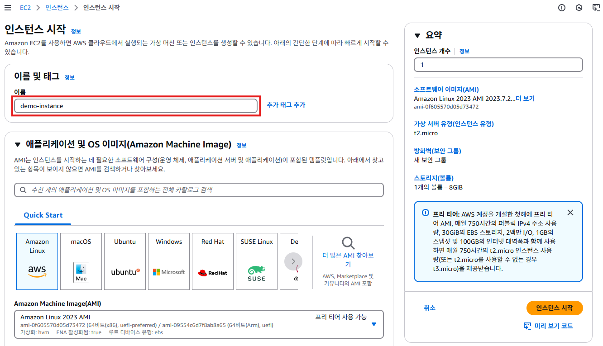
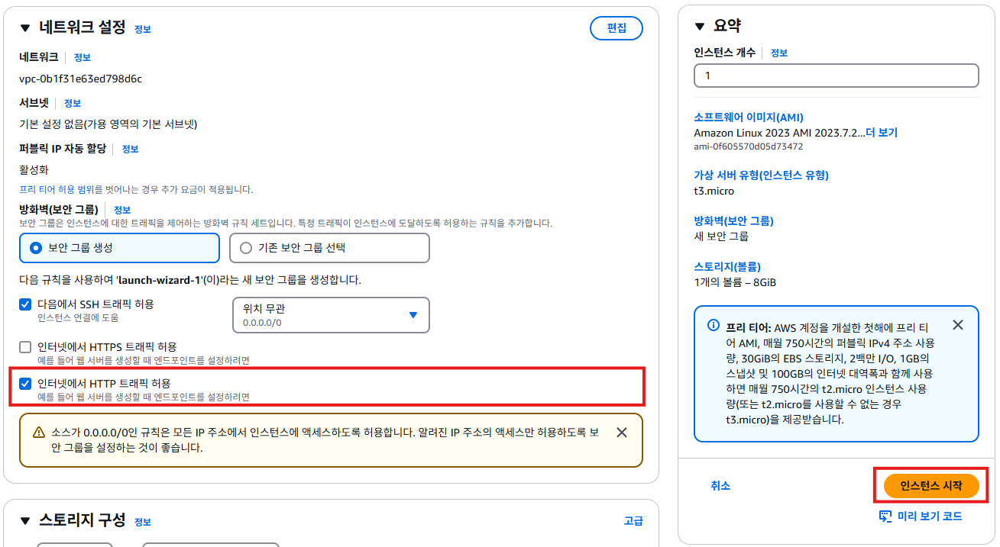

# AWS EC2(Elastic Compute Cloud)

## EC2 인스턴스란?
- **가상서버**: EC2 인스턴스는 AWS 클라우드에서 실행되는 가상 서버다.
- **온디맨드 컴퓨팅**: 사용자는 필요할 때 인스턴스를 생성하고, 사용하지 않을 때 종료하거나 삭제할 수 있다.
- **유연성**: 다양한 인스턴스 타입과 크기 선택이 가능하며, 필요한 컴퓨팅 성능에 맞춰 선택할 수 있다.

## EC2의 주요 장점
1. 유연성
   - 다양한 인스턴스 타입과 크기 선택 가능 (CPU, 메모리, 스토리지, 네트워크 성능).
   - 필요할 때 언제든지 인스턴스 생성, 삭제 가능.
   - 다양한 OS (Amazon Linux, Ubuntu, Windows Server, Red Hat 등) 선택 가능.
2. 확장성 (Scalability)
   - Auto Scaling을 통해 트래픽 증가 시 자동으로 인스턴스 확장.
   - ELB (Elastic Load Balancer)와 연동하여 부하 분산 가능.
   - 높은 사용량을 자동으로 감지하고 리소스를 조정할 수 있음.
3. 비용 효율성
   - 온디맨드, 예약 인스턴스, 스팟 인스턴스 등 다양한 요금제 선택 가능.
   - 짧은 시간의 작업은 스팟 인스턴스로 비용 절감.
   - 장기 사용 시 예약 인스턴스로 추가 할인 가능.
4. 보안
   - 보안 그룹(Security Group)으로 인바운드 및 아웃바운드 트래픽 제어.
   - VPC (Virtual Private Cloud)로 네트워크 격리 가능.
   - IAM (Identity and Access Management)으로 사용자 권한 제어.
   - SSL/TLS 암호화를 통해 안전한 데이터 전송.
5. 고가용성
   - 멀티 AZ (Availability Zone) 배포로 서비스 중단 위험 감소.
   - Elastic IP를 통해 고정 IP 제공.
   - Amazon CloudWatch로 인스턴스 상태 모니터링 가능.
6. 자동화 가능성
   - CloudFormation 또는 Terraform을 사용하여 인프라 자동 생성.
   - Lambda와 EC2를 연동하여 서버리스 컴퓨팅 환경 구축 가능.
   - 사용자 정의 AMI(Amazon Machine Image)로 반복 가능한 환경 구성.
7. 다양한 사용 사례 지원
   - 웹 서버, 데이터베이스 서버, 머신러닝 환경, 게임 서버 등 다양한 용도로 활용 가능.
   - 클라우드에서 손쉽게 새로운 애플리케이션 환경을 테스트하고 배포할 수 있음.
8. 글로벌 인프라
   - AWS는 전 세계 여러 리전에 데이터 센터(Availability Zone)를 운영.

## EC2 인스턴스 생성하기
1. AWS 관리 콘솔에 접속한다. 관리 콘솔에서 우측 상단의 리전이 서울로 설정되어 있는지 확인한다.
    

2. 관리 콘솔의 왼쪽 상단의 검색메뉴에 ec2를 검색하여 나오는 ec2를 클릭한다.
    

3. EC2 서비스 화면에서 [인스턴스 시작]버튼을 클릭한다.
    

4. **이름** 함목에 인스턴스의 이름을 입력한다. `demo-instance`를 입력한다.
    

5. **애플리케이션 및 OS 이미지**를 선택하면 항목에서 **Amazon Linux**를 선택하고, **Amazon Machine Image(AMI)** 에서 **Amazon Linux 2023 AMI**를 선택한다.
    

6. **인스턴스 유형**을 클릭하면 드롭다운 메뉴가 표시된다. **t3.micro**를 검색하여 선택한다.
    

7. **키 페어(로그인)** 항목을 클릭하여 **키 페어 없이 계속 진행 (권장하지 않음)** 을 선택한다.
    

8. 네트워크 설정에서는 **인터넷에서 HTTP 트래픽 허용** 항목만 체크하고, [인스턴스 시작] 버튼을 클릭한다.
    

9. 인스턴스 생성이 완료되었다. [모든 인스턴스 보기] 버튼을 클릭한다. 
    

10. 인스턴스 목록 화면에서 `demo-instance`가 생성된 것을 확인할 수 있다. **상태검사**에 **초기화**라고 표시된다. 몇분 정도 기다리면 **3/3개 검사 통과**라고 표시된다.
    

11. **상태 검사**가 **3/3개 검사 통과**로 변경되었으면, 인스턴스 생성이 완료된 것이다. 해당 인스턴스의 체크박스를 체크하고, 상단의 [연결] 버튼을 클릭한다.
    

12. "인스턴스 연결"화면에서 **EC2 인스턴스 연결**을 확인하고, [연결] 버튼을 클릭한다.
   

13. 아래와 같은 터미널 화면이 표시된다.
   

14. 아래의 명령어를 순서대로 입력하고 실행해서 Nginx(웹서버)를 설치한다.
    ```bash
    # root 권한으로 변경한다.
    sudo -i

    # yum을 최신 상태로 업데이트한다.
    yum update -y
    # nginx를 설치한다.
    yum install -y nginx
    # nginx를 실행한다.
    systemctl enable nginx
    systemctl start nginx
    # nginx의 홈 디렉토리로 이동한다.
    cd /usr/share/nginx/html
    # nginx의 홈 디렉토리에 index.html파일을 추가한다.
    echo "<h1>Hello world</h1><h2>This is demo Instance</h2>" > index.html
    ```

15. "인스턴스 목록"화면에서 `demo-instance`의 **퍼블릭 IPv4 주소**를 확인한다.
   

16. 웹 브라우저를 열고 주소창에 `http://13.125.115.95`를 입력하면, 아래와 같은 화면이 표시된다.
   
    
