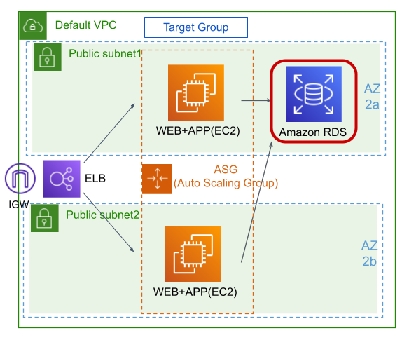
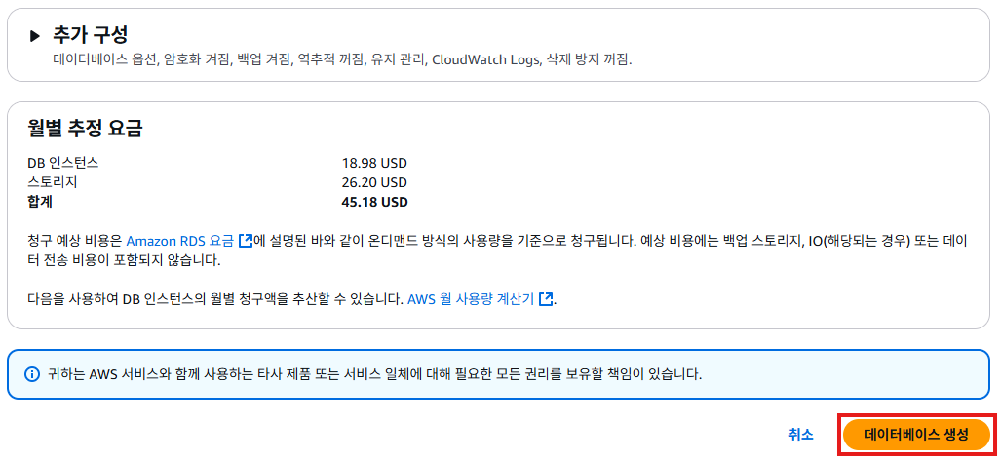
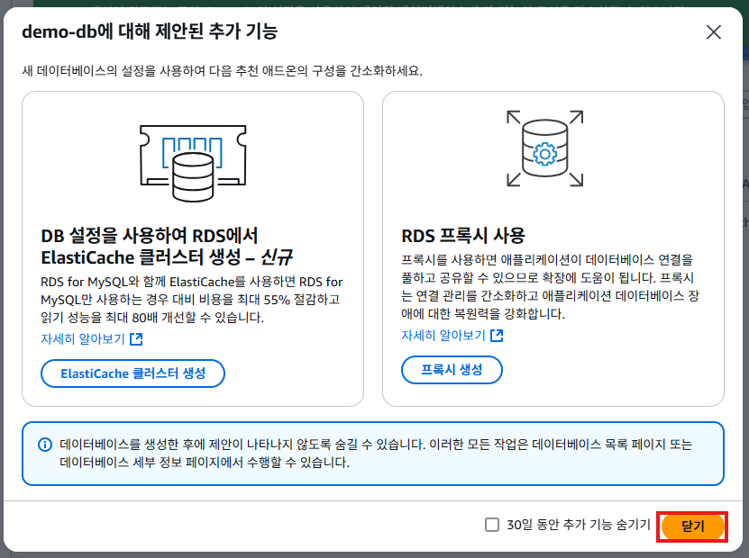

# RDS 생성하기
- RDS르 생성해서 아래와 같은 아카텍처로 구성할 것이다.
   

## RDS 보안 그룹 생성하기
1. EC2 서비스의 왼쪽 메뉴에서 [보안 그룹]을 클릭한다. [보안 그룹 생성]버튼을 클릭한다.
   

2. "보안 그룹 생성"화면의 **기본 세부 정보**에서 **보안 그룹 이름**항목에 `demo-db-sg`을 입력한다. **설명**항목에 `Demo Database Security Group`을 입력한다. 
   

3. "보안 그룹 생성"화면의 **인바운드 규칙**에서 [규칙 추가]버튼을 클릭해서 인바운드 규칙을 추가한다. **유형**항목에 `MYSQL/Aurora`를 선택한다. **소스**항목에 `Anywhere-IP4`를 선택한다. [보안 그룹 생성] 버튼을 클릭한다.
   

4. 보안 그룹 생성이 완료된다.
   

## RDS 생성하기
1. 관리 콘솔의 검색 메뉴에서 RDS를 검색하여 [aurora and RDS]를 클릭한다.
   

2. RDS의 대시보드에서 [데이터베이스 생성] 버튼을 클릭한다.
   

3. "데이터베이스 생성"화면에서 **데이터베이스 생성 방식 선택**항목에서 `표준 생성`으를 선택한다. **엔진 옵션**항목에서 `MySQL`을 선택한다.
   

4. "데이터베이스 생성"화면에서 **템플릿**항목에서 `개발/테스트`를 선택한다. **가용성 및 내구성**항목에서 `단일 AZ DB 인스턴스 배포`를 선택한다.
   

5. "데이터베이스 생성"화면의 **설정**에서 **DB 인스턴스 식별자**항목에 `demo-db`를 입력한다. **마스터 사용자 이름**항목에 `demoadmin`을 입력한다. **자격 증명 관리**항목에서 `자체 관리`를 선택한다. **마스터 암호**항목과 **마스터 암호 확인**항목에 `zxcv1234!!`를 입력한다.
   

6. "데이터베이스 생성"화면의 **인스턴스 구성**에서 **DB 인스턴스 클래스**항목에서 `버스터블 클래스`를 선택하고, `db.t3.micro`를 선택한다.
   

7. "데이터베이스 생성"화면의 **연결**에서 **퍼블릭 엑세스**항목에 `아니요`를 체크한다. **VPC 보안 그룹(방화벽)** 항목에서 `기존 항목 선택`을 체크하고, **기본 VPC 보안 그룹**항목에서 `demo-db-sg`를 선택한다.
   

8. "데이터베이스 생성"화면의 [데이터베이스 생성]버튼을 클릭한다.
   

9. 아래와 같은 화면이 표시되면 [닫기]버튼을 클릭한다.
   

10. 데이터베이스 화면에서 `demo-db`가 생성된 것을 확인할 수 있다.
   

11. 'demo-db'를 선택하면 인스턴스의 상태를 확인할 수 있다. **엔드포인트 주소**항목의 주소로 **마스터 사용자 이름**과 **마스터 암호**를 사용하여 접속할 수 있다.
   