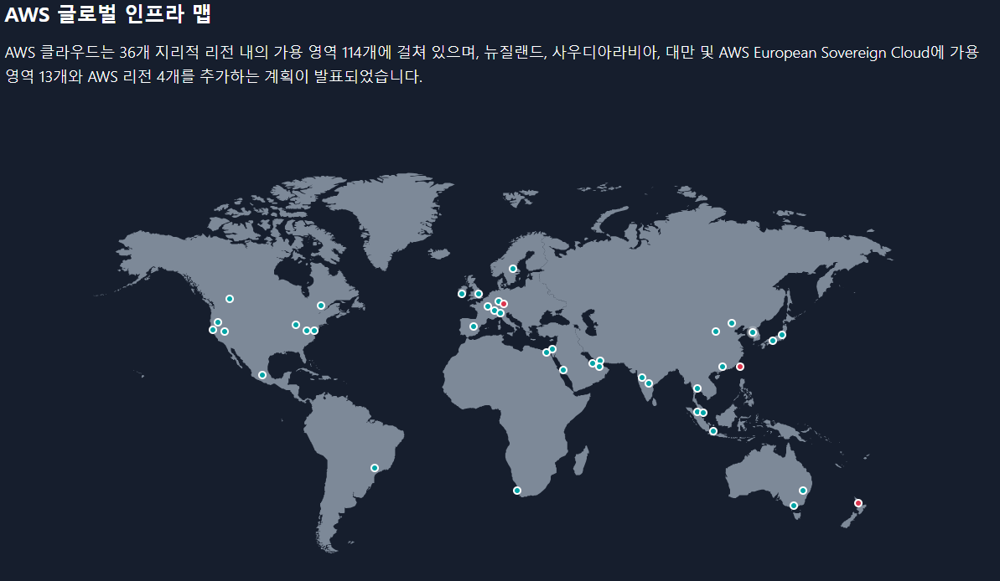
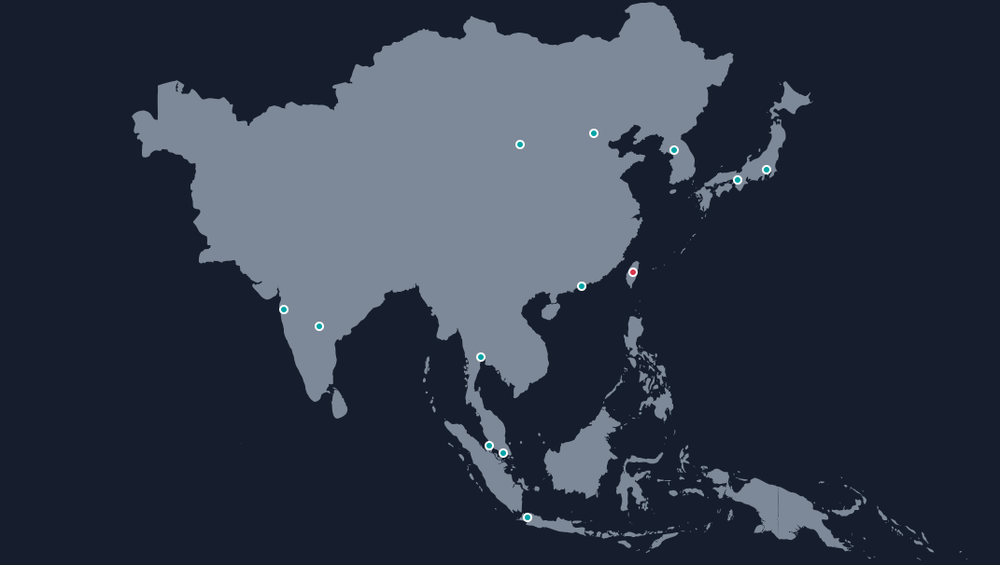
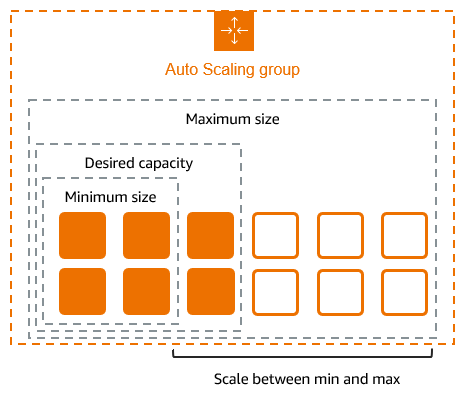

# 로드 밸런싱

## 1. AWS ELB (Elastic Load Balancer)
### AWS ELB란?
- **AWS ELB**는 AWS에서 제공하는 **트래픽 분산 서비스**로, 들어오는 네트워크 트래픽을 여러 Amazon EC2 인스턴스, 컨테이너, IP 주소 또는 Lambda 함수로 자동으로 분산한다.
- ELB는 서로 다른 EC2 인스턴스에 대한 하나의 엔드포인트를 제공한다. 사용자는 실제 요청이 처리되는 백엔드 인스턴스에 대한 고려없이, 동일한 엔드포인트로 요청을 전송할 수 있다.
- 클라우드 환경에서 **높은 가용성과 확장성을 보장**하며, 서버의 부하를 자동으로 분산시켜 성능을 최적화하고 장애 발생시 자동으로 트래픽을 다른 인스턴스로 전달할 수 있도록 한다.

### Load Blancer의 주요 기능
#### 자동 트래픽 분산 (Auto Traffic Distribution)
- ELB는 수신된 클라이언트 요청을 자동으로 여러 대상(EC2 인스턴스, Lambda 함수, IP 주소 등)으로 분산한다.
- 다양한 로드 밸런싱 알고리즘 (라운드 로빈, 무작위, 가중 라운드 로빈)을 통해 효율적인 분산이 가능하다.
  
#### 고가용성 및 장애 자동 감지 (High Availability & Fault Detection)
- 헬스 체크 (Health Checks): ELB는 대상 그룹의 인스턴스 상태를 지속적으로 모니터링하여 비정상 인스턴스를 자동으로 트래픽 분산에서 제외한다.
- 다중 AZ (Availability Zone) 지원: 여러 가용 영역(AZ)에서 대상 인스턴스를 자동으로 관리하여 서비스 중단 위험을 최소화한다.

#### SSL/TLS 종료 (SSL/TLS Termination)
- ELB에서 SSL/TLS 인증을 직접 처리하여 서버 부하 감소.
- HTTPS 요청을 로드 밸런서에서 암호 해제(SSL Termination) 후 대상 서버로 HTTP로 전달.
- AWS Certificate Manager (ACM)와 통합하여 SSL 인증서 자동 관리 가능.

#### URL 기반 라우팅 (URL-Based Routing, ALB)
- Application Load Balancer (ALB)에서 지원하는 기능.
- URL 경로 또는 호스트 헤더 기반으로 다양한 대상 그룹으로 트래픽 분산.
  - 예: /api/* → API 서버 그룹, /static/* → 정적 파일 서버 그룹.
  
#### 동적 확장 (Auto Scaling 연동)
- ELB는 Auto Scaling과 통합되어 대상 인스턴스의 수를 자동으로 조정할 수 있다.
- 사용량이 증가하면 인스턴스가 자동으로 추가되고, 사용량이 감소하면 인스턴스가 자동으로 제거된다.
- 이는 애플리케이션의 비용 효율성을 높이고 성능을 최적화할 수 있다.

#### 엔드포인트 역할 제공
- 로드 밴런서는 스케일 아웃에 대한 하나의 **엔드 포인트**를 제공한다.
- 로드 밸런서(Load Balancer)에서 트래픽을 하나의 경로로 받아서 다수의 인스턴스에 분산하게 되어, 유저 입장에서는 각각의 인스턴스에 일일히 접근해서 관리하는게 아닌 하나의 주소로 접속해서 관리할 수 있게 된다. 인스턴스가 떨어져나가거나 오류가 나서 트래픽을 수신하지 못할 때에도 로드밸런서가 스마트하게(health check / monitoring) 알아서 트래픽을 전송하지 않게 하고, 새로운 인스턴스가 등록이 되면 자동으로 분산을 시켜준다.

  

  

### AWS ELB의 주요 유형

| ELB 유형 | 설명 | 사용 사례 |
|---|---|---|
| **Application Load Balancer (ALB)** | HTTP/HTTPS 기반의 7계층 (애플리케이션 계층) 로드 밸런싱 | 웹 서버, API 서버 |
| **Network Load Balancer (NLB)** | TCP/UDP 기반의 4계층 (네트워크 계층) 로드 밸런싱 | 높은 성능이 필요한 애플리케이션 (게임 서버) |
| **Network Load Balancer (GWLB)** | 게이트웨이 역할을 하며, 트래픽을 네트워크 가상 어플라이언스로 전달 | 방화벽, IDS/IPS, 보안 소프트웨어 |

## 2. 보안 그룹(Security Group)

### 보안 그룹이란?
- 보안 그룹은 AWS EC2 인스턴스 및 다른 AWS 서비스에 대한 가상 방화벽 역할을 하는 설정이다.
- 인스턴스 수준의 네트워크 보안을 제어하며, 인바운드 및 아웃바운드 트래픽을 규제한다.
- AWS VPC (Virtual Private Cloud) 내부에서 작동하며, 지정된 보안 규칙에 따라 허용된 트래픽만 인스턴스로 전달된다.

### 보안그룹 특징
  - 인바운드 규칙에 의해 허용된 트래픽은 자동으로 아웃바운드 응답이 허용된다.
  - 보안 그룹은 개별 인스턴스 또는 인스턴스 그룹에 적용할 수 있다.
  - 하나의 인스턴스에 여러 보안 그룹을 적용할 수 있다.
  - 보안 그룹은 허용 규칙만 지정할 수 있으며, 명시적으로 거부하는 규칙은 설정할 수 없다.
  - 트래픽이 보안 그룹에서 허용되지 않으면 자동으로 차단된다.
  - 보안 그룹 규칙 변경시 인스턴스를 다시 시작할 필요없이 즉시 적용된다.

### 보안 그룹 규칙 구성 요소

| 항목 | 설명 |
|---|---|
| **프로토콜 (Protocol)** | 트래픽 유형을 지정 (TCP, UDP, ICMP 등 |
| **포트 범위 (Port Range)** | 허용할 포트 또는 포트 범위를 지정 HTTP(80), HTTPS(443), SSH(22) |
| **소스 (Source)** | 트래픽의 출발지를 지정 IP 주소(예: 203.0.113.0/24),  특정 IP(예: 203.0.113.15), 또는 보안 그룹 자체를 소스로 지정함 |
| **목적지 (Destination)** | 아웃바운드 트래픽의 대상을 지정 |

- 인바운드 규칙
  - 외부에서 인스턴스로 들어오는 트래픽을 제어한다
  - 예시
    - HTTP 트래픽(80) - 모든 IP (0.0.0.0/0) 허용
    - SSH 트래픽(22) - 특정 IP (203.0.113.15)만 허용.
- 아웃바운드 규칙
  - 인스턴스에서 외부로 나가는 트래픽을 제어한다.
  - 기본적으로 모든 아웃바운드 트래픽이 허용된다.

## 3. 대상 그룹 (Target Group)

### 대상 그룹이란?
- **대상 그룹**은 AWS ELB(Elastic Load Balancer)가 트래픽을 분산할 대상의 집합을 의미한다.
- 대상 그룹은 ELB가 트래픽을 분산할 수 있는 대상(EC2 인스턴스, Lambda 함수, IP 주소, 컨테이너)을 정의하는 논리적 그룹이다.
- 로드 밸런서가 수신한 트래픽을 대상 그룹에 포함된 대상에게 자동으로 전달한다.

### 대상 그룹의 특징
- **다양한 대상 유형 지원** :  EC2 인스턴스, Lambda 함수, IP 주소, 컨테이너.
- **독립적인 헬스 체크 설정** : 대상 그룹마다 별도의 헬스 체크 규칙을 지정할 수 있다.
- **고유의 대상 그룹 이름** : 대상 그룹은 각 로드 밸런서에서 이름으로 식별된다.
- **동적 대상 추가/제거** : Auto Scaling 그룹과 연동하여 대상 그룹의 대상이 자동으로 조정될 수 있다.

## 4. AWS 리전(Region), AWS 가용영역(Availlability Zone, AZ) 

### AWS 리전
#### AWS 리전이란?
- 리전은 AWS의 글로벌 클라우드 인프라를 지리적으로 분리하여 구성한 지역 단위의 그룹으로, 여러 가용영역(AZ)으로 구성되어 있다.
- 리전은 3개 이상의 가용영역을 논리적 그룹으로 묶어 놓은 인프라다.

#### AWS 리전의 특징
- 지리적 분리: 각 리전은 지리적으로 서로 다른 위치에 분산
- 독립적인 인프라: 리전 간에는 네트워크, 전력 등이 완전희 분리됨
- 다양한 서비스 제공: 각 리전은 제공하는 서비스가 서로 다를 수 있음

### AWS 가용영역
#### AWS 가용영역이란?
- 가용영역은 AWS 리전 내에서 완전히 격리된 독립적인 데이터 센터다.
- 가용영역은 1개 이상의 데이터 센터의 집합이다.

#### AWS 가용영역의 특징
- 완전한 격리: 전원, 네트워크, 보안 시스템이 분리되어 있음음
- 초저지연 네트워크 연결: 동일 리전 내 다른 AZ와의 초고속 연결을 제공
- 고가용성 보장: 여러 AZ에 걸친 배포로 장애 대비 가능

## 5. 고가용성 (High Availability)과 내결함성 (Fault Tolerance)

### 고가용성
#### 고가용성이란?
- 고가용성(High Availability)은 서비스가 **가능한 한 오랜 시간 동안 지속적으로 운영될 수 있도록 보장하는 설계**를 의미한다.
- 고가용성의 목표는 **최소한의 다운타임**으로 서비스 제공을 유지하는 것이다.

#### AWS의 고가용성 아키텍처
##### 특징
- **다중 가용영역 사용**: 서비스가 여러 AZ에 걸쳐 분산되어 있어 한 AZ가 중단되더라도 다른 AZ에서 서비스가 계속 동작할 수 있습니다.
- **자동 복구**: Auto Scaling 및 ELB로 서버가 비정상일 경우 자동으로 새로운 서버 생성.
  
##### 구현방법
- 멀티 AZ 배포:
  - EC2 인스턴스를 여러 AZ에 분산 배치.
  - RDS (MySQL, PostgreSQL 등) 멀티 AZ로 자동 장애 조치 (Failover).
- ELB (Elastic Load Balancer):
  - 사용자 트래픽을 여러 AZ의 서버로 자동 분산.
  - 헬스 체크로 비정상 인스턴스는 자동으로 제외.
- Auto Scaling 그룹:
  - 서버 CPU 사용량, 네트워크 트래픽 증가 시 자동으로 서버 수 조정.
- Route 53 지능형 라우팅:
  - 여러 리전에 걸쳐 트래픽을 자동으로 분산.
  - 기본 리전 장애 발생 시 다른 리전으로 자동 전환.

### 내결함성
#### 내결함성이란?
- 내결함성(Fault Tolerance)은 **시스템에 장애가 발생하더라도 사용자에게 서비스 중단 없이 정상적으로 동작할 수 있는 능력**을 의미한다.
- 목표는 **장애 발생 시에도 사용자에게 영향을 미치지 않는 것**이다.

### 고가용성과 내결함성의 차이점

| 기준 | 고가용성 | 내결함성 |
|---|---|---|
| 목표 | 서비스의 지속적 운영 (최소한의 다운타임) |	서비스 중단 없이 장애 발생 시에도 정상적으로 동작 |
| 사용자 경험 | 짧은 중단 시간 (빠른 복구) |	서비스 중단 없이 지속적 제공 |
| 서비스 | 짧은 중단이 발생해도 상관없는 서비스(예: 일반 웹사이트, 쇼핑몰) | 비즈니스 중요도가 높은 서비스(예: 금융시스템, 의료 시스템) |

## 6. 오토 스케일링 그룹 (Auto Scaling Group)

### 오토 스케일링 그룹이란?
- **Auto Scaling 그룹(ASG)** 은 AWS에서 지정된 조건에 따라 EC2 인스턴스의 수를 자동으로 조정하여 서비스의 가용성과 성능을 최적화하는 서비스다.
- 주로 **웹 애플리케이션 서버, API 서버, 마이크로서비스 아키텍처**에서 자동 확장 및 축소를 위해 사용된다.
- Auto Scaling 그룹은 사용자의 정의된 조건에 따라 EC2 인스턴스를 자동으로 추가하거나 삭제하여 서비스의 고가용성을 보장한다.
  

  > Auto Scaling 그룹은 논리적 단위로 처리되는 Amazon EC2 인스턴스의 모음입니다. 그룹 및 해당 인스턴스에 대한 설정을 구성하고, 그룹의 최소, 최대 및 원하는 용량을 정의합니다. 서로 다른 최소 및 최대 용량 값을 설정하면 그룹의 경계가 형성되어 애플리케이션의 로드가 수요에 따라 크게 높아지거나 낮아질 때 그룹을 크기 조정할 수 있습니다. Auto Scaling 그룹을 크기 조정하려면 원하는 용량으로 수동 조정하거나 Amazon EC2 Auto Scaling에서 수요의 변화를 충족하도록 용량을 자동으로 추가 및 제거할 수 있도록 합니다.

## 7. AWS AMI(Amazon Machine Image)

### AMI란?
- **Amazon Machine Image (AMI)** 는 AWS EC2 인스턴스를 생성할 때 사용하는 이미지 템플릿이다.
- AMI는 OS, 애플리케이션, 파일 시스템 설정 등 인스턴스 생성에 필요한 모든 소프트웨어 설정을 포함하고 있습니다.
- AMI를 기반으로 EC2 인스턴스를 생성하면 사전 구성된 환경에서 서버를 빠르게 시작할 수 있다.

## 8. 시작 템플릿 (Launch Template)

### 시작 템플릿이란?
- **EC2 시작 템플릿 (Launch Template)** 은 AWS EC2 인스턴스를 생성할 때 필요한 모든 설정을 사전 정의하여 일관된 서버 환경을 자동으로 배포할 수 있도록 하는 템플릿이다.
- EC2 인스턴스를 수동으로 구성하는 번거로움을 줄이고, Auto Scaling 그룹, Spot 인스턴스, On-Demand 인스턴스 등 다양한 배포 환경에서 동일한 설정을 사용하여 서버를 빠르고 일관되게 생성할 수 있다.

### 시작 템플릿의 주요 구성 요소
- **AMI (Amazon Machine Image)**
  - EC2 인스턴스의 운영 체제와 소프트웨어 구성 (Amazon Linux 2, Ubuntu, Windows Server 등).
  - 예: React + Spring Boot 설치된 커스텀 AMI.
- **인스턴스 유형**
  - CPU, 메모리, 네트워크 성능을 정의하는 EC2 인스턴스 타입.
  - 예: t3.medium, m5.large, c6g.large 등.
- **키 페어 (Key Pair)**
  - SSH로 EC2 인스턴스에 접속할 수 있는 보안 인증 키.
  - 기존 키 페어 또는 새로운 키 페어 지정 가능.
- **보안 그룹 (Security Group)**
  - 인스턴스의 네트워크 접근 제어 (허용할 포트, IP 주소 범위).
  - 예: HTTP (80), HTTPS (443), SSH (22) 허용.
- **네트워크 설정**
  - VPC (Virtual Private Cloud), 서브넷, 탄력적 IP 설정.
  - 퍼블릭 또는 프라이빗 서브넷 지정 가능.
- **스토리지 설정 (EBS 볼륨)**
  - 루트 볼륨 (OS 설치) 및 추가 데이터 볼륨 설정.
  - EBS 볼륨 유형 (gp3, io1, st1) 및 크기 설정.
- **IAM 역할 (IAM Role)**
  - EC2 인스턴스가 AWS 서비스 (S3, CloudWatch 등)에 액세스할 수 있는 권한 지정.
  - 예: S3 버킷에서 정적 파일 로드 권한.
- **사용자 데이터 (User Data)**
  - 인스턴스 시작 시 자동으로 실행할 스크립트.
  - 예: React + Spring Boot 애플리케이션 자동 실행 스크립트.