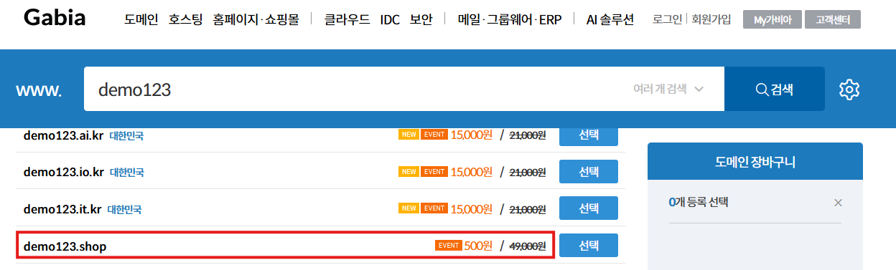
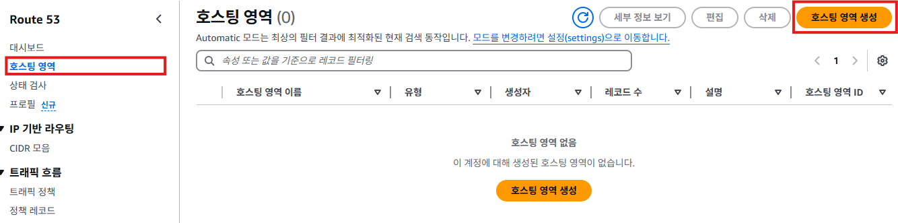
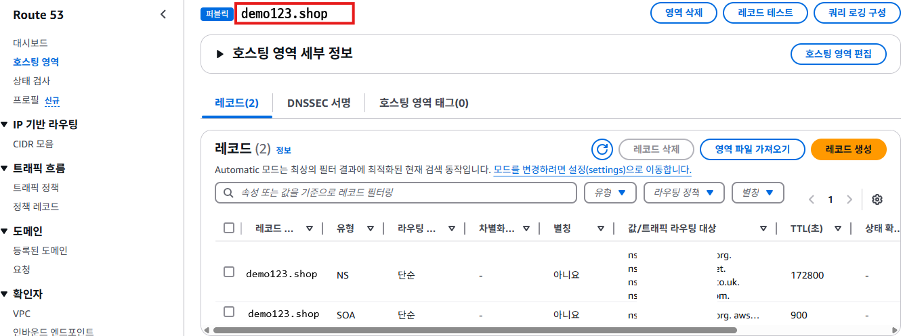
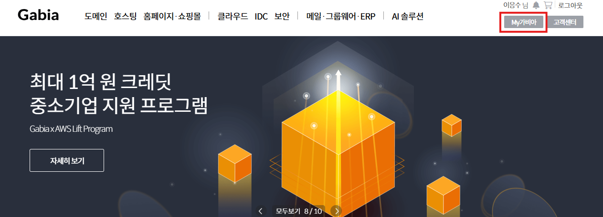
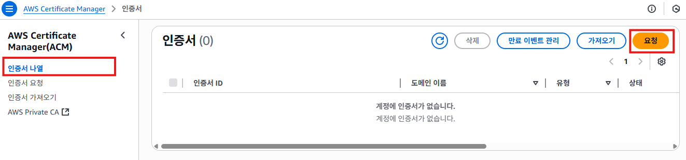
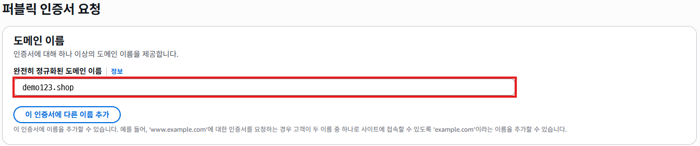
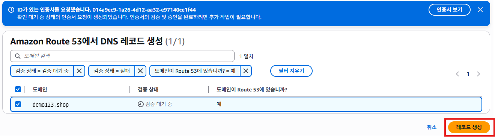
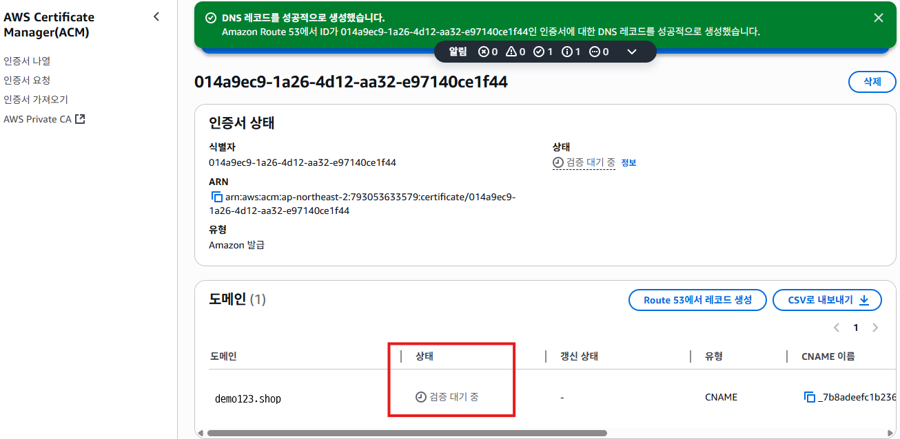

# 도메인 등록 및 연결하기

## 도메인 등록하기
1. 가비아(https://www.gabia.com/)에 접속한다.
   

2. 원하는 도메인을 고르고 등록한다.
   

3. 관리 콘솔의 검색 메뉴에서 `Route 53`를 검색하여 [Route 53]를 클릭한다.
   

4. Route 53 서비스의 메뉴에서 [호스팅 영역]을 클릭한다. [호스팅 영역 생성]버튼을 클릭한다.
   

5. "호스팅 영역 생성"화면에서 **도메인 이름**항목에 `demo123.shop`을 입력한다. **설명**항목에 `demo123.shop 웹사이트 호스팅 영역`을 입력한다. [호스팅 영역 생성]버튼을 클릭한다.
   

6. 호스트 생성이 완료되면 아래와 같은 화면이 표시된다.
   

7. "호스팅 영역 세부 정보"의 **레코드**탭을 클릭한다. **레코드**에서 **값/트래픽 라우팅 대상**정보를 복사한다.
   

8. 가비아 홈 페이지에서 [My가비아]를 클릭한다.
   

9. My가비아 페이지에서 [서비스 관리]를 클릭하고, [관리]버튼을 클릭한다.
   

10. 도메인 상세 페이지에서 네임서버 [설정]버튼을 클릭한다.
   

11. 네임서버 설정 화면의 각 필드에 7번에서 복사한 **값/트래픽 라우팅 대상**정보를 입력한다. 입력할 때 주소 끝의 `.`은 입력하지 않는다.
   

## 퍼블릭 인증서 요청
1. 관리 콘솔의 검색 메뉴에서 `certificate manager`를 검색하여 [Certificate Manager]를 클릭한다.
   

2. ACM 서비스 화면에서 [인증서 나열]을 클릭한다. [요청]버튼을 클릭한다.
   

3. "인증서 요청"화면에서 **인증서 유형**항목의 `퍼블릭 인증서 요청`을 체크한다. [다음]버튼을 클릭한다.
   

4. "퍼블릭 인증서 요청"화면에서 **완전희 정규화된 도메인 이름**항목에 구매한 도메인 이름을 입력한다. 나머지 항목은 전부 기본값을 그대로 사용한다. [요청]버튼을 클릭한다.
   
   

5. 퍼블릭 인증서 요청이 생성되면 아래와 같은 화면이 표시된다. 도메인 부분의 **상태**가 `검증 대기중`으로 표시된다. [Route 53에서 레코드 생성]버튼을 클릭한다.
   

6. 요청한 도메인이 선택되어 있는지 확인한 후 [레코드 생성] 버튼을 클릭한다.
   

7. **DNS 레코드를 성공적으로 생성했습니다.** 메세지를 확인한다.
   

8. "도메인"의 **상태**항목이 `성공`으로 변경되면 인증서 발급이 완료된 것이다.
   

## ELB와 도메인 연결