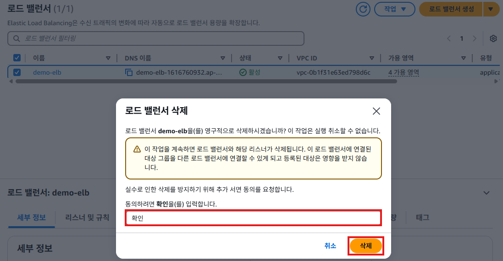
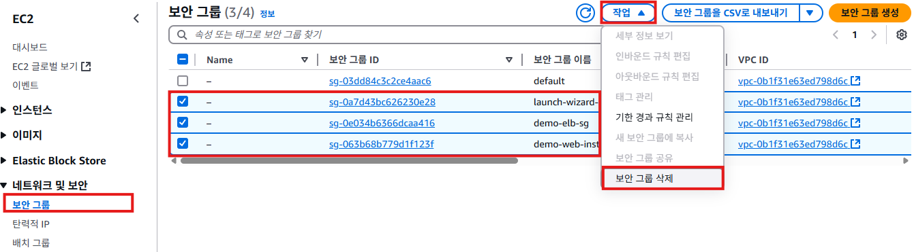
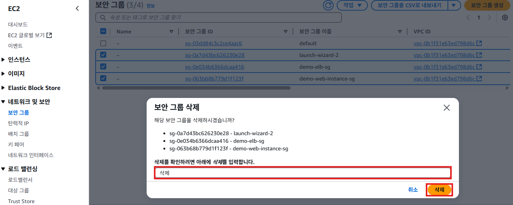

# 리소스 삭제

1. ## 로드밸런서 삭제
1. EC2 서비스의 왼쪽 메뉴에서 [로드밸런서]를 클릭한다. `demo-elb`를 선택하고, [작업] -> [로드 밸런서 삭제]를 클릭한다.
   

2. **로드 밸런서 삭제**팝업창에서 입력란에 `확인`을 입력하고, [삭제]버튼을 클릭한다.
   

## 대상 그룹 삭제
1. EC2 서비스의 왼쪽 메뉴에서 [대상그룹]을 클릭한다. `demo-tg`를 선택하고, [작업] -> [삭제] 클릭한다.
   

2. **대상 그룹을 삭제하시겠습니까?**팝업창에서 [예, 삭제합니다]버튼을 클릭한다.
   

## 보안 그룹 삭제
1. EC2 서비스의 왼쪽 메뉴에서 [보안 그룹]을 클릭한다. `demo-elb-sg`, `demo-web-instance-sg`, `launch-wizard-x`를 선택하고, [작업] -> [보안 그룹 삭제] 클릭한다.
   

2. **보안 그룹 삭제**팝업창에서 입력란에 `삭제`를 입력하고, [삭제]버튼을 클릭한다.
   

## 인증서 삭제
1. Certificate Manger 메뉴에서 [인증서 나열]을 클릭한다. `demo123.shop` 도메인 인증서를 체크하고, [삭제]버튼을 클릭한다.
   

2. **선택한 인증서를 삭제하시겠습니까?**팝업창에서 입력란에 `삭제`를 입력하고, [삭제]버튼을 클릭한다.
   

## 레코드 삭제
1. Route 53메뉴에서 [호스팅 영역]을 클릭한다. `demo123.shop`를 클릭한다.
   
   
2. **레코드**탭을 클릭한다. 레코드 유형이 `A`, `CNAME`인 레코드를 체크한다.
   

3. **선택한 레코드를 삭제하시겠습니까?**팝업창에서 삭제할 레코드를 확인하고, [삭제]버튼을 클릭한다.
   