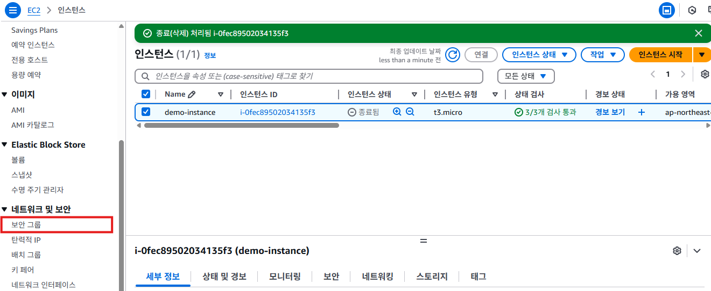
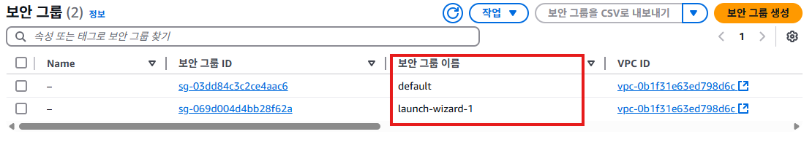

# 보안 그룹(Security Group)

## 보안 그룹이란?
- 보안 그룹은 AWS EC2 인스턴스 및 다른 AWS 서비스에 대한 가상 방화벽 역할을 하는 설정이다.
- 인스턴스 수준의 네트워크 보안을 제어하며, 인바운드 및 아웃바운드 트래픽을 규제한다.
- AWS VPC (Virtual Private Cloud) 내부에서 작동하며, 지정된 보안 규칙에 따라 허용된 트래픽만 인스턴스로 전달된다.

### 보안그룹 특징
  - 인바운드 규칙에 의해 허용된 트래픽은 자동으로 아웃바운드 응답이 허용된다.
  - 보안 그룹은 개별 인스턴스 또는 인스턴스 그룹에 적용할 수 있다.
  - 하나의 인스턴스에 여러 보안 그룹을 적용할 수 있다.
  - 보안 그룹은 허용 규칙만 지정할 수 있으며, 명시적으로 거부하는 규칙은 설정할 수 없다.
  - 트래픽이 보안 그룹에서 허용되지 않으면 자동으로 차단된다.
  - 보안 그룹 규칙 변경시 인스턴스를 다시 시작할 필요없이 즉시 적용된다.

### 보안 그룹 규칙 구성 요소

| 항목 | 설명 |
|---|---|
| **프로토콜 (Protocol)** | 트래픽 유형을 지정 (TCP, UDP, ICMP 등 |
| **포트 범위 (Port Range)** | 허용할 포트 또는 포트 범위를 지정 HTTP(80), HTTPS(443), SSH(22) |
| **소스 (Source)** | 트래픽의 출발지를 지정 IP 주소(예: 203.0.113.0/24),  특정 IP(예: 203.0.113.15), 또는 보안 그룹 자체를 소스로 지정함 |
| **목적지 (Destination)** | 아웃바운드 트래픽의 대상을 지정 |

- 인바운드 규칙
  - 외부에서 인스턴스로 들어오는 트래픽을 제어한다
  - 예시
    - HTTP 트래픽(80) - 모든 IP (0.0.0.0/0) 허용
    - SSH 트래픽(22) - 특정 IP (203.0.113.15)만 허용.
- 아웃바운드 규칙
  - 인스턴스에서 외부로 나가는 트래픽을 제어한다.
  - 기본적으로 모든 아웃바운드 트래픽이 허용된다.
  
## 보안 그룹 생성하기

1. EC2 목록 화면의 왼쪽 메뉴에서 **보안 그룹**을 클릭한다.
   

2. 아래와 같이 보안 그룹이 표시된다. **launch-wizard-1**과 **default** 2개의 보안그룹이 존재한다. **default**는 기본값이다. **launch-wizard-1**은 인스턴스 생성할 때 자동으로 생성된 보안 그룹이다.
   

3. 
