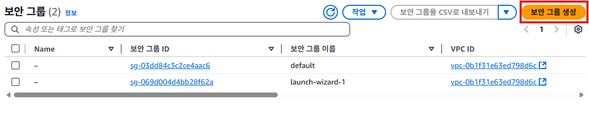
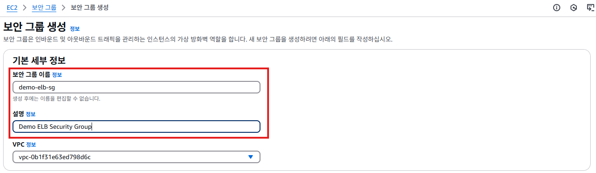
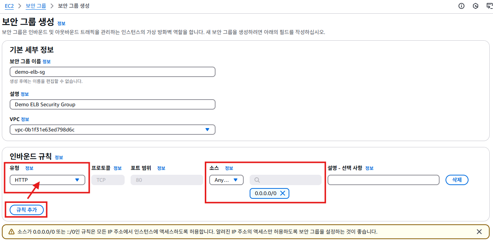
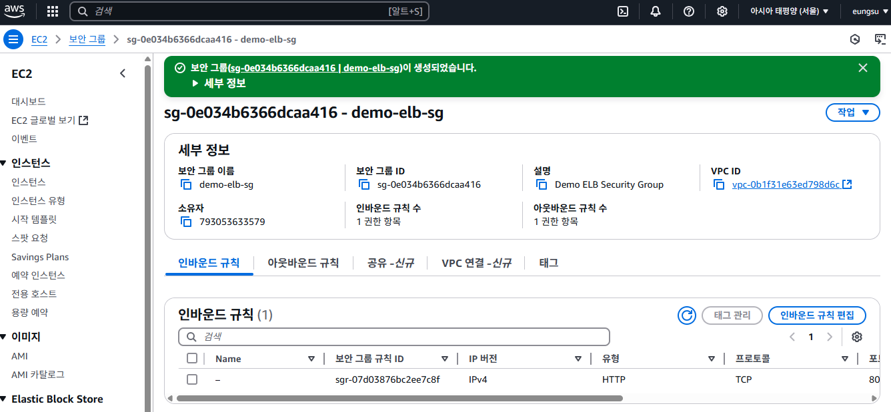
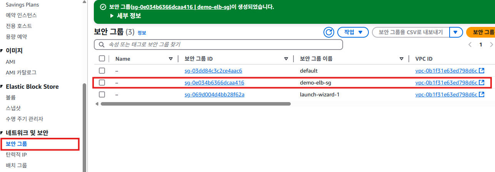

# 보안 그룹 생성하기

로드밸런서에서 사용할 보안그룹을 생성한다.

1. EC2 목록 화면의 왼쪽 메뉴에서 **보안 그룹**을 클릭한다.
   

2. 아래와 같이 보안 그룹이 표시된다. **launch-wizard-1**과 **default** 2개의 보안그룹이 존재한다. **default**는 기본값이다. **launch-wizard-1**은 인스턴스 생성할 때 자동으로 생성된 보안 그룹이다.
   

3. [보안 그룹 생성] 버튼을 클릭한다.
   

4. "보안 그룹 생성 화면"에서 **보안 그룹 이름**, **설명**을 입력한다. 보안 그룹 이름은 `demo-elb-sg`다. 설명은 `Demo ELB Security Group`다.
   

5. **인바운드 규칙**항목에서 [규칙 추가]버튼을 클릭하여 인바운드 규칙을 추가한다. **유형**은 `HTTP`, **소스**는 `Anywhere-IPv4`를 선택한다.
   

6. [보안 그룹 생성] 버튼을 클릭한다.
   

7. 보안 그룹이 생성되었다는 메세지를 확인한다.
   

8. 왼쪽 메뉴에서 **보안 그룹**을 클릭하면, 새로 생성한 `demo-elb-sg` 보안 그룹을 확인할 수 있다.
   

