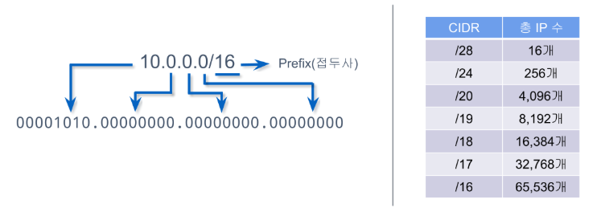
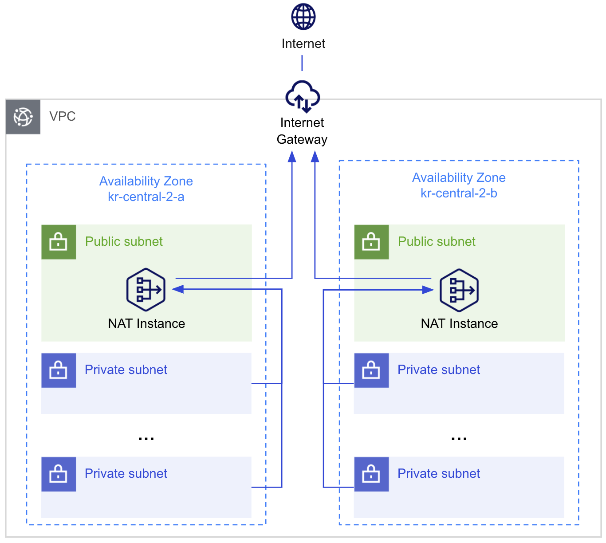

# VPC (Virtual Private Network)

## VPC란 무엇인가?
VPC(가상 사설 클라우드, Virtual Private Cloud)는 AWS에서 사용자가 정의할 수 있는 격리된 네트워크 환경이다. VPC는 클라우드 내에서 사용자가 자신의 네트워크 환경을 직접 구성할 수 있도록 지원한다. 사용자가 지정한 IP 주소 범위, 서브넷, 라우팅 테이블, 인터넷 게이트웨이, 네트워크 ACL(Access Control List) 등 다양한 네트워크 리소스를 포함한다.
- VPC는 AWS 클라우드 내에서 독립적인 네트워크 공간을 제공한다.
- 사용자는 VPC를 통해 프라이빗 네트워크 환경을 구축할 수 있다.
- 보안 그룹과 네트워크 ACL을 통해 네트워크 트래픽을 제어할 수 있다.
  
## VPC의 주요 구성 요소
### CIDR (Classless Inter-Domain Routing) 블록
- VPC의 IP 주소 범위를 정의한다.
- CIDR(Classless Inter-Domain Routing)은 IP 주소를 효율적으로 할당하고 라우팅할 수 있도록 개발된 표준이다. 전통적인 클래스 기반 IP 주소 방식(A, B, C 클래스)을 대체하여 유연하고 효율적인 네트워크 주소 관리를 가능하게 한다.
- CIDR 표기법
  ```nginx
  IP Address/PrefixLength
  ```
- CIDR 블록의 크기는 /16에서 /28까지 설정할 수 있다.
- CIDR블록의 IP 주소 범위
  

### 서브넷 (Subnet)
- VPC 내에서 논리적으로 구분된 네트워크 섹션이다.
- **퍼블릭 서브넷(Public Subnet)**: 인터넷 게이트웨이를 통해 외부 인터넷과 연결된 서브넷.
  - Default VPC는 퍼블릭 서브넷만 있다.
- **프라이빗 서브넷(Private Subnet)**: 외부 인터넷과 직접 연결되지 않는 서브넷.
- 서브넷은 AWS 가용 영역(AZ, Availability Zone)별로 생성할 수 있다.

### 라우팅 테이블 (Route Table)
- VPC 내에서 네트워크 트래픽의 흐름을 제어한다.
- 기본적으로 각 VPC에는 기본 라우팅 테이블이 생성되며, 사용자는 추가 라우팅 테이블을 정의할 수 있다.
- 각 서브넷은 라우팅 테이블과 연결되어 있어, 트래픽의 방향을 제어할 수 있다.

### 인터넷 게이트웨이 (Internet Gateway, IGW)
- VPC와 외부 인터넷 간의 연결을 제공하는 네트워크 장치.
- 퍼블릭 서브넷을 외부 네트워크와 연결할 수 있도록 한다.

### NAT 게이트웨이 (NAT Gateway)
- 프라이빗 서브넷에서 외부 인터넷에 연결할 수 있도록 지원하지만, 외부에서 프라이빗 서브넷으로의 직접적인 연결은 차단한다.
- 프라이빗 네트워크 내의 인스턴스가 외부 API나 소프트웨어 업데이트를 위해 외부 네트워크에 액세스할 수 있도록 한다.

### 보안 그룹 (Security Group)
- 인스턴스 수준에서 인바운드 및 아웃바운드 트래픽을 제어하는 가상 방화벽이다.
- 상태 저장(Stateful) 방식으로, 인바운드 트래픽을 허용하면 자동으로 아웃바운드 트래픽도 허용된다.

### 네트워크 ACL (Network Access Control List)
- 서브넷 수준에서 트래픽을 제어하는 네트워크 방화벽이다.
- 상태 비저장(Stateless) 방식으로, 인바운드 및 아웃바운드 규칙을 별도로 정의할 수 있다.

### VPC 피어링 (VPC Peering)
- 서로 다른 VPC 간의 프라이빗 네트워크 연결을 설정할 수 있다.
- 동일한 AWS 리전에 있는 VPC 또는 서로 다른 리전에 있는 VPC 간 연결이 가능하다.

### VPC 엔드포인트 (VPC Endpoint)
- VPC 내에서 AWS 서비스에 안전하게 액세스할 수 있도록 하는 네트워크 인터페이스.
- 퍼블릭 인터넷을 통하지 않고 AWS 서비스(S3, DynamoDB 등)에 직접 연결할 수 있다.

## VPC의 역할
### 격리된 네트워크 환경 제공
- 각 VPC는 AWS 클라우드 내에서 다른 VPC와 완전히 격리된 독립적인 네트워크를 생성한다.
- 사용자 네트워크 설정에 따라 퍼블릭 및 프라이빗 네트워크를 분리할 수 있다.

### 네트워크 보안 제어
- 보안 그룹(Security Group)과 네트워크 ACL을 통해 인바운드 및 아웃바운드 트래픽을 제어할 수 있다.
- IP 주소 기반 또는 포트 기반의 세부적인 제어가 가능하다.

### 다양한 네트워크 아키텍처 구성 지원
- 퍼블릭 서브넷, 프라이빗 서브넷, 하이브리드 네트워크 구성 등 다양한 아키텍처를 지원한다.
- 인터넷 게이트웨이, NAT 게이트웨이, VPC 피어링 등을 통해 다양한 네트워크 연결을 설정할 수 있다.

### 고가용성 및 확장성 지원
- VPC는 여러 가용 영역(AZ, Availability Zone)에서 서브넷을 생성할 수 있어 고가용성을 보장한다.
- 추가 서브넷 생성, 라우팅 테이블 추가 등으로 네트워크 확장이 용이하다.

## VPC의 사용예제
다음은 VPC를 활용한 일반적인 아키텍처 예제다.
- **퍼블릭 서브넷**: 웹서버가 위치하여 외부에서 직접 접근 가능
- **프라이빗 서브넷**: 데이터베이스 서버, 애플리케이션 서버가 위치하며 외부에서 직접 접근 불가
- **인터넷 게이트웨이**: 퍼블릭 서브넷의 웹 서버가 인터넷에 연결될 수 있도록 지원
- **NAT 게이트웨이**: 프라이빗 서브넷의 서버가 외부 인터넷에 접근할 수 있도록 지원



## 서브넷 (Subnet)

### 서브넷이란?
- AWS VPC(Virtual Private Cloud)에서 **서브넷(Subnet)** 은 VPC 내의 IP 주소 범위를 기반으로 네트워크를 세분화한 논리적 네트워크 구획이다.
- 서브넷을 통해 VPC 내에서 퍼블릭 및 프라이빗 네트워크를 구성할 수 있으며, 애플리케이션의 보안, 네트워크 트래픽 관리, IP 주소 할당을 효율적으로 수행할 수 있다. 
  - **서브넷(Subnet)**: VPC 내에서 IP 주소 블록(CIDR 블록)을 기반으로 네트워크를 세분화한 논리적 구획.
  - **CIDR (Classless Inter-Domain Routing)**: IP 주소 블록 형식을 지정하는 방식 (예: 10.0.1.0/24).
  - **IPv4 또는 IPv6**: 서브넷은 IPv4 또는 IPv6 주소를 사용할 수 있으며, 두 버전을 동시에 사용할 수도 있습니다.
  - **퍼블릭 서브넷(Public Subnet)**: 인터넷 게이트웨이(Igw)와 연결되어 외부 인터넷에 직접 연결할 수 있는 서브넷.
  - **프라이빗 서브넷(Private Subnet)**: NAT 게이트웨이 또는 프라이빗 링크를 통해서만 외부와 통신할 수 있는 서브넷.
  
### 서브넷의 종류
AWS에서는 서브넷을 두 가지로 나눌 수 있습니다:

#### 퍼블릭 서브넷 (Public Subnet)
- 인터넷 게이트웨이(Igw)가 연결된 서브넷.
- 서브넷의 라우팅 테이블에 "0.0.0.0/0 → 인터넷 게이트웨이" 규칙이 포함되어 있음.
- EC2 인스턴스에 퍼블릭 IP 주소가 자동 할당되며 외부에서 직접 접근 가능.
- 주로 웹 서버, API 서버 등 외부 접근이 필요한 자원을 배치할 때 사용.

#### 프라이빗 서브넷 (Private Subnet)
- 인터넷 게이트웨이와 연결되지 않은 서브넷.
- 외부와 직접 통신하지 않으며, NAT 게이트웨이 또는 VPN을 통해서만 외부에 접근 가능.
- EC2 인스턴스는 프라이빗 IP만 할당받아 외부에서 직접 접근 불가.
- 데이터베이스, 내부 서비스, 백엔드 애플리케이션 등 외부로부터 보호가 필요한 자원에 적합.


## 인터넷 게이트웨이 (Internet Gatewary, IGW)

### 인터넷 게이트웨이란?
- AWS의 **인터넷 게이트웨이(Internet Gateway, IGW)**는 VPC(Virtual Private Cloud) 내의 퍼블릭 서브넷이 외부 인터넷과 통신할 수 있도록 연결해주는 네트워크 컴포넌트다.
- IGW는 AWS VPC에서 퍼블릭 서브넷을 설정할 때 필수적인 요소로, EC2 인스턴스가 인터넷을 통해 외부와 통신할 수 있도록 한다.

### 인터넷 게이트웨이의 핵심 개념
- 외부 통신 지원: IGW는 VPC의 퍼블릭 서브넷에 위치한 인스턴스가 인터넷과 통신할 수 있도록 한다.
- 수평적 확장: IGW는 자동으로 수평적 확장되어 성능에 제한이 없다.
- 고가용성: AWS 리전 내 모든 가용 영역에서 동시 사용 가능하며, 특정 가용 영역(AZ)에 의존하지 않는다.
- 내부/외부 트래픽 처리: IGW는 인바운드(수신) 및 아웃바운드(발신) 인터넷 트래픽을 모두 처리할 수 있다.

### 인터넷 게이트웨이의 주요 특성
- 퍼블릭 IP 필수: VPC의 퍼블릭 서브넷에서 외부 인터넷과 통신하려면 인스턴스에 퍼블릭 IP 또는 엘라스틱 IP가 할당되어야 한다.
- 라우팅 테이블 연결: 퍼블릭 서브넷의 라우팅 테이블에 0.0.0.0/0 → 인터넷 게이트웨이 경로가 설정되어야 한다.
- 보안 그룹 및 네트워크 ACL: IGW를 통한 외부 통신은 보안 그룹 및 네트워크 ACL 규칙에 의해 보호된다.