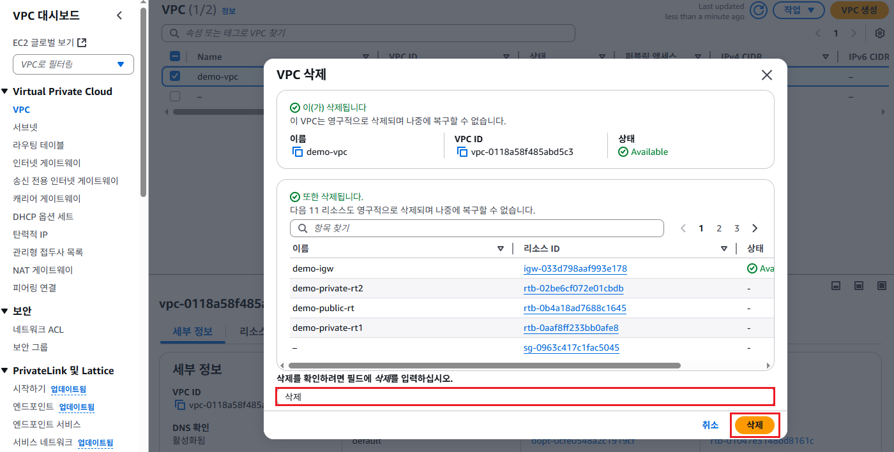

# 리소스 삭제

## 인스턴스 삭제
1. EC2 서비스 메뉴에서 **인스턴스**를 클릭한다. `demo-instance`, `demo-private-instance`를 선택하고, [인스턴스 상태] -> [인스턴스 종료(삭제)]를 클릭한다.
   

2. "종료(삭제) 인스턴스" 팝업에서 [종료(삭제)]버튼을 클릭한다.
   

## NAT 게이트웨이 삭제
1. VPC 서비스 메뉴에서 [NAT 게이트웨이]를 클릭한다.  `demo-natgw1`을 선택하고 [작업] -> [NAT 게이트웨이 삭제]버튼을 클릭한다.
   

2. "NAT 게이트웨이 삭제"팝업에서 입력란에 `삭제`를 입력하고, [삭제]버튼을 클릭한다.
   

## VPC 삭제
1. VPC 메뉴에서 [VPC]를 선택한다. `demo-vpc`를 선택하고, [작업] -> [VPC]삭제를 클릭한다.
   

2. "VPC 삭제"팝업창에서 입력필드에 `삭제`를 입력하고, [삭제]버튼을 클릭한다.
   

## 탄력적 IP 릴리스
1. VPC 서비스 메뉴에서 [탄력적 IP]를 클릭한다. 탄력적 IP 주소 목록에서 모두 선택하고, [작업] -> [탄력적 IP 주소 릴리스]를 클릭한다.
   

2. "탄력적 IP 주소 릴리스" 팝업창에서 [릴리스] 버튼을 클릭한다.
   