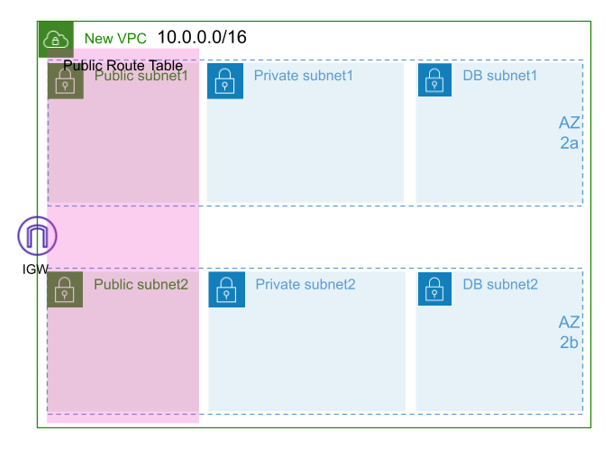
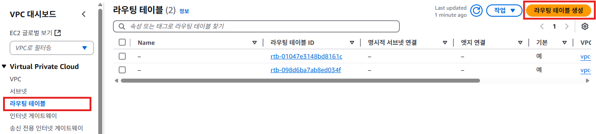
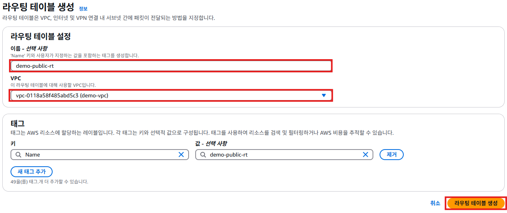
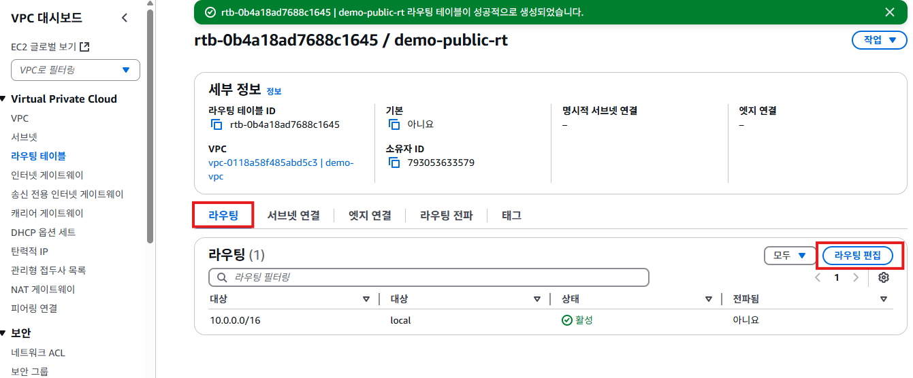
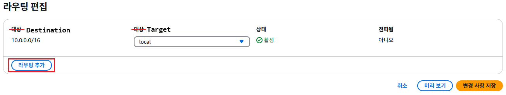
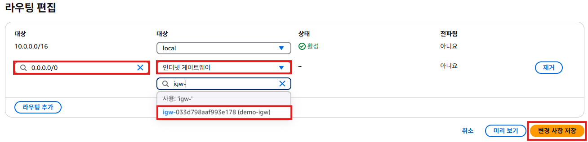
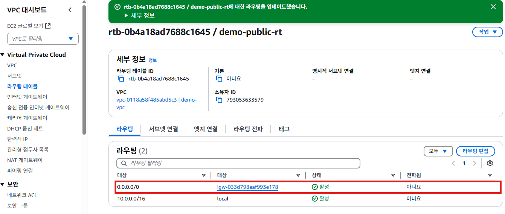
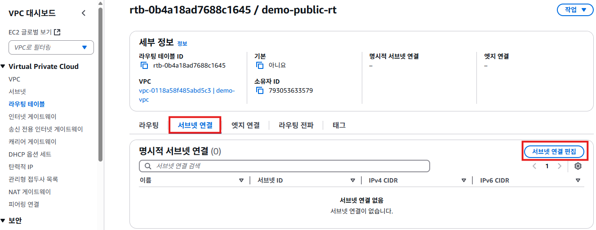
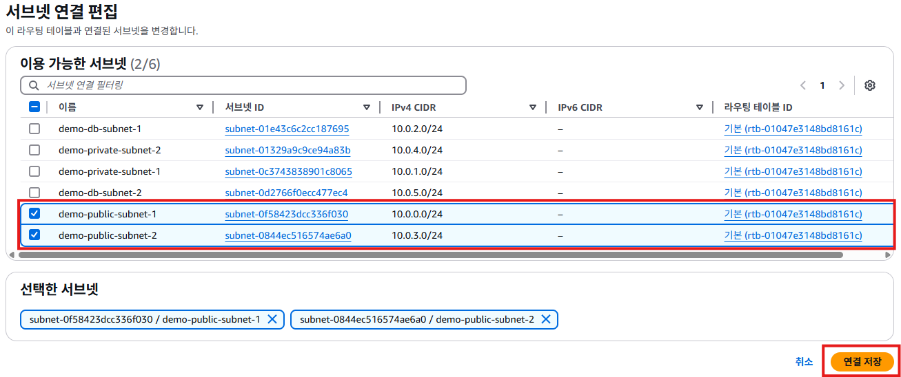
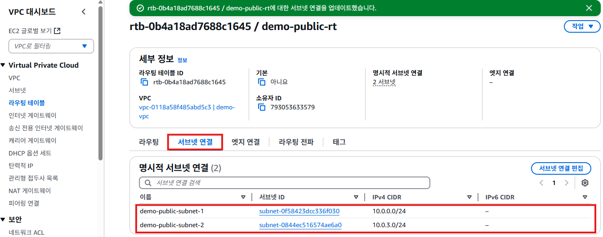

# 라우팅 테이블
- 라우팅 테이블(Route Table)은 네트워크 트래픽의 흐름을 제어하는 핵심 구성요소이다. 
- 라우팅 테이블에는 서브넷의 트래픽이 어디로 가야 하는지 규칙들(route)정의 하여 트래픽의 흐름 제어를 한다.
  
-  2개의 퍼블릭 서브넷의 트래픽을 관리하는 퍼블릭 라우팅 테이블을 작성한다.

## 라우팅 테이블 생성하기
1. VPC 서비스 메뉴에서 [라우팅 테이블]을 클릭한다. [라우팅 테이블 생성]버튼을 클릭한다.
   

2. "라우팅 테이블 생성"화면에서 **라우팅 테이블 설정**의 **이름**항목에 `demo-public-rt`를 입력한다. **VPC**항목에서 `demo-vpc`를 선택한다. [라우팅 테이블 생성]버튼을 클릭한다.
   

3. 라우팅 테이블 생성이 완료되면 아래와 같은 화면이 표시된다. [라우팅] 탭을 클릭한다. [라우팅 편집]버튼을 클릭한다.
   

4. "라우팅 편집"화면에서 Destination과 Target이 모두 대상으로 번역되어 표시된다. [규칙 추가]버튼을 클릭한다.
   
   - Destination은 어떤 IP 범위를 선택할지를 지정한다. `10.0.0.0/16`은 VPC의 네트워크 범위다.
   - Target은 Destination의 IP 범위의 트래픽을 어디로 보낼지를 나타낸다. `10.0.0.0/16`범위의 IP를 가진 트래픽은 `local`로 보내라는 의미다.

5. **Destination**항목에 `0.0.0.0/0`을 입력한다. **Target**항목은 `인터넷 게이트웨이`를 선택하고, `demo-igw`를 선택한다. [변경 사항 저장]버튼을 클릭한다.
   
   - Destination은 `0.0.0.0/0`을 지정한다. `0.0.0.0/0`은 모든 IP주소 범위를 나타내는 예약된 주소다.
   - Target은 `demo-igw`를 지정한다.
   - 이 규칙은 모든 트래픽(`10.0.0.0/16`을 제외한)을 인터넷 게이트웨이로 보내라는 룰이다.

6. 라이팅 테이블이 업데이트 되면, 아래와 같은 화면이 표시된다. **라우팅 탭**에 `0.0.0.0/0 라이팅 규칙`이 추가된 것을 확인한다.
   

7. **서브넷 연결**탭을 클릭한다. [서브넷 연결 편집]버튼을 클릭한다.
   

8. "서브넷 연결 편집"화면에서 **이용 가능한 서브넷**항목에서 `demo-public-subnet-1`, `demo-public-subnet-2`를 체크한다. [연결 저장]버튼을 클릭한다.
   

9. 서브넷 연결이 완료된 후, [서브넷 연결]탭을 클릭한다. **명시적 서브넷 연결**항목에서 `demo-public-subnet-1`, `demo-public-subnet-2` 2개의 퍼블릭 서브넷이 연결된 것을 확인할 수 있다.
   

10. 퍼블릭 서브넷에 인스턴스를 생성하면 인터넷을 연결할 수 있다. 인스턴스 생성 전에 보안그룹을 생성한다. 보안그룹은 VPC에 종속되기 때문에 새로운 VPC가 만들어졌으면, 보안 그룹도 새로 만든다.