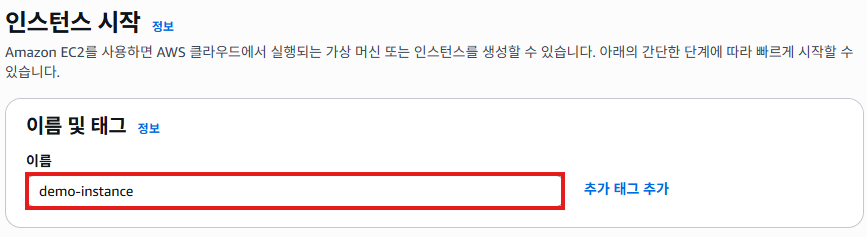

# 인스턴스 생성
- 퍼블릭 서브넷에 인스턴스를 생성한다.

## 인스턴스 생성하기
1. EC2 서비스 메뉴에서 [인스턴스]를 클릭한다. [인스턴스 시작]버튼을 클릭한다.
   

2. "인스턴스 시작"화면에서 
   - **이름**항목에 `demo-instance`를 입력한다. **애플리케이션 및 OS이미지**항목에서 `Amazon Linux`에서 `Amazon Linux 2023 AMI`를 선택한다.
   
   

   - **인스턴스 유형**항목에서 `t2.micro`를 선택한다. **키 페이(로그인)**항목에서 `키 페어 없이 계속 진행(권장되지 않음)`을 선택한다.
   

   - **네트워크 설정**에서 [편집]버튼을 클릭한다.
   

   - **VPC**항목에서 `demo-vpc`를 선택한다. **서브넷**항목에서 `demo-public-subnet-1`을 선택한다. **방화벽**항목에서 `기존 보안 그룹 선택`을 체크한다. **일반 보안 그룹**항목에서 `demo-instance-sg`를 선택한다.
   

   - **고급 세부 정보**를 클릭하여 메뉴를 확장한다.
   

   - **고브 세부 정보**의 **사용자 데이터**항목에 아래의 스크립트를 추가한다.
   
     ```bash
     #!/bin/bash
     yum update -y
     yum install -y nginx
     systemctl enable nginx
     systemctl start nginx
     ```
   
   - 요약 정보를 확인하고, [인스턴스 시작]버튼을 클릭한다.
   

3. 인스턴스 생성이 완료되면, 아래의 화면이 표시된다. [모든 인스턴스 보기]버튼을 클릭한다.
   

4. `demo-instance`를 선택한 후, 아래쪽에 **세부정보**탭에서 **퍼블릭 IPv4 주소**를 확인한다.
   

5. 웹 브라우저의 주소창에 `http://3.34.50.215`를 입력하면, 아래와 같은 화면이 표시된다.
   
