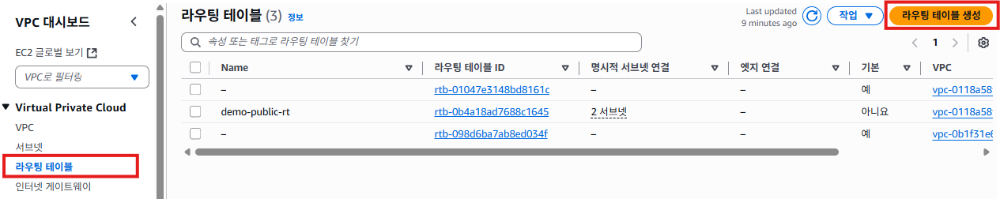
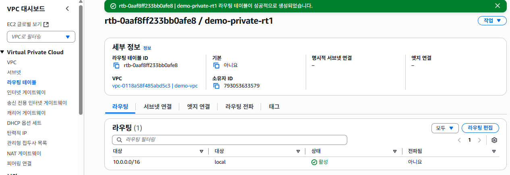

# 프라이빗 라우팅 테이블 생성

## 프라이빗 라우팅 테이블 생성하기
1. VPC 서비스 메뉴에서 [라우팅 테이블]을 클릭한다. [라우팅 테이블 생성]을 클릭한다.
   

2. 라우팅 테이블 설정에서 **이름**항목에 `demo-private-rt1`을 입력한다. **VPC**항목에 `demo-vpc`를 선택한다. [라우팅 테이블 생성]버튼을 클릭한다.
   

3. 라우팅 테이블 생성이 완료되면, 아래의 화면이 표시된다.
   