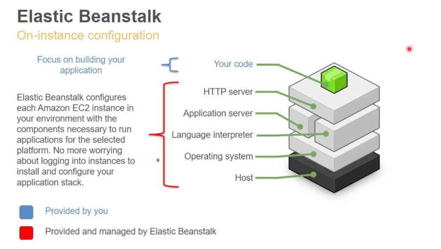
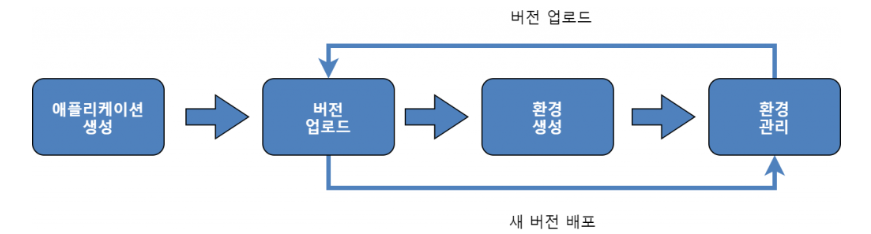

# Elastic Beanstalk

## Elastic Beanstalk 이란?
- AWS **Elastic Beanstalk(이하 EB)** 은 **AWS 인프라에 대한 복잡한 설정 없이도 웹 애플리케이션을 손쉽게 배포, 관리, 확장할 수 있는 완전 관리형 PaaS(Platform as a Service) 서비스**다.
- AWS Elastic Beanstalk는 Java, .NET, PHP, Node.js, Python, Ruby, Go, Docker를 사용하여 Apache, Nginx, Passenger, IIS와 같은 친숙한 **서버에서 개발된 웹 애플리케이션 및 서비스를 간편하게 배포하고 조정할 수 있는 서비스**다.
- Elastic Beanstalk를 사용하면 코드를 업로드해서 **용량 프로비저닝, 로드 밸런싱, 오토 스케일링, 애플리케이션 상태 모니터링, 배포를 자동으로 처리**하도록 구성할 수 있다. 배포 완료 후 애플리케이션을 실행하는 데 필요한 AWS 리소스를 쉽게 제어할 수 있으며 언제든지 기본 리소스에 액세스할 수 있다.
- Elastic Beanstalk는 **추가 비용 없이 애플리케이션을 저장 및 실행하는 데 필요한 AWS 리소스에 대해서만 요금을 지불**하면 된다.
  


## Elastic Beanstalk 특징
- **빠르고 간단하게 서버 구성** : 배포 과정을 Elastic Beanstalk에서 처리하기 때문에 코드를 업로드하면 배포부터 EC2, 로드밸런싱, 오토 스케일링, 모니터링 설정을 Elastic Beanstalk 한곳에서 할 수 있고, 이후 과정을 Elastic Beanstalk가 자동으로 처리한다.(수정 완료)
- **생산성** : Elastic Beanstalk는 인프라를 구성, 운영하고, 애플리케이션 스택을 관리해 주어 사용자가 관리에 시간을 들일 필요가 없다. 플랫폼의 최신 패치와 업데이트를 통해 최신 상태로 유지한다.
- **적절한 규모 유지** : Elastic Beanstalk는 오토 스케일링 설정을 간단하게 조정하여 애플리케이션의 특정 요건에 따라 자동으로 애플리케이션을 확장하거나 축소한다.
- **간단한 리소스 제어** : Amazon EC2 인스턴스 유형과 같은 AWS 리소스를 자유롭게 선택할 수 있다. 또한, Elastic Beanstalk를 사용하면 애플리케이션을 실행하는 데 필요한 AWS 리소스를 사용자가 원하는 대로 설정이 가능하다.

## Elastic Beanstalk 구성 아키텍처
```plaintext
[Elastic Beanstalk Application]
    └── [Environment]  ← 단일 배포 단위
         ├── EC2 Instances (Auto Scaling 그룹 포함)
         ├── Elastic Load Balancer (ALB/NLB)
         ├── RDS Instance (선택 사항)
         ├── S3 Bucket (배포 버전 저장)
         ├── CloudWatch Logs (로그 수집)
         └── IAM Role (EC2 Instance Profile & 서비스 권한)
```
### [Elastic Beanstalk Application]
- Elastic Beanstalk 애플리케이션은 단일 웹 서비스 또는 시스템 전체를 나타내는 논리적 상위 단위입니다.
- 하나의 Application은 **여러 버전(application versions)** 과 **여러 환경(environments)** 을 포함할 수 있습니다.

### [Environment] ← 단일 배포 단위
- 실제로 애플리케이션이 배포되고 실행되는 물리적 실행 단위입니다.
- Elastic Beanstalk는 이 Environment에 따라 자동으로 리소스를 생성합니다.
- 하나의 Environment는 다음 구성 요소들을 포함합니다:
    - EC2 Instances (Auto Scaling 그룹 포함)
      - 애플리케이션 코드가 실행되는 가상 서버 인스턴스
      - lastic Beanstalk는 EC2를 **Auto Scaling Group(ASG)** 으로 구성하여 트래픽에 따라 인스턴스를 자동 확장/축소합니다.
      - 플랫폼 선택(Java, Node.js 등)에 따라 기본 AMI 이미지가 자동으로 적용됩니다.
    - Elastic Load Balancer (ALB/NLB)
      - 다수의 EC2 인스턴스에 HTTP 요청을 자동 분산
      - **ALB(Application Load Balancer)**가 기본이며, 필요 시 NLB도 설정 가능
      - 헬스 체크를 통해 비정상 인스턴스를 자동으로 제외
    - RDS Instance (선택 사항)
      - DB가 필요한 애플리케이션의 경우 RDS(MySQL, PostgreSQL 등)를 함께 생성 가능
      - 다만, EB 환경과 수명을 공유하므로 실무에서는 RDS를 별도로 구성하는 것이 권장됩니다.
    - S3 Bucket (배포 버전 저장)
      - 사용자가 업로드한 `.zip`, `.war`, `.jar` 파일은 S3 버킷에 저장
      - S3 버킷 이름: `elasticbeanstalk-<region>-<account-id>`
      - CI/CD 자동화 시 이 버킷을 통해 자동 배포 가능
    - CloudWatch Logs (로그 수집)
      - EC2 인스턴스의 로그(/var/log, 애플리케이션 로그 등)를 CloudWatch Logs로 전송
      - 콘솔 또는 CLI에서 로그 확인 가능
    - IAM Role (EC2 Instance Profile & 서비스 권한)
      - EB가 AWS 리소스를 생성하고 EC2 인스턴스가 AWS 서비스(S3, CloudWatch 등)에 접근하기 위해 필요한 권한 역할

## Elastic Beanstalk 구성 요소
```yaml
Application: my-app
  ├── Version: v1, v2, ...
  ├── Environment: prod-env, dev-env
       ├── Platform: Java 17
       └── Tier: Web Server

```

| 구성 요소                      | 설명                                                    |
| -------------------------- | ----------------------------------------------------- |
| **Application**            | 하나의 서비스 단위를 의미. 버전, 환경 등 포함하는 최상위 단위                  |
| **Application Version**    | 배포 가능한 애플리케이션 소스 패키지(zip/war 등). S3에 저장됨              |
| **Environment**            | 실제 실행 인프라 (EC2, ELB 등 포함). 버전을 배포할 단위                 |
| **Configuration Template** | 환경 구성 정보(인스턴스 유형, 스케일링, 로깅 등)를 정의한 템플릿                |
| **Environment Tier**       | 웹 서버(Web Server Tier) 또는 워커(Worker Tier) 환경 구분        |
| **Platform**               | 실행 환경(예: Java 17 with Corretto, Node.js 18, Docker 등) |


## Elastic Beanstalk 워크 플로우


1. 애플리케이션 생성
   - Elastic Beanstalk에서 **애플리케이션**은 배포할 소프트웨어를 포괄적으로 나타내는 **논리적인 컨테이너**다.
   - 애플리케이션은 하나 이상의 **환경(environment)** 을 가질 수 있습니다 (예: dev, staging, prod).

2. 버전 업로드
   - 개발된 코드(예: `.zip`, `.jar`, `.war`)를 AWS에 업로드하여 **버전(version)** 을 생성한다.
   - **이 버전은 내부적으로 S3에 저장**되며, 환경에 배포될 수 있는 단위가 된다.

3. 환경 생성
   - **환경(environment)**은 애플리케이션의 실제 실행 인프라다.
   - 환경 생성 시 다음 요소가 자동 구성
     - EC2 인스턴스
     - Load Balancer (ALB/NLB)
     - Auto Scaling Group
     - CloudWatch
     - 필요 시 RDS
   - 환경 종류:
     - **Web Server 환경**: HTTP 요청을 처리
     - **Worker 환경**: SQS 큐 기반 백그라운드 작업 처리

4. 환경 관리
   - 실행 중인 환경을 **모니터링, 설정 변경, 배포 업데이트, 스케일 조정** 등으로 지속적으로 관리
   - Elastic Beanstalk 콘솔 또는 CLI로 가능  

5. 새 버전 업로드 및 재배포
   - 애플리케이션에 변경 사항이 생기면 **새 버전을 업로드**하고 **기존 환경에 재배포**한다.
   - Elastic Beanstalk는 배포 전략에 따라 다음을 지원:
     - All at once
     - Rolling
     - Rolling with additional batch
     - Immutable (가장 안전)

6. 반복적 배포 및 관리
   - 애플리케이션 변경 → 버전 업로드 → 환경 재배포 → 모니터링 및 관리
   - 이 루프를 통해 지속적인 운영과 DevOps 프로세스 구현 가능


