# 엘라스틱 빈스톡으로 배포하기

## IAM 역할 생성하기
- 엘라스틱 빈스톡 서비스에 부여할 역할을 IAM에 만든다.
  
1. AWS 검색창에서 `IAM`을 입력하고, [IAM]을 선택한다.
   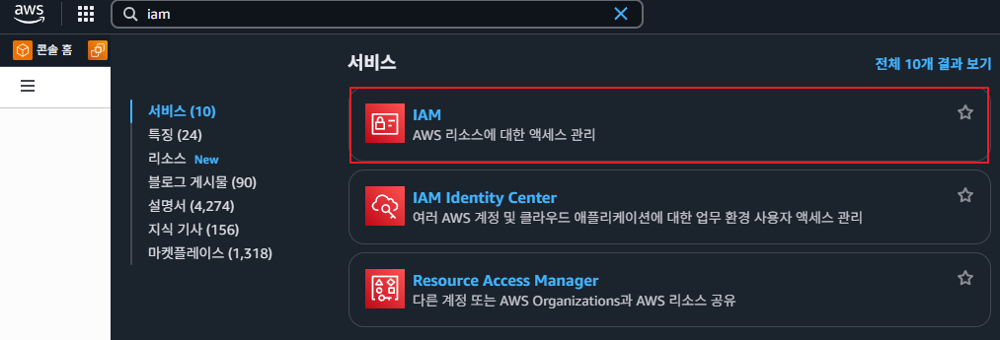

2. IAM의 왼쪽 메뉴에서 [역할]을 클릭한다. [역할 생성]버튼을 클릭한다.
   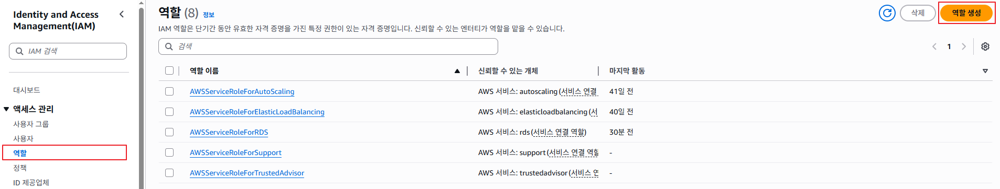

3. "신뢰할 수 있는 엔터티 선택"화면에서 **신뢰할 수 있는 엔터티 유형**항목에서 `AWS 서비스`를 선택한다. "사용 사례"의 **서비스 또는 사용 사례**항목에서 `EC2`를 선택한다. [다음]버튼을 클릭한다.
   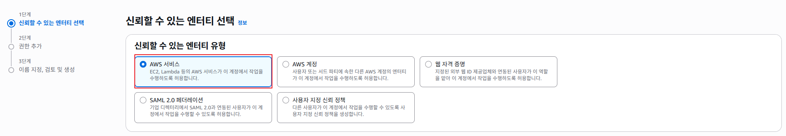
   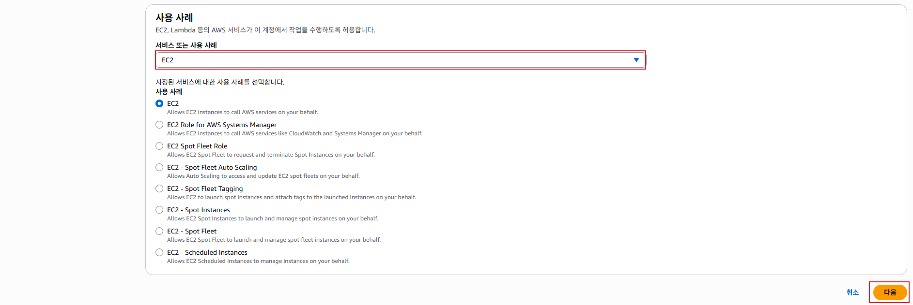

4. "권한 추가"화면에서 다음 3개의 권한(`AWSElasticBeanstalkMulticontainerDocker`, `AWSElasticBeanstalkWebTier`, `AWSElasticBeanstalkWorkTier`)을 검색하여 체크하고 [다음]버튼을 클릭힌다. 
   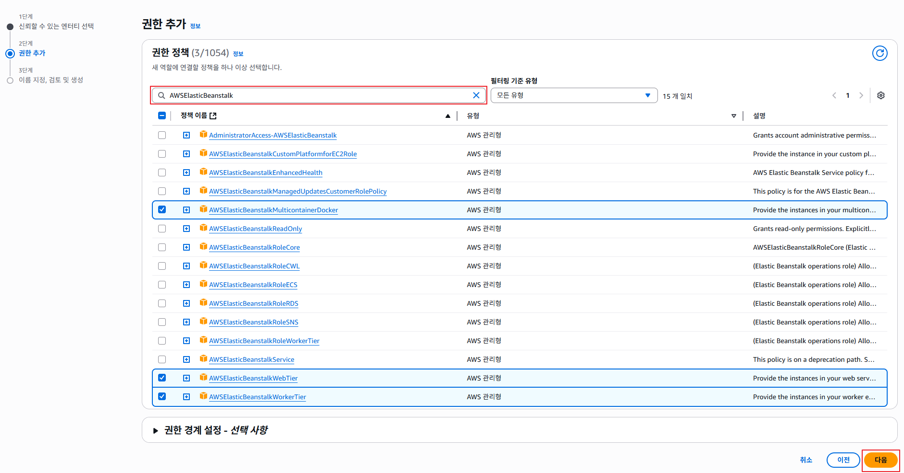

5. "이름 지정, 검토 및 생성"화면에서 `demo-eb-ec2-role`입력하고, [역할 생성]버튼을 클릭한다.
   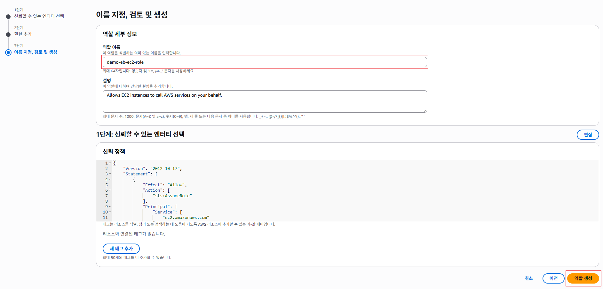

## 엘라스틱 빈스톡 서비스 생성하기
1. AWS 검색창에서 `elastic beanstalk`을 입력하고, 검색 결과에서 `Elastic beanstalk`를 클릭한다.
   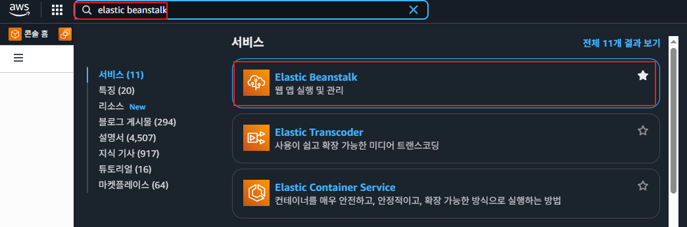

2. [애플리케이션 생성]버튼을 클릭한다.
   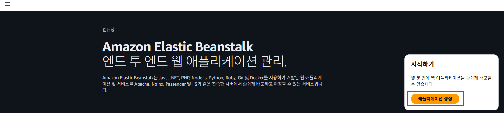

3. "환경 구성"화면에서 **환경 티어**항목에서 `웹 서버 환경`을 선택한다. **애플리케이션 이름**항목에 `demo-eb`를 입력한다. **플랫폼 유형**항목에서 `관리형 플랫폼`을 선택한다. **플랫폼**항목에 `Java`를 선택한다. **애플리케이션 코드**항목에서 `샘플 애플리케이션`을 선택한다. **구성 사전 설정**항목은 `단일 인스턴스(프리 티어 사용 가능)`을 선택한다. [다음] 버튼을 클릭한다.
   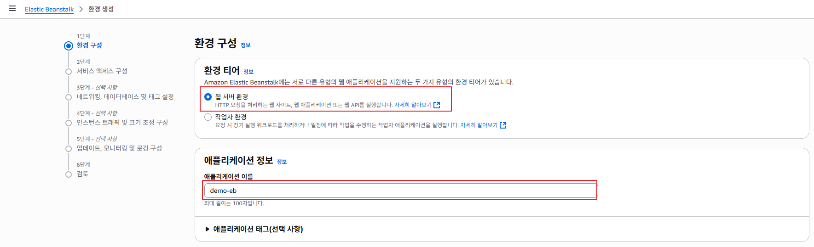
   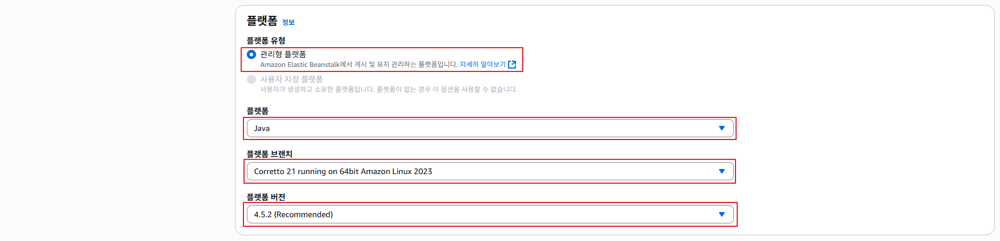
   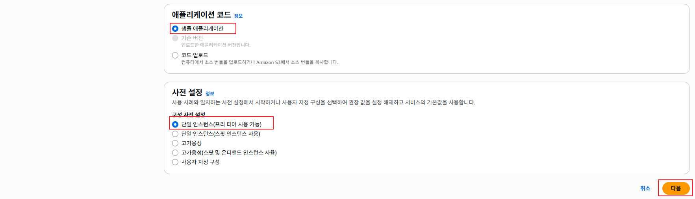

4. "서비스 엑세스 구성"화면에서 **서비스 역할**항목에서 [역할 생성]버튼을 클릭한다.
   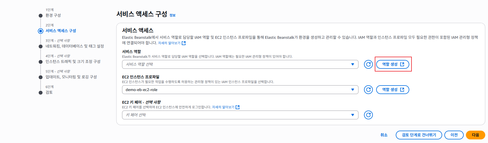

5. "신뢰할 수 있는 엔터티 선택"화면에서 선택된 내용 변경없이, [다음]버튼을 클릭한다.
   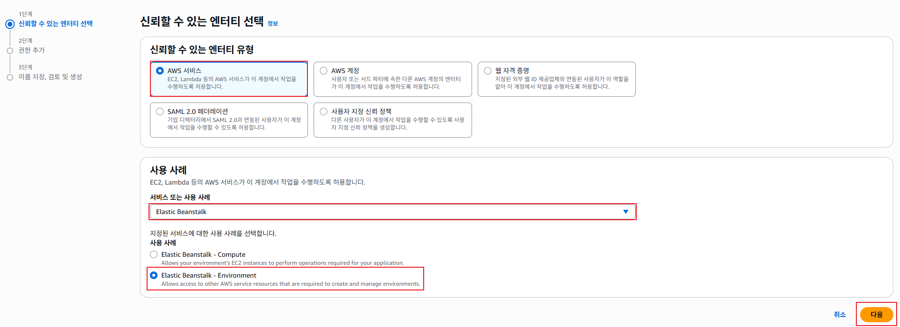

6. **권한 추가**화면에서 `AWSElasticBeanstalkEnhancedHealth`, `AWSElasticBeanstalkManagedUpdatesCustomerRolePolicy` 권한 정책이 선택되었음을 확인하고, [다음]버튼을 클릭한다.
   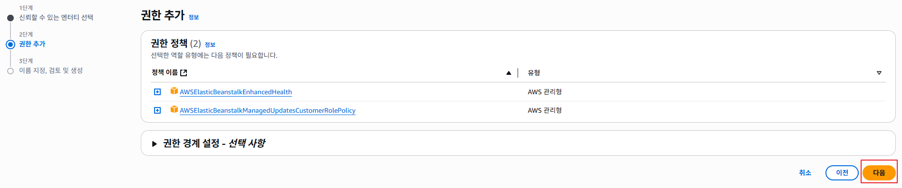

7. "이름 지정, 검토 및 생성"화면에서 **역할 이름**항목에 `aws-elasticbeanstalk-service-role`을 확인하고, [역할 생성]버튼을 클릭한다.
   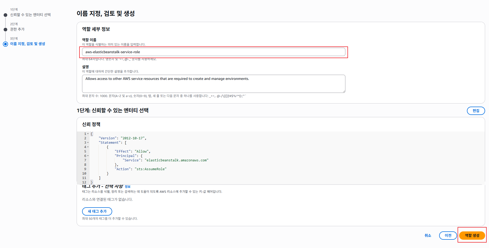

8. 역할 목록에서 `aws-elasticbeanstalk-service-role` 생성되었음을 확인한다.
   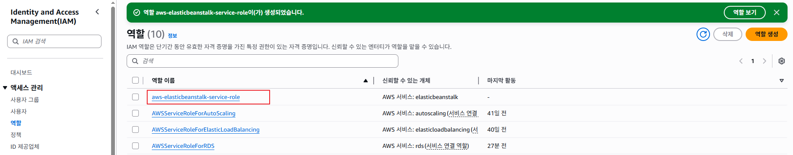

9. "서비스 엑세스 구성"화면으로 되돌아와서, **서비스 역할**항목의 [새로 고침]버튼을 클릭하고, `aws-elasticbeanstalk-service-role`을 선택한다. **EC2 인스턴스 프로파일**항목에서 `demo-eb-ec2-role`을 선택한다. [검토 단계로 건너뛰기] 버튼을 클릭한다. 
   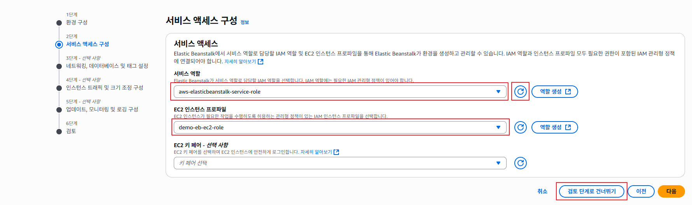

10. "검토"화면에서 내용을 확인하고 [생성]버튼을 클릭한다.
   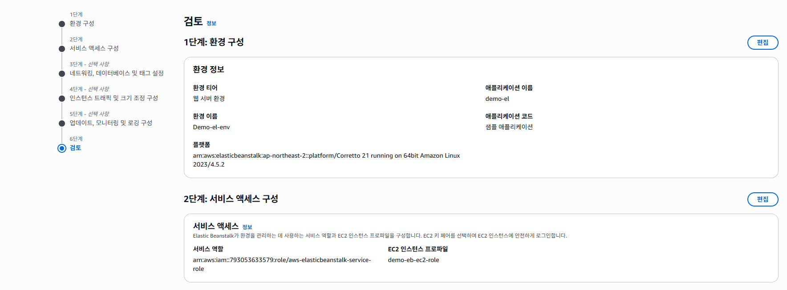
   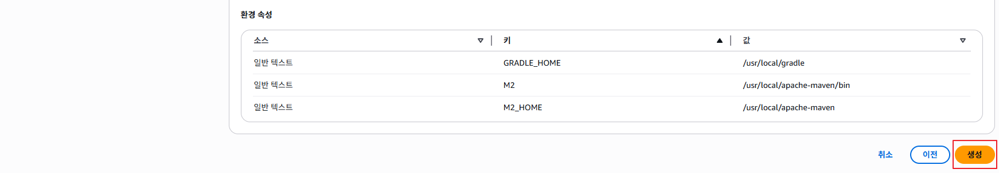

11. 생성 요청한 웹 앱을 사용할 준비가 완료될 때까지 잠시 기다린다. 프로젝트 생성이 완료되면 화면이 전환된다. **도메인**항목의 주소를 복사해서 브라우저 창에 입력한다.
   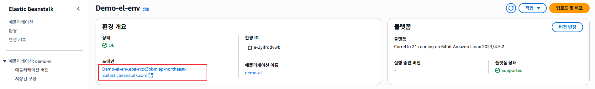

12. 아래의 화면이 표시된다.
   
