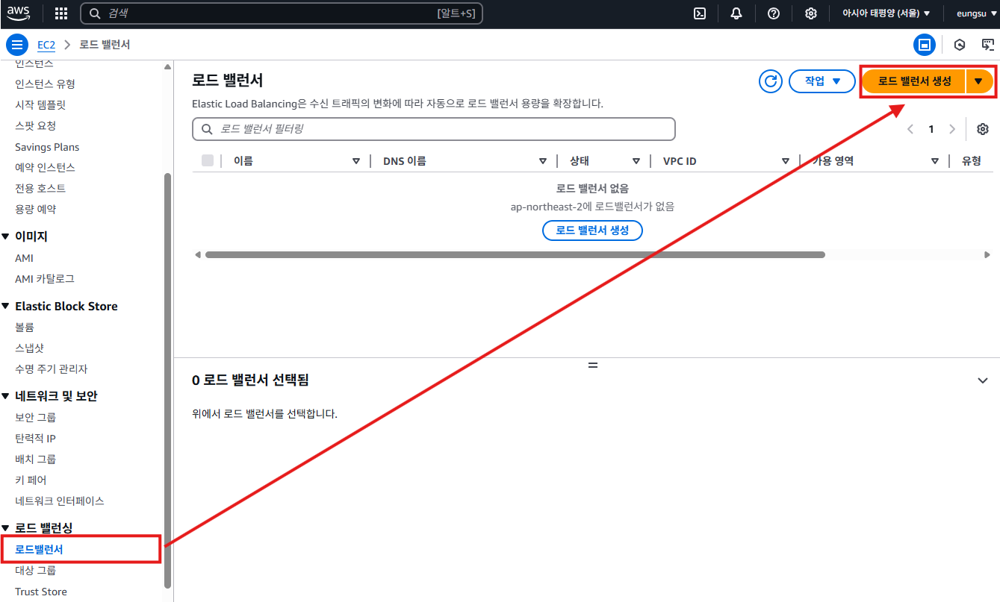
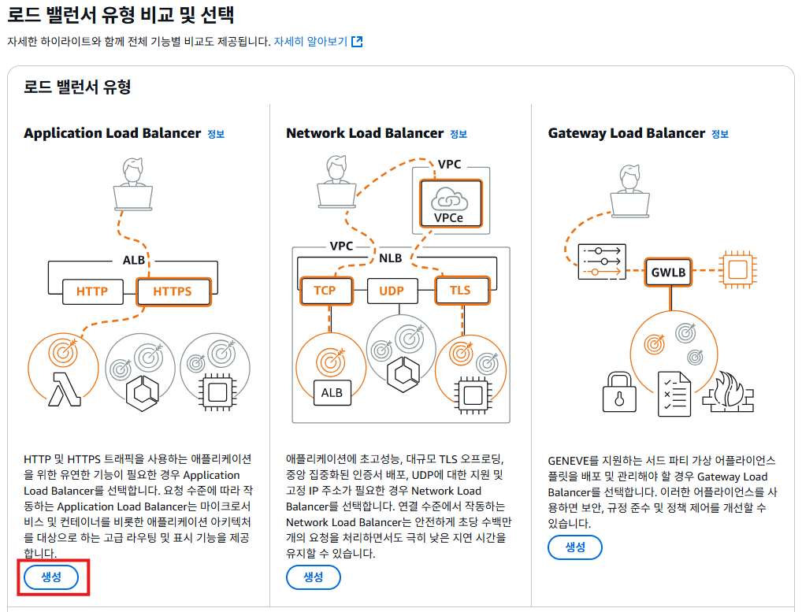
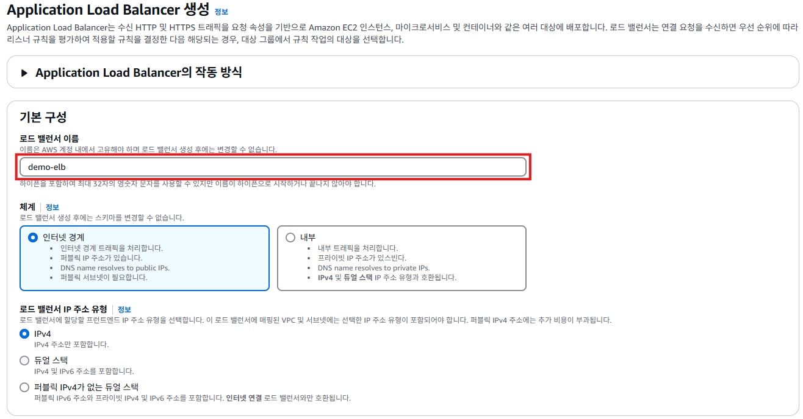
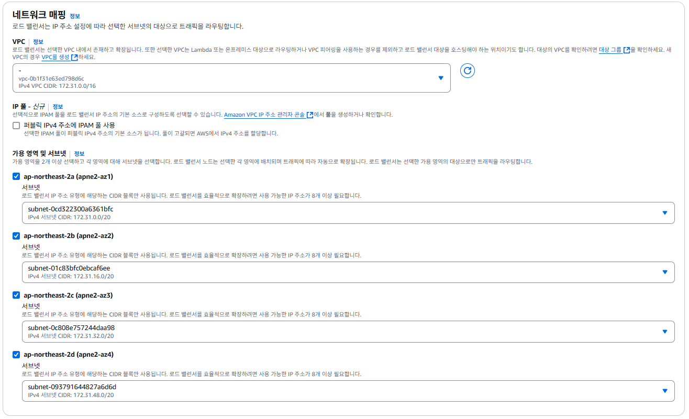
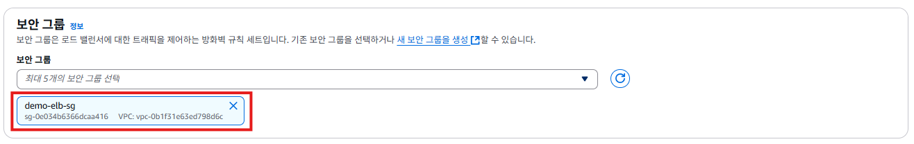
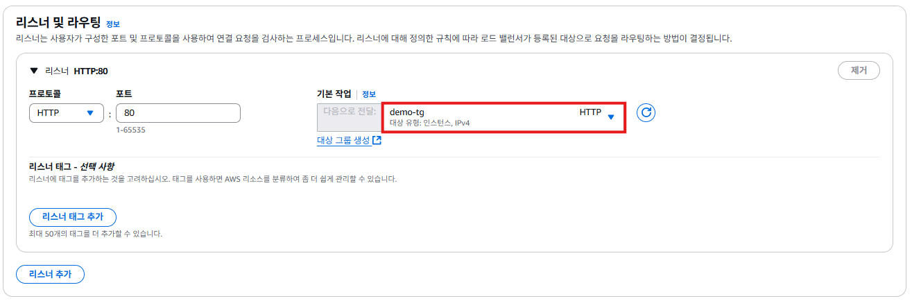
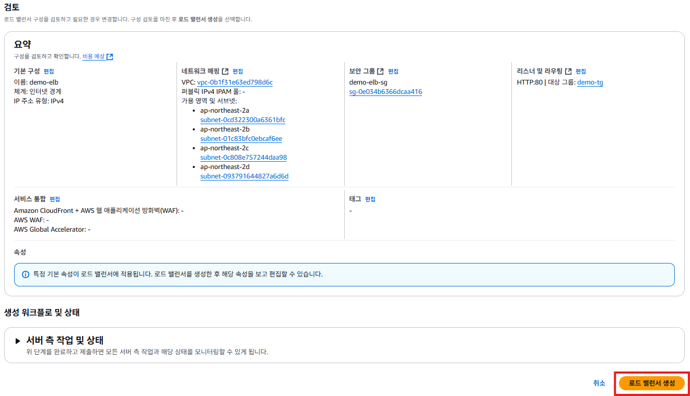
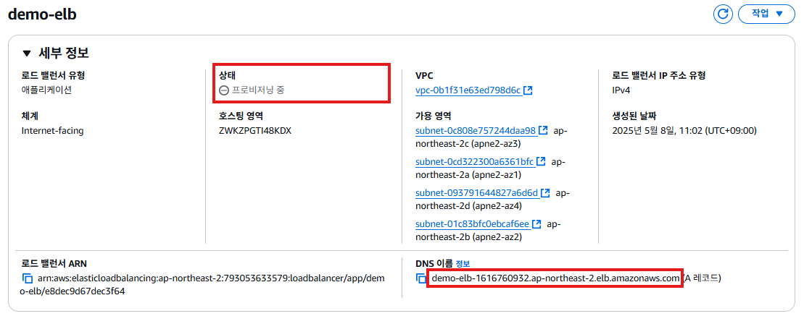
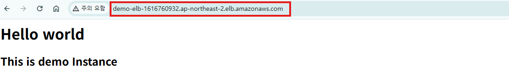

# 로드밸런서 생성하기

1. EC2 서비스의 왼쪽 메뉴에서 [로드밸런서]를 클릭한다. [로드 밸런서 생성]버튼을 클릭한다.
   

2. "로드 밸런서 유영 비교 및 선택"화면에서 **Application Load Balancer**의 [생성]버튼을 클릭한다.
   

3. "Application Load Balancer 생성"화면의 "기본 구성"의의 **로드 밸런서 이름**항목에 `demo-elb`를 입력한다.
   

4. "Application Load Balancer 생성"화면의 "네트워크 매핑"의 **가용 영역 및 서브넷**항목에서 **가용 영역을 2개 이상 선택하고, 영역당 하나의 서브넷을 선택**한다.
   

5. "Application Load Balancer 생성"화면의 "보안 그룹"의 **보안 그룹**항목에서 `default` 보안 그룹은 삭제하고, `demo-elb-sg` 보안 그룹을 선택한다.
   

6. "Application Load Balancer 생성"화면의 "리스너 및 라우팅"의 **리스너 및 라우팅**는 로드밸런서에 접속하는 트래픽이 어노 포트로 오는걸 학인하고 있을지를 정하고, 들어온 트래픽을 어디로 전달할지를 설정하는 부분이다. 우리는 HTTP 프로토콜을 사용할 것이기 때문에 **리스너**는 HTTP 80번 포트로 설정되어 있는 기본값을 그대로 사용하고, 다음으로 전달에 우리가 생성한 대상 그룹(`demo-tg`)를 선택한다.
   

7.  "Application Load Balancer 생성"화면의 요약 정보를 확인하고, [로드 밸런서 생성] 버튼을 클릭한다.
   

8. `demo-elb`의 "세부 정보"를 확인한다.
   
   
9.  `demo-elb`의 "세부 정보"를 확인한다. **상태**항목의 값이 **활성**으로 변경되면, **DNS 이름**을 복사하여, 브라우저에 복사/붙여넣기 해서 웹 서버에 접속해본다.
   
 