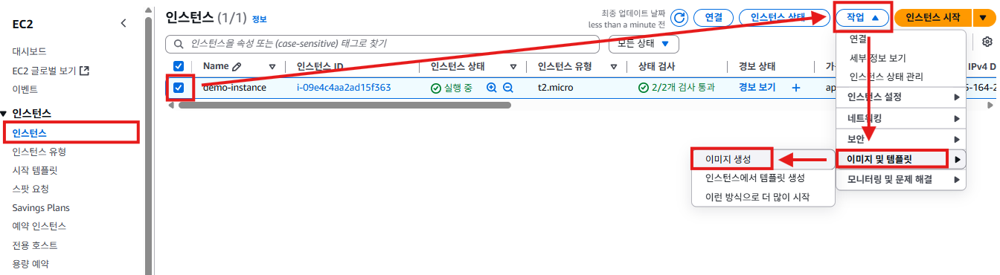
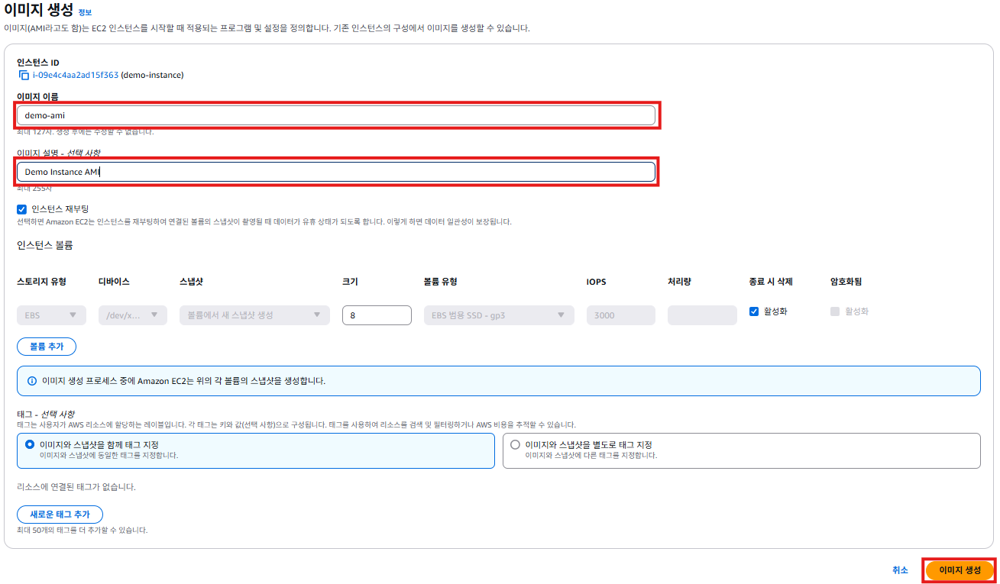
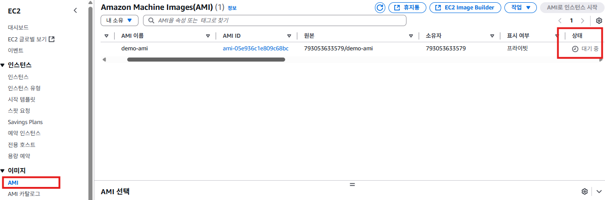

# AWS AMI 생성하기

1. EC2 서비스의 왼쪽 메뉴에서 [인스턴스]를 클릭한다. 인스턴스 목록에서 `demo-instance`를 체크한다. [작업] -> [이미지 및 템플릿] -> [이미지 생성] 순서로 클릭한다.
   

2. "이미지 생성"화면에서 **이미지 이름**항목에 `demo-ami`를 입력한다. **이미지 설명**항목에 `Demo Instance AMI`를 입력한다. [이미지 생성] 버튼을 클릭한다.
   

3. EC2 서비스의 왼쪽 메뉴에서 [AMI]를 클릭한다. AMI 목록에 생성된 AMI가 표시된다. 
   